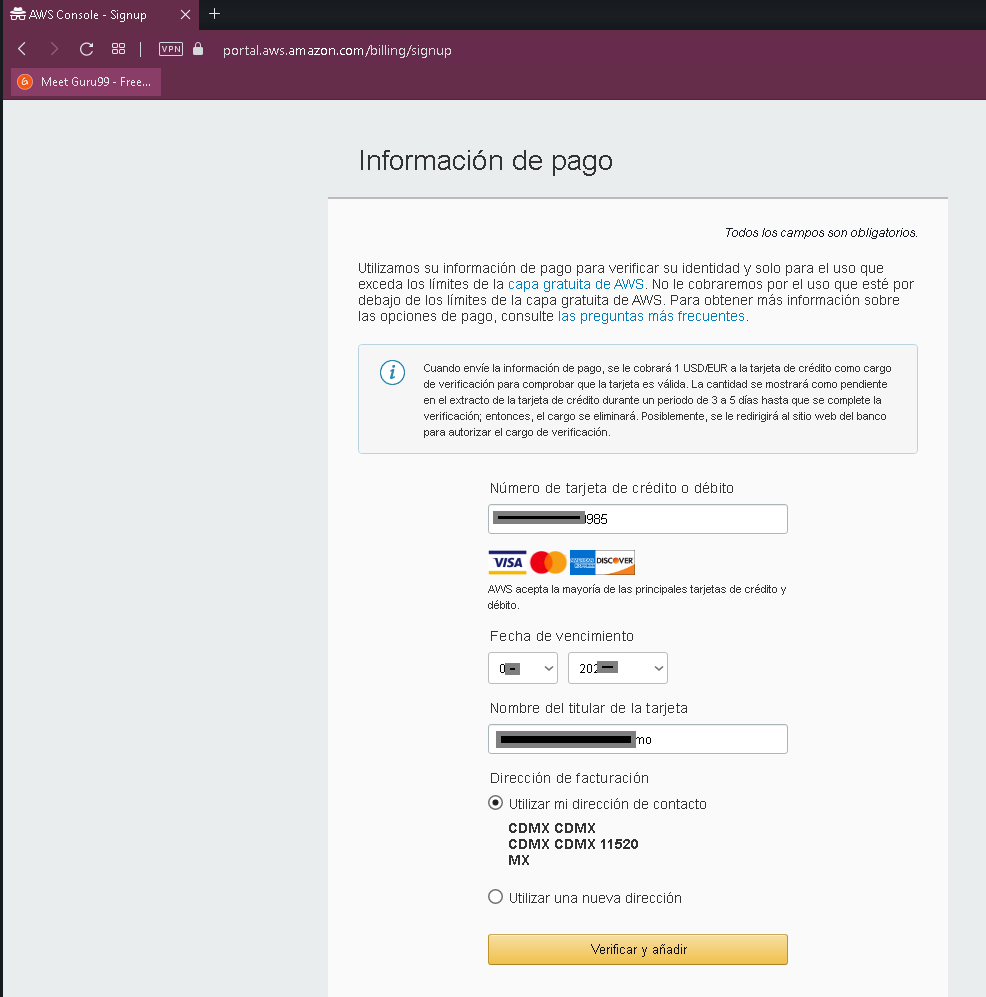
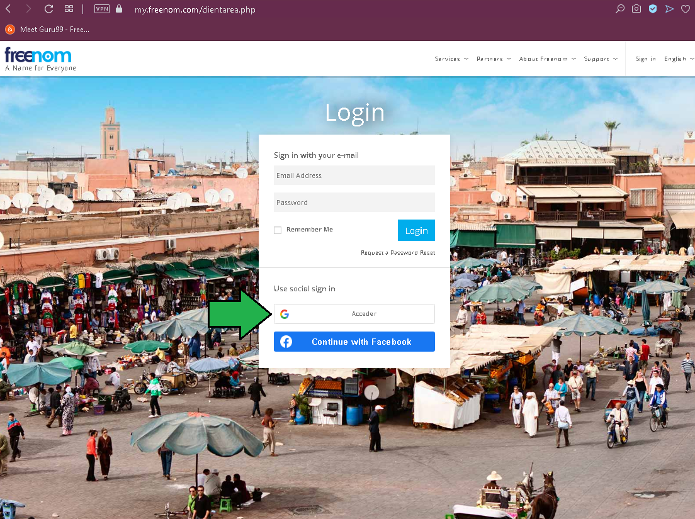
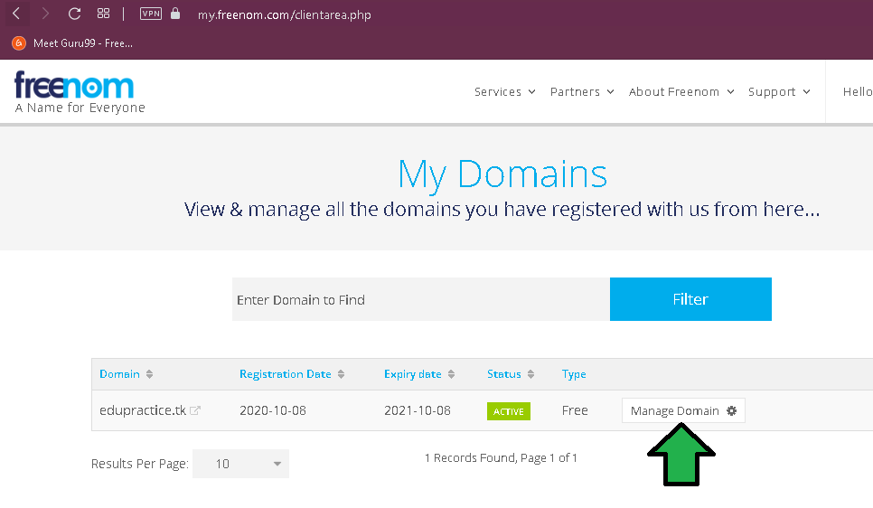

# ORGANIZACIÓN DE CLASE

###### Reto 1: 
Buscar en bolsas de trabajo trabajos relacionados con tecnologías de AWS, busca 10 empleos con rango salarial después calcula un promedio. Por último lista también las habilidades que piden las empresas. Para temas de paridad monetaria se recomienda buscar empleos pagados en MXN pero no es mandatorio.

###### Reto 2:
Abre una cuenta en [Amazon Web Services](https://portal.aws.amazon.com/billing/signup#/start), en un punto se pide para dar de alta la cuenta un número telefónico, si el mensaje o llamada no llegan, intenta agregar un +1 al número, por ejemplo si pusiste el +52 56 48 78 45 12, intenta con +152 56 48 78 45 12. Para abrir la cuenta es necesaria una tarjeta de crédito o débito, al ingresarla se te hará el cobro de un dólar el cual Amazon te reembolsará, solo es para validar la tarjeta. Normalmente los servicios que ofrece Amazon son bajo demanda, por lo que debes ser cuidadoso a la hora de levantar recurso destruirlos para así no incurrir en grandes costos. 
Mucho cuidado a la hora de escoger servicios como RDS, Redshift y Kinesis, en un descuido te puede llegar una factura alta al final de mes.

1. Ingresar a https://aws.amazon.com/es/console/ y dar click en (a).

2. Ingresar los datos solicitados con **tu** propio email.48

3. Ingresar los datos adicionales

4.- Ingresar datos de pago. La tarjeta es usada para propósito de comprobación de identidad. Un cargo de un dólar será hecho a la cuenta especificada.

5. Aquí se debe especificar como se verificará el número de la cuenta. Para números de México se debe usar +52 **1** Número a 10 dígitos. Importante seleccionar método por llamada, el SMS muchas veces no llega o llega horas tarde. Ingresado el captcha la llamada será hecha al número especificado.

5.1: La llamada será hecha por AWS, se mostrará un código PIN de 4 dígitos.

5.2: La llamada es en inglés, solo se debe especificar el pin a 4 dígitos que se despliega en el navegador web sin ingresar alguna tecla adicional.

6. Ingresados los dígitos el proceso de verificación esta hecho.

7. Habrá que seleccionar el plan que mejor acomode a las necesidades, básicamente estos planes dan acceso a soporte técnico de AWS en diferentes niveles, no hay beneficio adicional sobre los precios de los servicios o una restricción en los mismos, todos los planes tienen acceso al mismo número de servicios y a todas sus capacidades.

8. La bienvenida es dada, los datos que se piden pueden ser llenado en base a la investigación de puestos en el paso anterior.

9. Una vez llegados los email se podrá iniciar sesión.

10. Ingresar a la [dirección](https://aws.amazon.com/es/console/), seleccionar la opción "Consola de administración de AWS", luego ingresar el email y password de la cuenta proporcionados en el paso 2.
 

11. ¡Felicidades! , estás listo para comenzar la carrera en el mundo Amazon Web Services.

###### Reto 3:
Familiarízate [navegando brevemente](https://aws.amazon.com/es/products/) en la página de servicios ofrecidos de AWS, lista los servicios que de una u otra forma se te hacen conocidos en base a tu experiencia con otras tecnologías de acuerdo a la descripción que leas en ellos. 

###### Reto 4: 
Vamos a necesitar un dominio del cual seas dueño para el proyecto final, si no quieres gastar dinero [Freenom](https://www.freenom.com/es/index.html?lang=es) es una buena opción gratuita por un año, si quieres optar por una opción de paga puedes acercarte a [Namecheap](https://www.namecheap.com/), es posible comprar un dominio dentro de Amazon Web Services pero nos quitará la diversión de configurar el DNS por nosotros mismos, eso sin contar que muchos de los clientes cuentan con dominios comprados fuera de Amazon. (Se recomienda encarecidamente que no se usen dominios ligados a algún servicio en producción ya que en la manipulación podríamos afectar el sitio productivo, si lo desea usar, úsese bajo su propio riesgo).

1. Ingresar a https://my.freenom.com/clientarea.php y acceder por medio de gmail.

Ya con la cuenta generada habrá que registrar un nuevo dominio.

2. Finalizado el proceso de registro ingresar a "Mis dominios":

3. Dar click en "Manage Domain"

4. Dar click en "nameservers"
 
 
 5. Ahora seleccionar "Use custom nameservers", dejar en blanco los campos por el momento y abrir una nueva pestaña del navegador para ingresar a la consola de AWS.
 

6. Ya en la consola, buscar el servicio "Route53" y acceder a él.

7. Dar click en "Crear una zona alojada"
 
 
 8. Ingresar el nombre del dominio que fue registrado en freenom (1), una descripción (2) y seleccionar Zona pública (3).  
 

9. Se generará la zona del dominio, comparemos los valores del registro de tipo NS a la pantalla del paso 5. 

10. Finalmente confirmar a freenom que queremos que AWS maneje el DNS del dominio.

De ahora en adelante todos los cambios que tengan que ver con DNS del dominio deberán ser gestionados en la consola de Route53.

11. Después de 10 minutos (aunque pueden pasar hasta 24 horas) se puede verificar con whois que el dominio ya es manejado por AWS.

###### Reto 5:
Ingrese a [Dell.com](https://www.dell.com/en-us/work/shop/servers-storage-and-networking/poweredge-r740-rack-server/spd/poweredge-r740/pe_r740_12248a_vi_vp), haga el ejercicio de armar una servidor a medida y vea cual es el precio final de su flamante servidor.
Por lo menos seleccionar RAID 5, da un buen balance entre protección y velocidad. ¿Qué procesador seleccionar?, es parte del arte de armar el servidor saber el uso que se le dará hay mucho que investigar de cada procesador antes de decidir por alguno.

