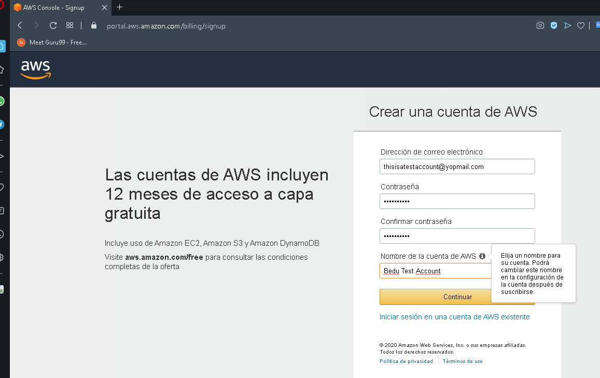
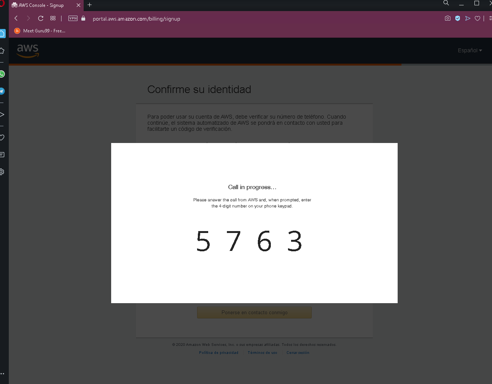
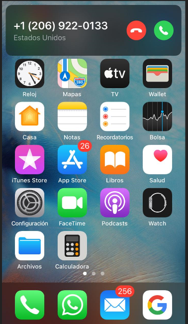
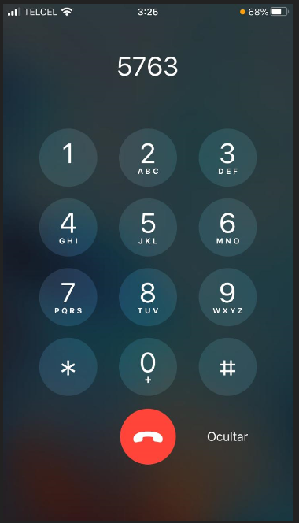
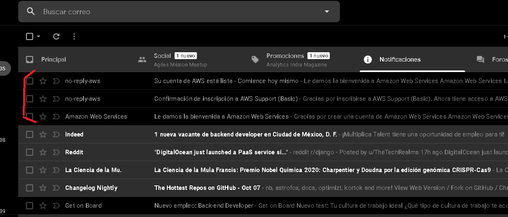

# Reto 02 - Abre tu primera cuenta en Amazon Web Services

## 1. Objetivo

## 2. Requisitos

* AWS CLI instalado
* Tarjeta de  crédito

## Desarrollo

> 🤓 **Nota para experto(a).**
>
>Guía al alumno a dar de alta un cuenta en Amazon Web Services

1. Ingresar a [Amazon Web Services](https://aws.amazon.com/es/console/) y dar click en (a).

</img>

#### 2. Ingresar los datos solicitados con tu propio email.

</img>

3. Ingresar los datos adicionales

</img>

4. Ingresar datos de pago. **La tarjeta es usada para propósito de comprobación de identidad.**

> 💡**Nota:**
>
>Para abrir la cuenta es necesario una tarjeta de crédito o débito, al ingresarla se te hará el **cobro de un dólar el cual Amazon te reembolsará, solo es para validar la tarjeta.**
>
>Normalmente los servicios que ofrece Amazon son bajo demanda, por lo que debes ser cuidadoso a la hora de levantar recurso destruirlos para así no incurrir en grandes costos.

#### ❗ Mucho cuidado a la hora de escoger servicios como RDS, Redshift y Kinesis, en un descuido te puede llegar una factura alta al final de mes.

</img>

5. A continuación se debe especificar como se verificará el número de la cuenta. 

> 💡**Nota:**
>
>Selecciona el método por llamada, el SMS muchas veces no llega o llega horas tarde.

### 🎩 Tip:

Para dar de alta la cuenta un número telefónico de México, si el mensaje o llamada no llegan, intenta agregar un **+1** al número

#### Ejemplo:

Si pusiste el **+52 56 48 78 45 12**, intenta con **+152 56 48 78 45 12**. 
Ingresado el captcha la llamada será hecha al número especificado.

</img>

5.1 La llamada será hecha por AWS, se mostrará un código PIN de 4 dígitos.

</img>

>❗**Cuidado**
>
> La llamada es en **inglés**, solo se debe especificar el pin a 4 dígitos que se despliega en el navegador web sin ingresar alguna tecla adicional.

</img>

</img>

6. Ingresados los dígitos el proceso de verificación está hecho.

</img>

7.  Habrá que seleccionar el plan que mejor acomode a las necesidades, básicamente estos planes dan acceso a soporte técnico de AWS en diferentes niveles, no hay beneficio adicional sobre los precios de los servicios o una restricción en los mismos, todos los planes tienen acceso al mismo número de servicios y a todas sus capacidades.

</img>

8. La bienvenida es dada, los datos que se piden pueden ser llenado en base a la investigación de puestos en el paso anterior.

</img>

9. Una vez llegados los email se podrá iniciar sesión.

</img>

10. Ingresar a la siguiente [dirección](https://aws.amazon.com/es/console/), seleccionar la opción "Consola de administración de AWS", luego ingresar el email y password de la cuenta proporcionados en el [paso 2](https://github.com/beduExpert/AWS-Cloud-Foundations2020/tree/main/1.-Fundamentos%20de%20Cómputo%20en%20la%20Nube/Reto%2002#2-ingresar-los-datos-solicitados-con-tu-propio-email).

</img>

</img>

11.  **🎉 ¡Felicidades!**, estás listo para comenzar la carrera en el mundo Amazon Web Services.

</img>