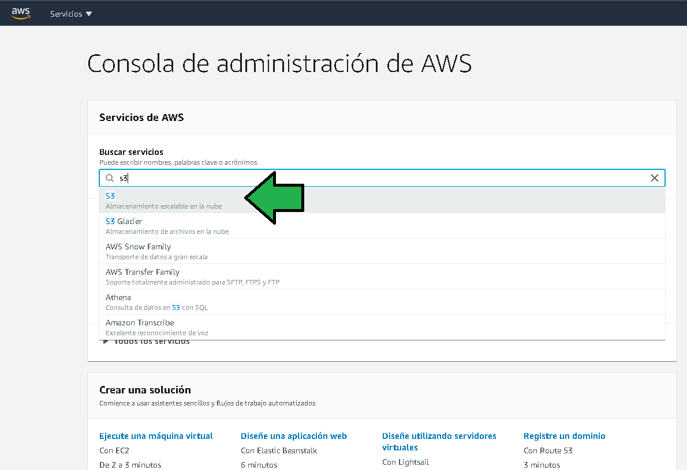

# Ejemplo 2 - Generando un bucket y copiando un archivo

## 1. Objetivo 
- Generar un bucket S3 como contenedor de facturas.

## 2. Requisitos 
- AWS CLI instalado y configurado.
- Algunos archivos que se deseen subir al bucket.


## 3. Desarrollo 

1. Abrir la línea de comandos del Sistema Operativo que se este usando:

2. Usar el comando  `mb` (make bucket) para generar un bucket.
```sh
aws --region us-east-1 s3 mb s3://facturas
```


**¿Qué ha pasado?** Los nombres de los buckets S3 deben ser únicos en todo el servicio, en este caso, alguien con otra cuenta ya tiene configurado un bucket con el nombre `facturas`, cambiando el nombre del archivo la generación del bucket es correcta: [**Referencia**](https://awscli.amazonaws.com/v2/documentation/api/latest/reference/s3/mb.html)


3. Listar los buckets S3 ejecutando el comando 
```bash
aws --region us-east-1 s3 ls
```
### [Referencia](https://awscli.amazonaws.com/v2/documentation/api/latest/reference/s3/ls.html)


4. Copiar múltiples archivos al bucket con el comando:

### [Referencia](https://docs.aws.amazon.com/cli/latest/reference/s3/cp.html)


```bash
aws --region us-east-1 s3 cp /mnt/d/temp/ s3://facturas-personales/ --exclude "*" --include "LP*.zip" --recursive
```


Al navegar en la consola de AWS al servicio S3 se aprecia el bucket generado anteriormente:




Al ingresar al bucket se verán los archivos que se subieron.


