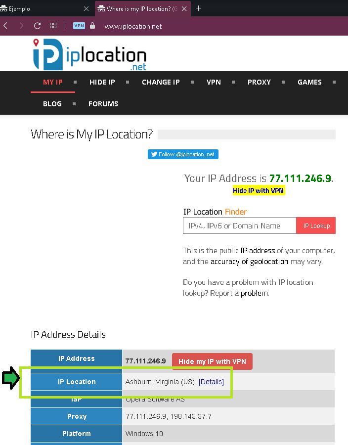

## Sesión X - Reto X 

### 1. Objetivo 🎯
- Permitir peticiones desde la IP de la VPN para comprobar que el acceso DNS por geolocalización funciona.

### 2. Requisitos 📌
- Acceso a AWS Console.
- Conocimiento básico sobre como funciona el protocolo DNS.
- Un registro en Route53 con política de direccionamiento geolocalización hacia un bucker S3 en modo hosting.

### 3. Desarrollo 📑

Se deberá acceder al servicio Route53, ahí se deberá seleccionar "Crear registro" escogiendo de tipo Geolocalización, al configurar el registro seleccionar el país que se vea en la página [https://www.iplocation.net](https://www.iplocation.net) con la VPN habilitada.

Al refrescar pantalla después de unos 5 minutos con VPN encendida se debe poder acceder a la página.

Al administrar un servicio DNS no es raro ver registros del mismo tipo apuntando al mismo valor

