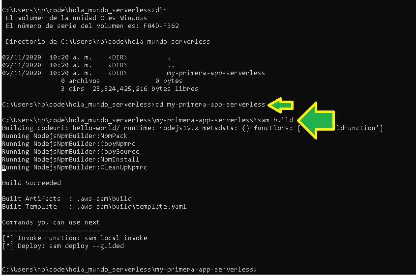
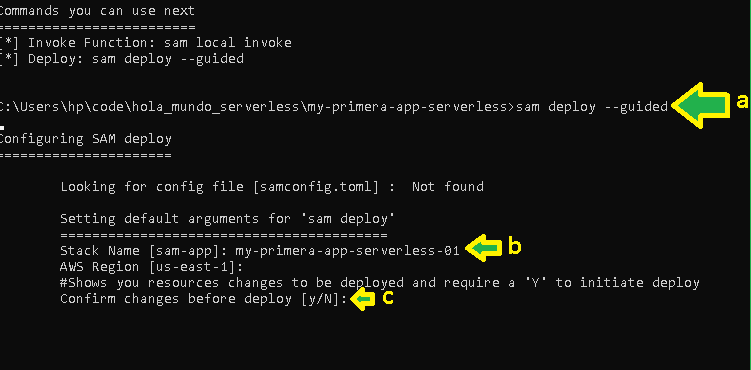
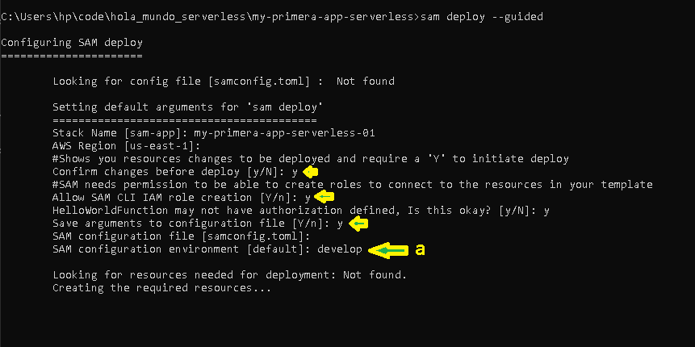
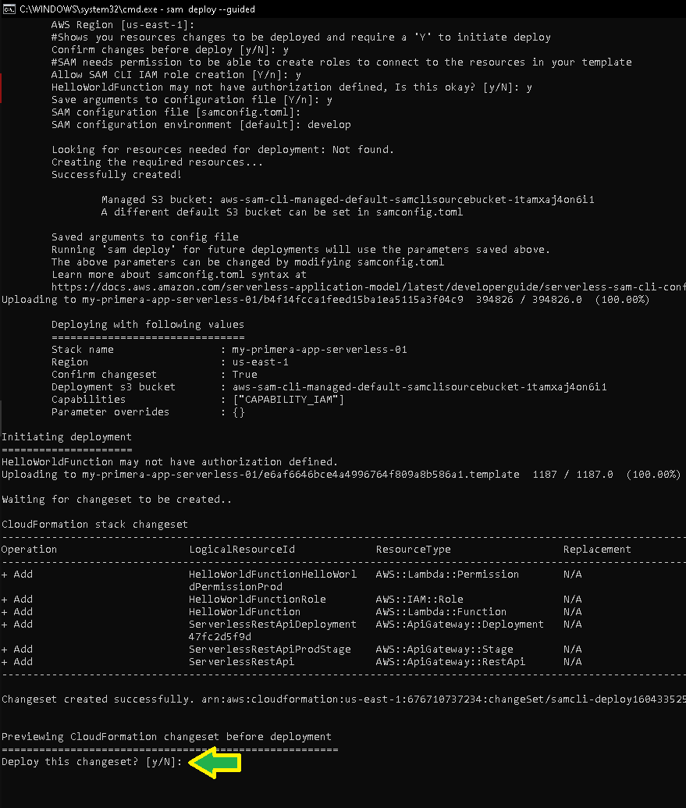
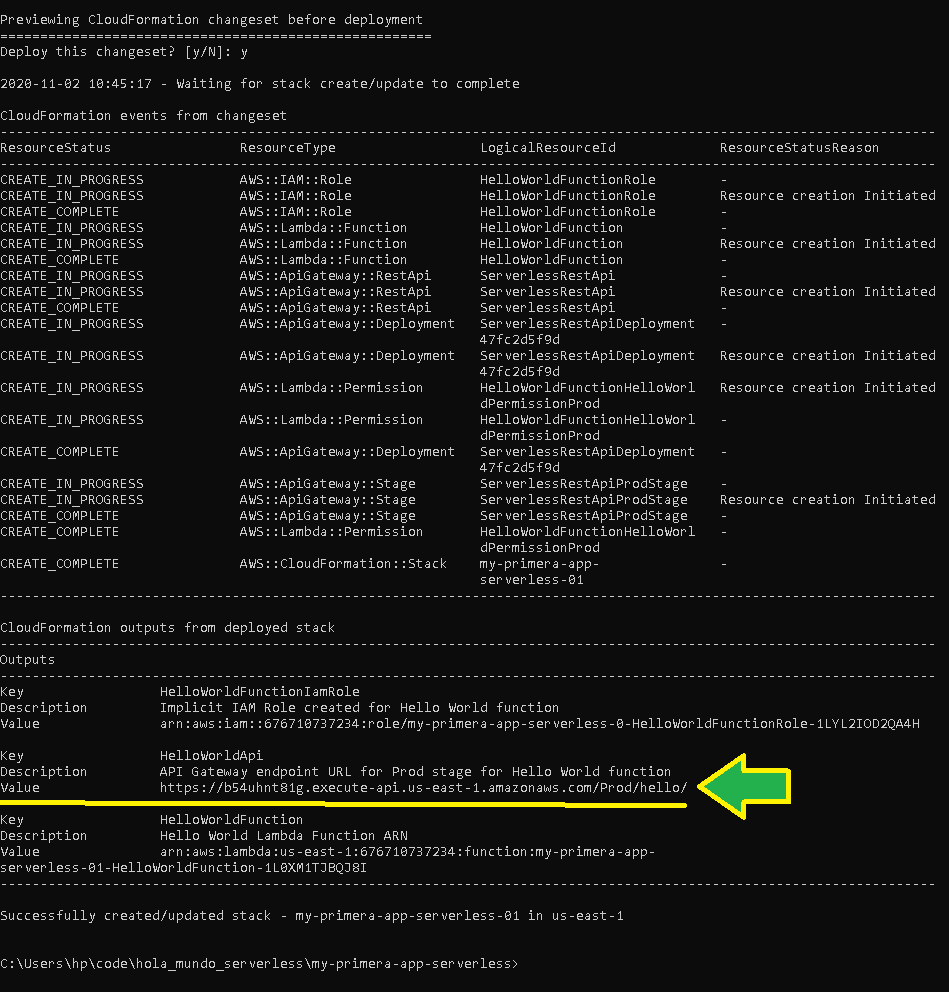

# Ejemplo 1 

# 1. Objetivo 🎯
- Explorar el modelo de computación en la nube Serverless.

# 2. Requisitos 📌
- AWS CLI instalado y configurado.
- Tener instalado [AWS SAM CLI](https://docs.aws.amazon.com/serverless-application-model/latest/developerguide/serverless-sam-cli-install.html), ayudará a hacer el despliegue sobre AWS Lambda y API Gateway más fácil al ser un framework, SAM significa Serverless Application Model.
- [Git instalado](https://git-scm.com).
- Conocimiento básico de la consola de comandos del sistema operativo que se use.
- [NodeJS instalado](https://nodejs.org/en/download/).

# 3. Desarrollo 📑

1. Verificar si se tiene instalado SAM CLI. Ejecutar el comando `sam`

2. Generar una carpeta especial como espacio de trabajo, al tener la carpeta navegar hasta ella y ejecutar `sam init`

3. Seleccionar un template Quick Start (a), seleccionar un lenguaje de prrogramación para este ejemplo será la opción 1 nodejs (b), asignar un nombre del proyecto (c).

4. Un template básico será clonado desde un repositorio remoto (por eso se requiere git instalado) (a), después seleccionar el template "Hello World" (b).

5. Hay que leer el README.md sugerido en la pantalla anterior, dentro del readme se encuentran los comandos para despliegue de la aplicación.

6. Ejecutar los comandos `sam build` en la carpeta del proyecto generado.

7.  Ejecutar el comando `sam deploy --guided`
Se ejecutará un pequeño Wizard que habrá que ir siguiendo (a).
b) Establecer un nombre descriptivo.
c) Confirmar cambios para despliegue.

Por el momento dar click en yes a todas las opciones para poder desplegar la aplicación de ejemplo.
Establecer el nombre de un "ambiente", para este ejemplo se establece como `develop`. El despliegue comienza, se muestra un resumen de los cambios.

8. Desplegar los cambios presionando "Y"

9. Al finalizar el despliegue se muestra una URL, esta URL es la que se podrá usar para consumir el servicio.

10. Al consumir desde el navegador la URL anterior se ve una respuesta de la aplicación.

11. Ir a la consola de AWS al servicio Lambda para ver que sucedió.

12. Al abrir la consola de Lambda, se verá una lambda desplegada.

