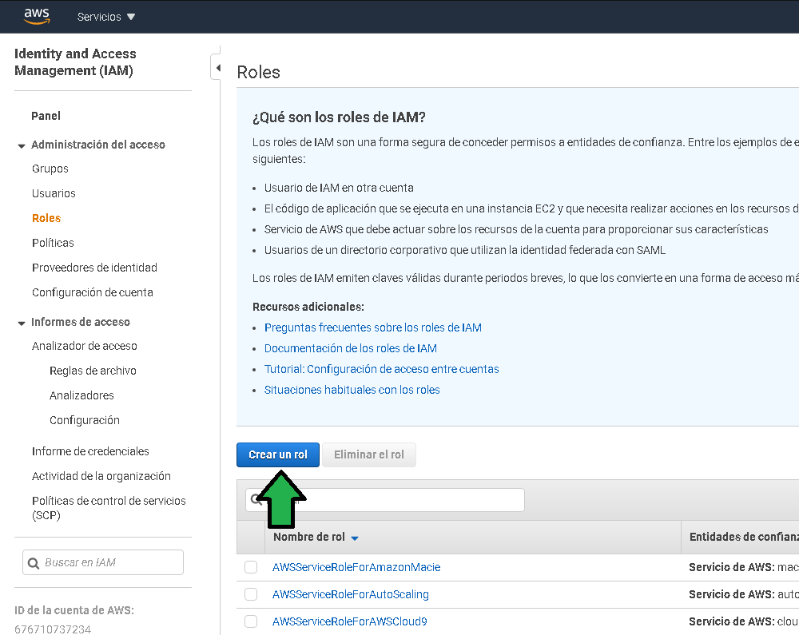
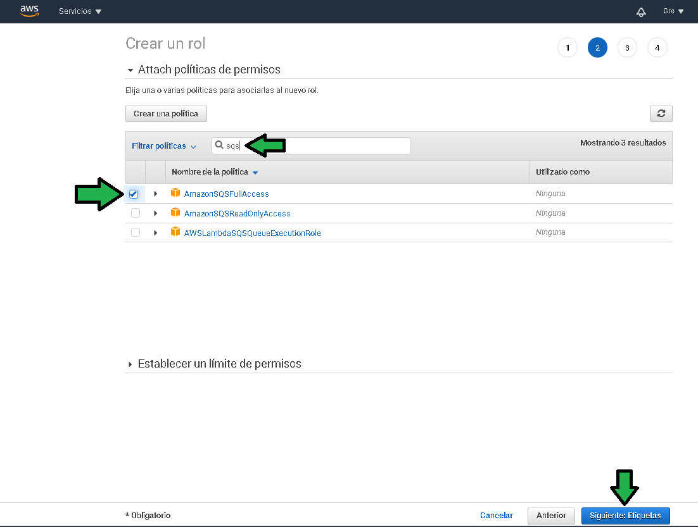
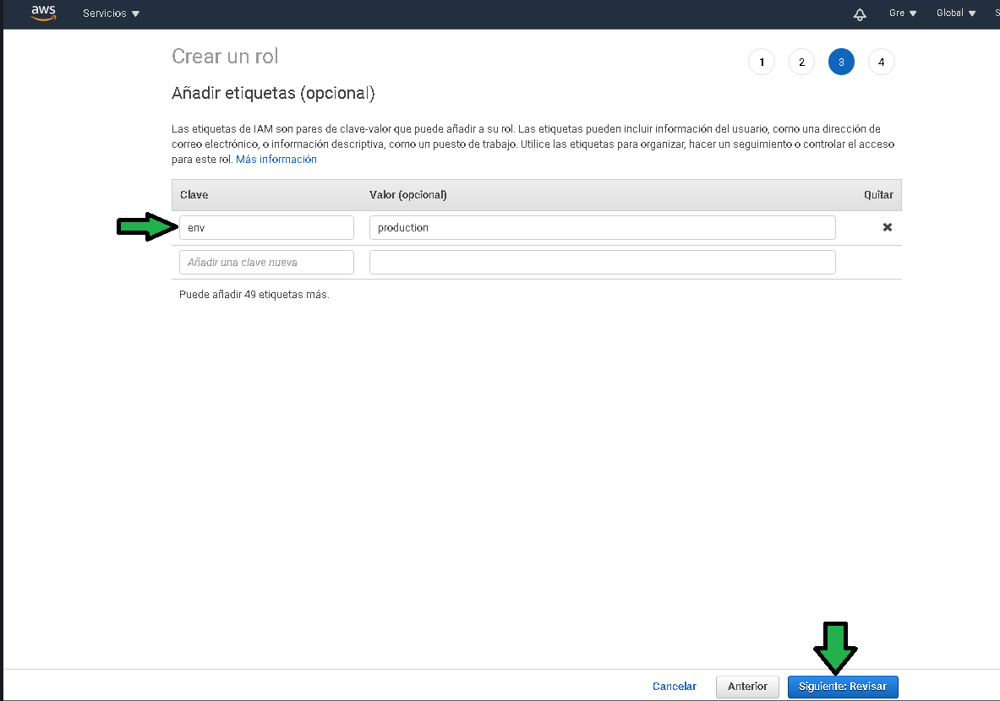
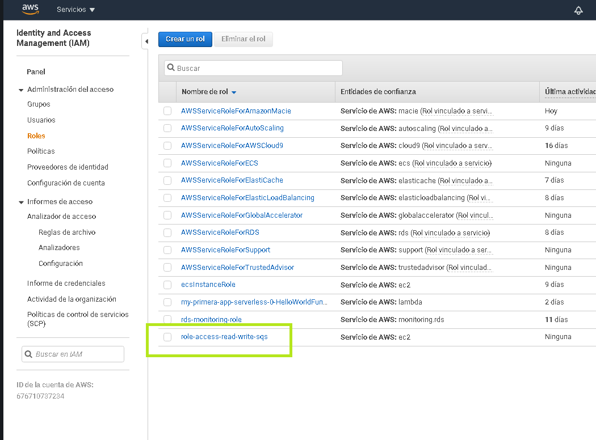
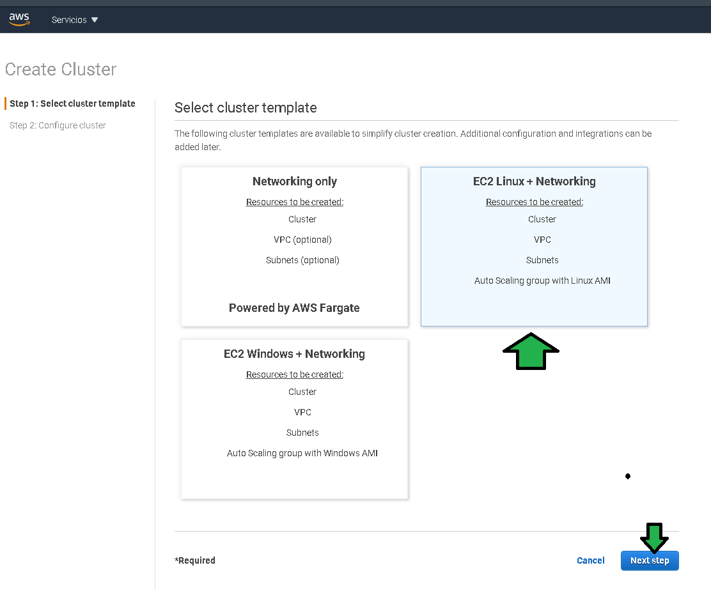
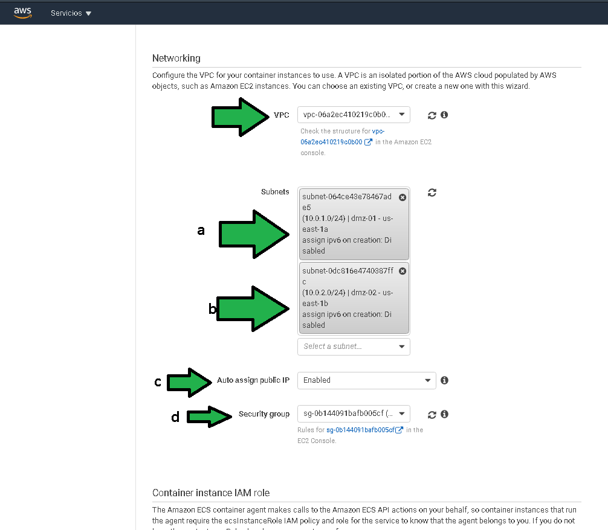
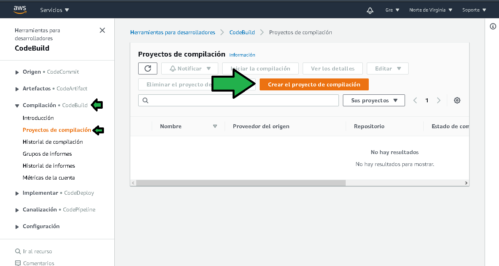

# Postwork

# 1. Objetivo 🎯

# 2. Requisitos 📋
-

# 3. Desarrollo 📑

#### El siguiente ejemplo y código están destinados únicamente a fines educativos. Asegúrese de personalizarlo, probarlo y revisarlo por su cuenta antes de usar cualquiera de esto en producción.

------Acceso a IAM para roles del cluster--

-----

-----------------------

