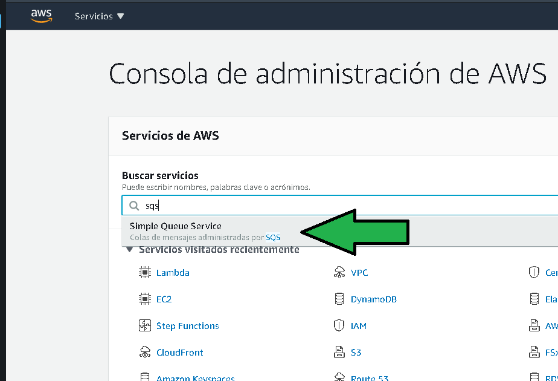
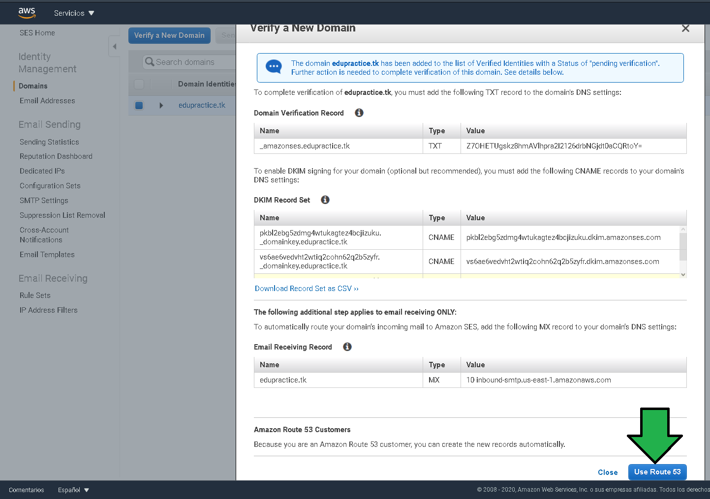
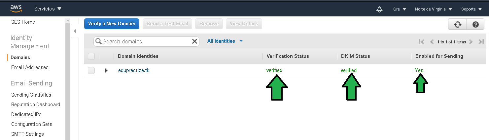
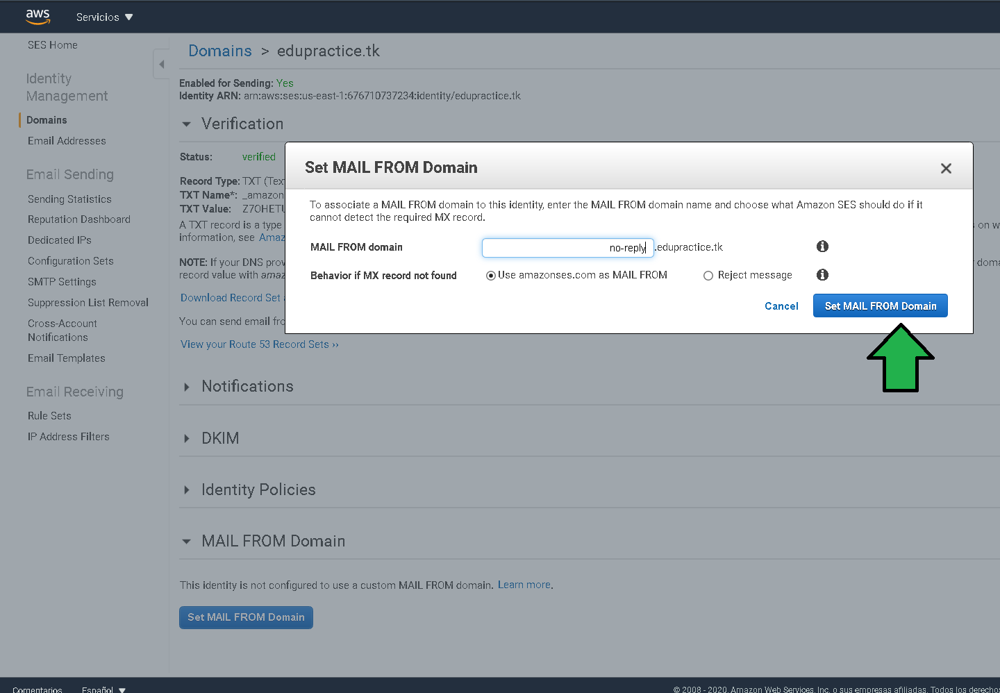
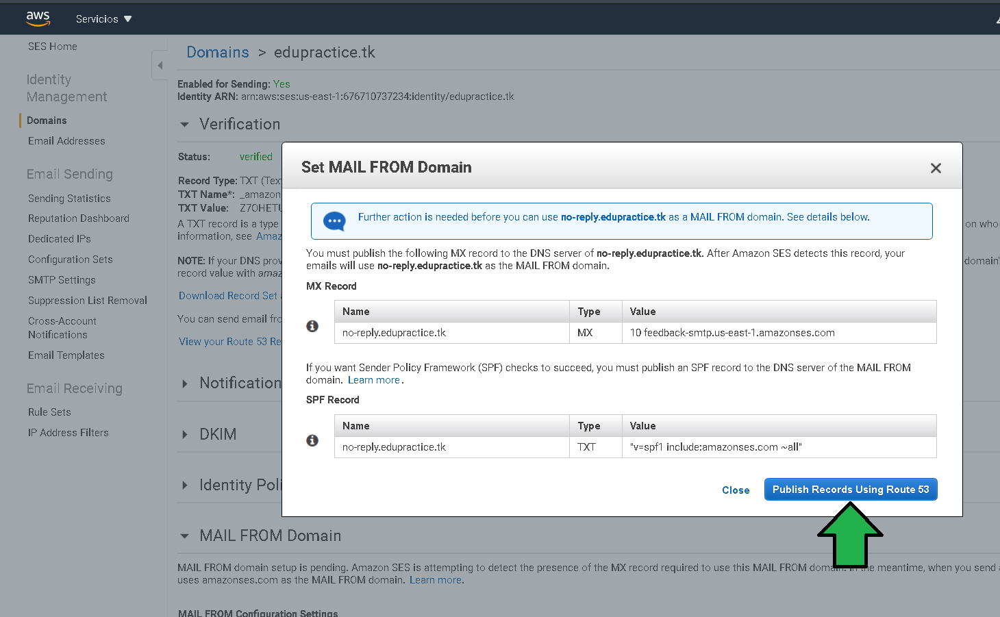
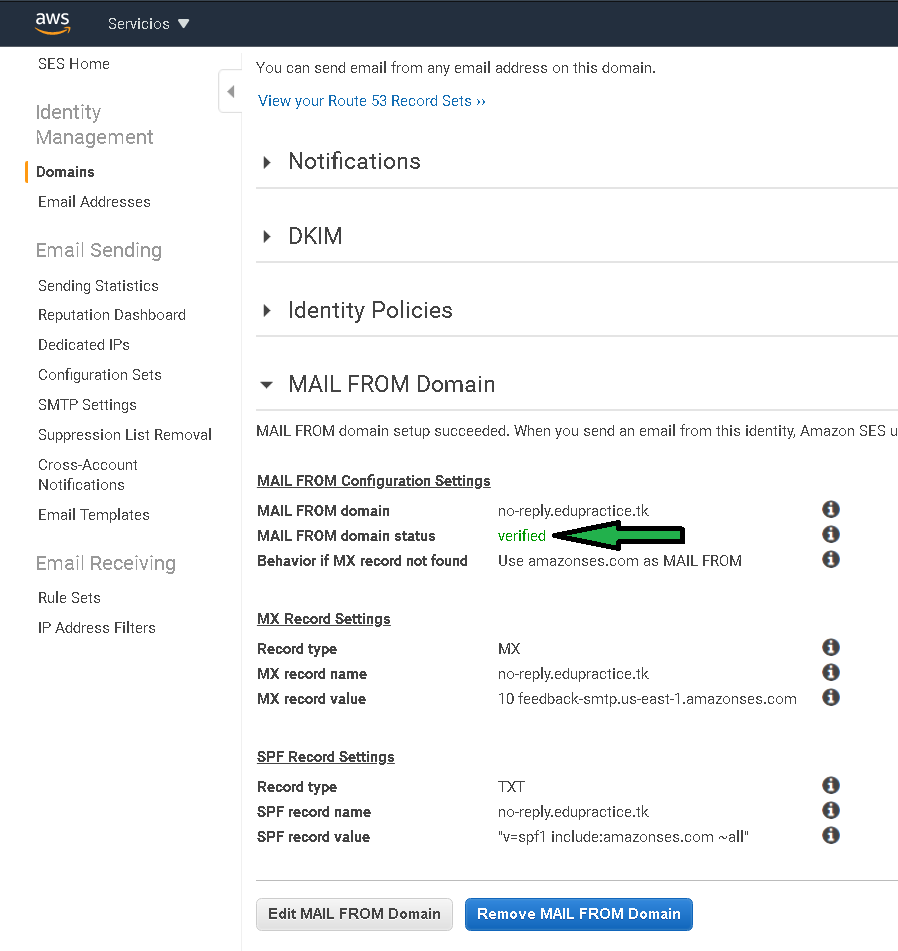
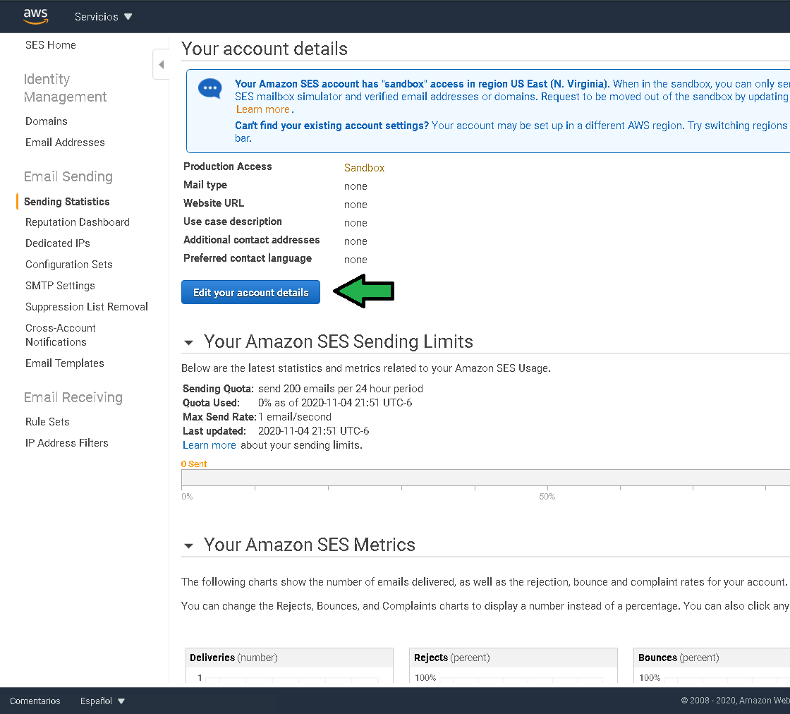

# Postwork

# 1. Objetivo 🎯
- Integración de servicios de Messaging, servicios para la comunicación entre servicios de AWS.

# 2. Requisitos 📋
- AWS CLI configurado
- Acceso a AWS console.

# 3. Desarrollo 📑
#### El siguiente ejemplo y código están destinados únicamente a fines educativos. Asegúrese de personalizarlo, probarlo y revisarlo por su cuenta antes de usar cualquiera de esto en producción.

El desarrollo de este postwork se dividirá en las siguientes fases:
* Establecer la seguridad mínima de acceso para  
* Generación de servicio de encolado de mensajes.
* Generación de cómputo par procesamiento de información.
* Servicio de envío de email.

El servicio SQS será el servicio seleccionado para mantener los datos del email antes de ser enviados en posteriores etapas.

1. Ingresar al servicio SQS en la consola de AWS.

2. Click en "Crear cola"

---------------------
Crear linamientos e instrucciones exactas y específicas que el alumno pueda seguir en cada postwork para que pueda complementar su proyecto postwork que iran realizando el clase y casa

-------------------------
Configurando SES para envío de email.

----------------------------------------

