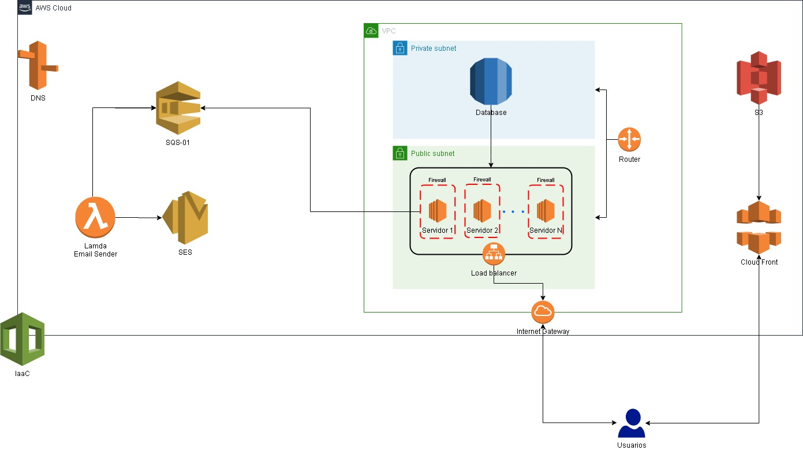

# AWS Cloud Foundations

## Objetivo:

Este curso sirve como preparación para la certificación [AWS Cloud Practitioner (CLF-C01)](https://aws.amazon.com/es/certification/certified-cloud-practitioner/) que valida los conocimientos del ecosistema AWS a nivel practicante, es decir, serás capaz de diseñar y proponer soluciones centradas en los servicios e infraestructura que ofrece AWS en la nube con la finalidad de soportar el **desarrollo**, **despliegue** y **consumo de aplicaciones web**.

El curso también sirve como una introducción a los principales conceptos del cómputo en la nube desde un enfoque tanto de gestión y negocio como práctico. Con los conocimientos adquiridos el podrás armar casos de negocios que consideren los beneficios de diferentes tipos y niveles de servicio que ofrece **AWS** frente a otras alternativas (**Google**, **IBM**, **Microsoft**, etc.).

Entenderás los **economics** y herramientas que te permitirán **optimizar los costos** asociados servicios e infraestructura en la plataforma de AWS que se ajusten a las necesidades de cada proyecto o negocio.

Podrás interactuar con los servicios Core de AWS tanto de cómputo **(EC2)**, **redes** y **distribución de contenido**, **almacenamiento**, **integración de aplicaciones**, **administración** y **gobernanza**.

Pondrás en práctica conceptos fundamentales para mantener una arquitectura confiables y segura, tales como: **Framework AWS Well Architectured**, el **modelo de responsabilidad compartida** y las **políticas de uso**. Además de las funciones para administración de usuarios, permisos y autenticación, así como las mejores prácticas sobre tolerancia a fallos, alta disponibilidad y recuperación ante desastres. 

## Requerimientos

No es necesario, pero sí recomendable tener **conocimientos previos de programación** y experiencia en el uso del **Sistema Operativo Linux**, así como estar familiarizado con los siguientes temas:

+ Redes y sistemas
+ Bases de datos SQL
+ Protocolos de red
+ TCP/IP
+ HTTP

## Proyecto

Subir una aplicación web con Amazon Web Services, que se estará dividido en FrontEnd y BackEnd.

El **FrontEnd** reside en S3 con Cloud CDN y se conectará con el **BackEnd** por medio de un balanceador de carga y  el BackEnd tendrá la capacidad de escalar en horizontal si la carga de trabajo lo requiere y a su vez se conecta a una base de datos RDS en una red privada (dicha base de datos se diseña con un RTO y RPO para hacer los backups).

El FrontEnd y el BackEnd en algún momento tendrán que realizar alguna tarea asíncrona, por lo cual es necesario que esa tarea sea hecha en segundo plano (Ej: un reporte), está tarea se almacena en un SQS y eventualmente esa información sea consumida por una Lambda que será quien haga esa tarea en segundo plano enviando el resultado por email. 

Toda esta infraestructura debe tener un certificado de seguridad para operar, por lo que sería necesario configurar **Route53** para que un dominio sea resuelto.Todo el código para probar el FrontEnd y BackEnd lo podemos bajar en algún proyecto ya hecho, así no sería necesario programar una aplicación desde 0.

