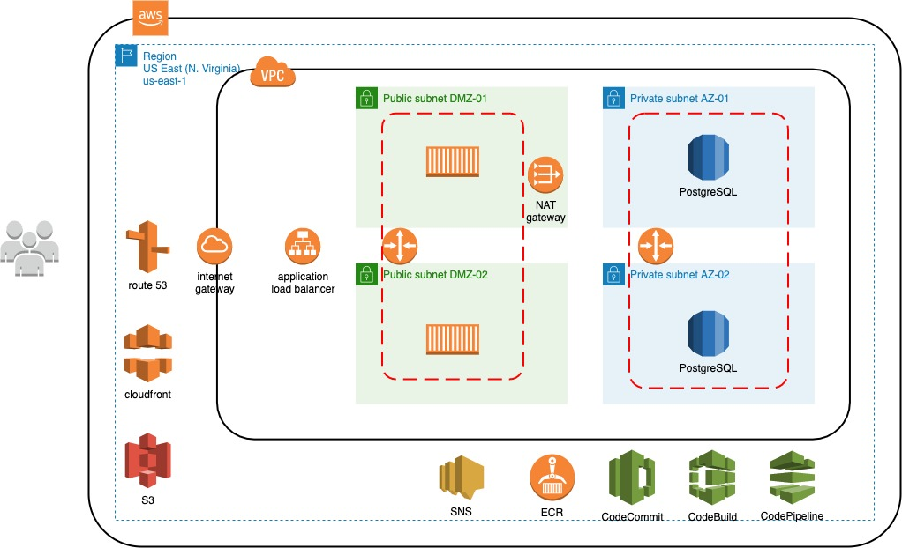

# Ejemplo 01 - Diagramación de arquitectura

## Objetivo

* Enseñar a diagramar arquitecturas en AWS

## Desarrollo

>**🛠 Herramienta**
>
> Para este ejercicio usaremos [diagrams.net](https://app.diagrams.net)

>**💡 Nota para experto(a)**
>
> Mencionar que es preferible que trabajen en `US East (N. Virginia)`
`us-east-1` por el certificado global o bien, una vez que elijan una región, se apeguen a ella

### Instrucciones

1. Comenzar por diagramar las subredes públicas y privadas
2. Agregar BD y grupo de seguridad en subnet privada
3. Poner instancias EC2 y grupos de seguridad en subnets públicas
4. Poner los elementos que la VPC usa para la comunicación interna
    * main route table
    * private route table
    * application load balancer
    * NAT Gateway
    * Internet Gateway

5. Trazar VPC

6. Poner componentes externos a la VPC
    * route 53
    * cloudfront
    * S3
    * SNS

7. Agregar componentes de CI/CD (Development)
    * CodeCommit
    * CodeBuild
    * CodePipeline
    * ECR

8. Trazar región

9. Trazar límite de AWS

10. Agregar usuarios

</img>