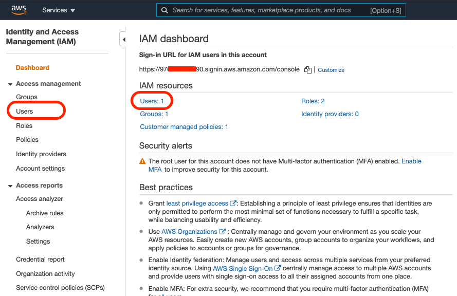
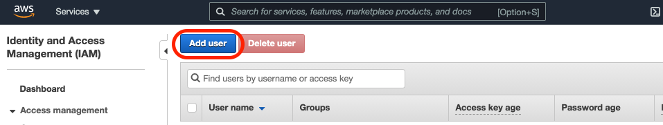
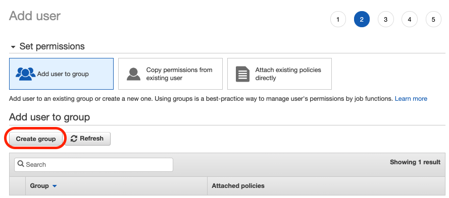
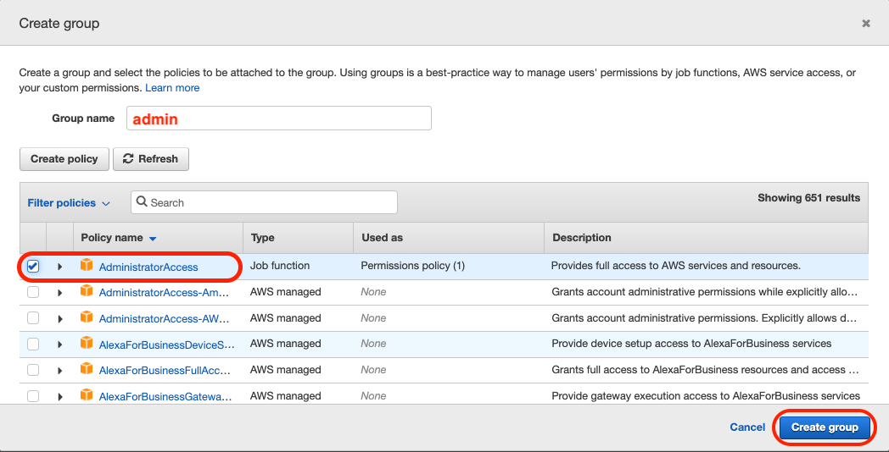
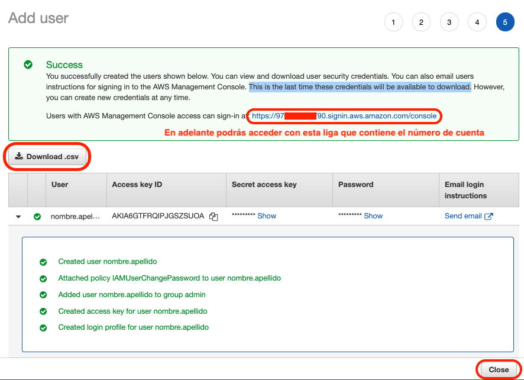

# Reto 06 - Creación de un perfil IAM

## Objetivo

* Crear un usuario que no sea el raiz para usar la cuenta

## Desarrollo

>**💡 Nota para experto(a)**
>
>Menciona al alumno la importacia de no usar el usuario raiz en el día a día de la cuenta

### Instrucciones

1. Al regresar a firmarte a tu cuenta AWS, podras observar que existen dos opciones: 
    * Root user
    * IAM user

2. Selecciona `Root user` e ingresa con el email y contraseña que usaste en la creación de la cuenta
</img>

3. Dentro del buscador de servicios, localiza IAM (Identity and Access Management) e ingresa a `users` ya sea con el menú izquierdo o la opción del dashboard
</img>
4. Da clic en la opción `Add user`
</img>
5. Completa la siguiente información
    * nombre de usuario con el que trabajarás en tu día a día
    * otorga aceso programatico (necesario para el CLI y SDK) y a la consola (acceso web)
    * requiere que se cambie el password después del primer ingreso
    * Da click en `Next`
</img>
6. Procederemos a otorgar los permisos de lo que puede hacer a través de un grupo
    * Da un nombre al grupo como `admin`
    * Seleccionar `AdministratorAccess`
    * Dar click en `Create group`
</img>
</img>
7. Agregar usuario al grupo recien creado
</img>
8. Agregar etiquetas representativas (pregunta a tu instructor qué te sugiere)
9. Descarga el archivo `.csv` que contiene la información de acceso y guardalo en un lugar seguro
</img>
10. Prueba el acceso con la URL que viene en el archivo `.csv` y cambia tu contraseña