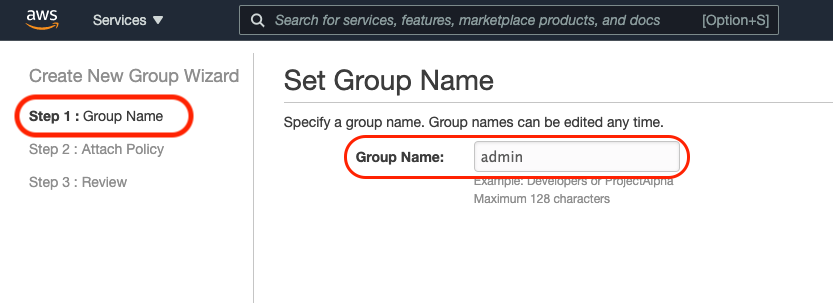

## Postwork 

# 1. Objetivo 🎯

- Complementar los grupos de permisos que necesitaremos a lo largo del curso.

>💡 **Nota:**
>
>Puedes consultar el [Ejemplo 2](./Ejemplo%2002/README.md) para recordar el procedimiento de creación de un grupo

1. Ingresa a IAM/Groups/Create New Group
2. Da el nombre `admin` nombre al grupo
</img>

3. Busca y selecciona los siguientes `policies`
* IAMFullAccess
* Billing
* AmazonAPIGatewayInvokeFullAccess
* AWSConfigRole
* AWSConfigUserAccess
* AmazonAPIGatewayAdministrator
* AWSKeyManagementServicePowerUser
</img>

4. Teniendo todas seleccionadas, da click en `Next Step`

5. Verifica que todas las `policies` se encuentren incluidas y da click en `Create group`
</img>

6. Entra al grupo recien creado y da click en `Add Users to Group`
</img>

7. Busca a tu usuario IAM y después de seleccionarlo, da click en `Add Users`
</img>

8. Repite los pasos anteriores para crear o completar los siguientes grupos

`admin`
* AmazonEC2FullAccess
* ElasticLoadBalancingFullAccess
* AmazonS3FullAccess
* CloudFrontFullAccess
* AmazonVPCFullAccess
* AmazonMacieFullAccess
* AmazonESFullAccess
* AmazonSNSFullAccess
* AmazonRoute53FullAccess
* AWSCertificateManagerFullAccess

`cloud`
* AmazonEC2FullAccess
* ElasticLoadBalancingFullAccess
* AmazonS3FullAccess
* CloudFrontFullAccess
* AmazonVPCFullAccess
* AmazonMacieFullAccess
* AmazonESFullAccess
* AmazonSNSFullAccess
* AmazonRoute53FullAccess
* AWSCertificateManagerFullAccess

`data`
* ComprehendFullAccess
* AmazonRekognitionFullAccess
* AmazonRekognitionServiceRole
* AWSGlueConsoleFullAccess
* AmazonRekognitionCustomLabelsFullAccess

`databases`
* AmazonRDSFullAccess
* AmazonDynamoDBFullAccess
* AmazonKeyspacesFullAccess

`devops`
* AWSCodeCommitFullAccess
* AmazonEC2ContainerRegistryFullAccess
* AmazonECS_FullAccess
* AWSCodePipelineFullAccess
* AWSCodeBuildAdminAccess
* AWSCloudFormationFullAccess
* AmazonElasticContainerRegistryPublicFullAccess
* AWSLambda_FullAccess

9. Agrega tu usuario a cada uno de los grupos creados