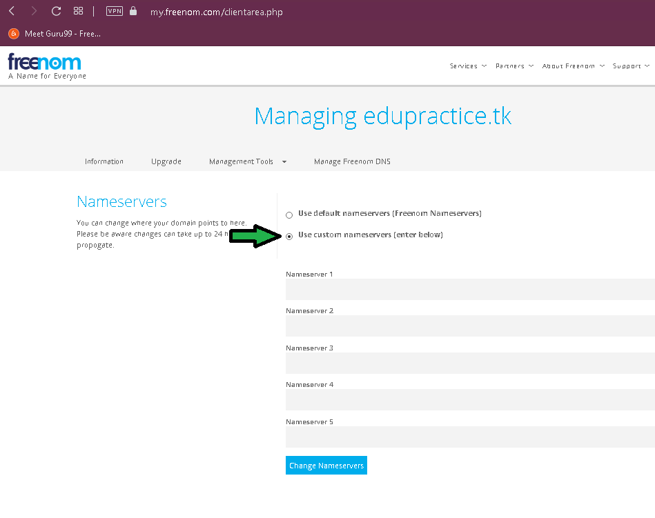

# Reto 04 - Adquirir un dominio

## Objetivo

* Crear y configurar un dominio.

## Desarrollo

> **💡 Nota para experto(a).**
>
>Guía al alumno a crear un dominio, explicar la ventajas y desventajas de un dominio privado y un dominio público y ayudar a tomar una decisión sobre que tipo de dominio usar. 

Vamos a necesitar un dominio del cual seas dueño para el proyecto final, si no quieres gastar dinero [Freenom](https://www.freenom.com/es/index.html?lang=es) es una buena opción gratuita, si quieres optar por una opción de paga puedes acercarte a [Namecheap](https://www.namecheap.com/), es posible comprar un dominio dentro de Amazon Web Services pero nos quitará la diversión de configurar el **DNS** por nosotros mismos  , eso sin contar que muchos de los clientes cuentan con dominios comprados fuera de Amazon. 

> **❗Cuidado**
>
>Se recomienda encarecidamente que no se usen dominios ligados a algún servicio en producción ya que en la manipulación podríamos afectar el sitio productivo.
**Si lo desea usar, úsese bajo su propio riesgo.**

> **💡 Nota:**
>
>Para este ejercicio vamos a usar un dominio público. 

1. Ingresar a Freenom y acceder por medio de gmail.

</img>

> **💡 Nota:**
>
>Ya con la cuenta generada habrá que registrar un nuevo dominio.

2. Finalizado el proceso de registro ingresar a **Mis dominios:**

</img>

3. Dar click en **Manage Domain**

</img>

4. Dar click en **nameservers**

</img>

#### 5. Ahora selecciona Use Custom Nameservers

</img>

> **💡 Nota:**
>
>**Dejar en blanco** los campos por el momento y abrir una nueva pestaña del navegador para ingresar a la consola de AWS.

6. Ya en la consola, buscar el servicio **Route53** y acceder a él.

</img>

7. Dar click en **Crear una zona alojada**

</img>

8. Ingresar el nombre del dominio que fue registrado en freenom (1), una descripción (2) y seleccionar Zona pública (3).

</img>

9.  Se generará la zona del dominio, comparemos los valores del registro de tipo **NS** a la pantalla del [paso 5](https://github.com/beduExpert/AWS-Cloud-Foundations2020/tree/main/1.-Fundamentos%20de%20Cómputo%20en%20la%20Nube/Reto%2004#5-ahora-selecciona-use-custom-nameservers). 

</img>

</img>

10. Finalmente confirmar a freenom que queremos que AWS maneje el **DNS** del dominio.

</img>

De ahora en adelante todos los cambios que tengan que ver con DNS del dominio deberán ser gestionados en la consola de **Route53**.

11. Después de 10 minutos (aunque pueden pasar hasta 24 horas) se puede verificar con Whois que el dominio ya es manejado por **AWS**.

</img>