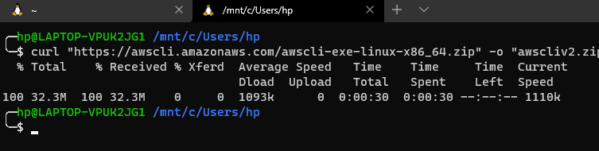
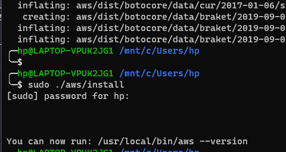

# Ejemplo 1 - Usando AWS CLI

## 1. Objetivo 
- Gestionar los recursos de AWS por línea de comandos con AWS CLI.

## 2. Requisitos 
- Sistema operativo actualizado.
- Python 3.4 o superior instalado. [¿Cómo instalar?](https://aws.amazon.com/es/blogs/developer/deprecation-of-python-2-6-and-python-3-3-in-botocore-boto3-and-the-aws-cli/).
- Fecha y hora correcta en el equipo local.

## 3. Desarrollo 

### Instala los siguientes recursos de AWS dependiendo de tu Sistema Operativo

* [Windows](https://github.com/beduExpert/AWS-Cloud-Foundations2020/tree/main/Sesi%C3%B3n%2002/Ejemplo%2001#instalaci%C3%B3n-en-windows)
* [Linux](https://github.com/beduExpert/AWS-Cloud-Foundations2020/tree/main/Sesi%C3%B3n%2002/Ejemplo%2001#instalaci%C3%B3n-linux)
* [Mac OS](https://github.com/beduExpert/AWS-Cloud-Foundations2020/tree/main/Sesi%C3%B3n%2002/Ejemplo%2001#instalaci%C3%B3n-en-mac)

### Instalación en Windows:

1. En Windows basta con descargar e instalar el siguiente [MSI](https://awscli.amazonaws.com/AWSCLIV2.msi)

</img>

2. Aceptar términos y condiciones, después especificar el directorio de instalación.

</img>

3. Esperar a finalizar la instalación.

</img>

</img>


4. Verificar la instalación abriendo una consola CMD ejecutando el comando `aws --version`

</img>

#### [Una vez instalado, pasaremos a la configuración de los recursos de AWS](https://github.com/beduExpert/AWS-Cloud-Foundations2020/tree/main/2.-Infraestructura%20y%20servicios%20en%20la%20nube/Ejemplo%2001#configuración)

### Instalación Linux:

1. Descargar el instalador para Linux con el comando:
```sh
curl "https://awscli.amazonaws.com/awscli-exe-linux-x86_64.zip" -o "awscliv2.zip"
```

</img>

2. Descomprimir el zip descargado con el comando 
```sh
unzip awscliv2.zip
```
</img>

3. Ejecutar instalador.
```bash
sudo ./aws/install
```
Ingresar el password para sudo, esperar por la instalación.

</img>

4. Comprobar la instalación con el comando
```bash
aws --version
```
</img>

#### [Una vez instalado, pasaremos a la configuración de los recursos de AWS](https://github.com/beduExpert/AWS-Cloud-Foundations2020/tree/main/2.-Infraestructura%20y%20servicios%20en%20la%20nube/Ejemplo%2001#configuración)

### Instalación en MAC:

1. Descargar el instalador pkg [aquí](https://awscli.amazonaws.com/AWSCLIV2.pkg).
2. Iniciar el instalador dando doble click al archivo instalado.

#### [Una vez instalado, pasaremos a la configuración de los recursos de AWS](https://github.com/beduExpert/AWS-Cloud-Foundations2020/tree/main/2.-Infraestructura%20y%20servicios%20en%20la%20nube/Ejemplo%2001#configuración)

### Configuración

Ya instalado AWS CLI, es necesario configurarlo.

1. Teniendo a la mano el archivo `.csv` generado en el [reto 06](../../Sesión%2001/Reto%2006/README.md) de la `Sesión 01`, ejecutar el comando:
```bash
aws configure
```

</img>

>💡  **Nota:**
> 
>Se recomienda seleccionar la región con menos latencia, se puede medir con [ping](https://ping.psa.fun)

Para obtener las claves de acceso pasar a la siguiente sección del ejemplo.

2. Con el comando ```aws help``` se puede consultar la ayuda.
3. Para obtener los usuarios en la cuenta AWS el comando es:

</img>

4. Se puede obtener una lista de los subcomandos disponibles, por ejemplo, para obtener los subcomandos disponibles para el comando "iam" ejecutar el comando 
```bash
aws iam help
```
El punto clave es el argumento `help`

</img>
