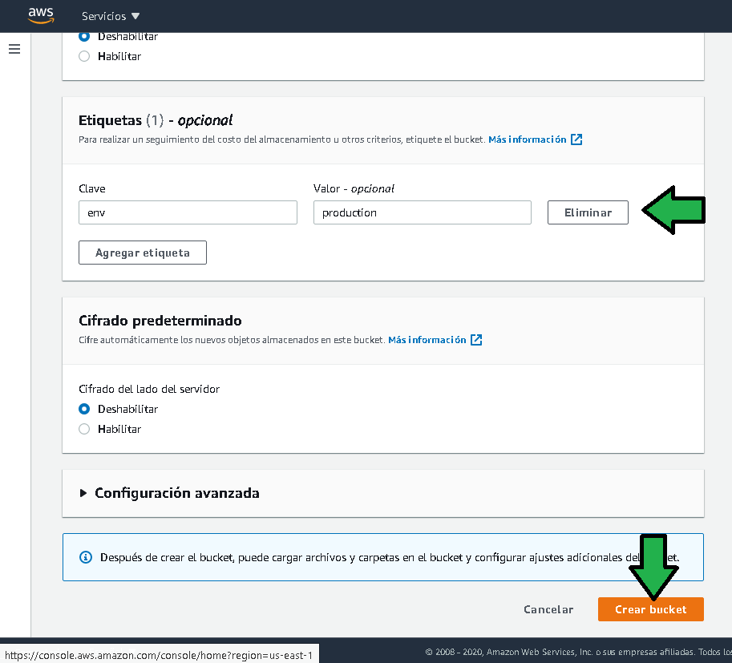
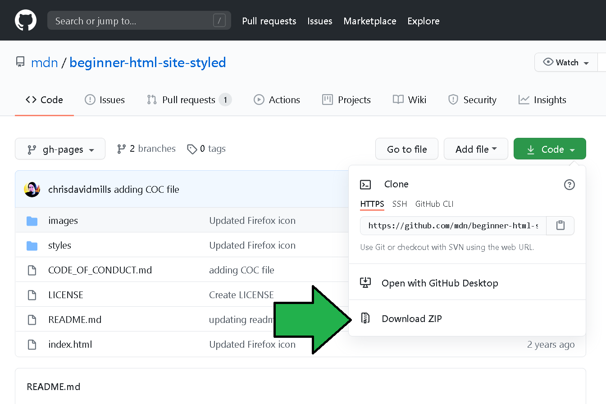
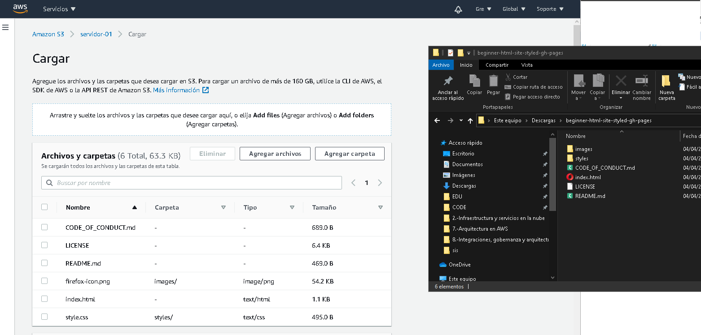
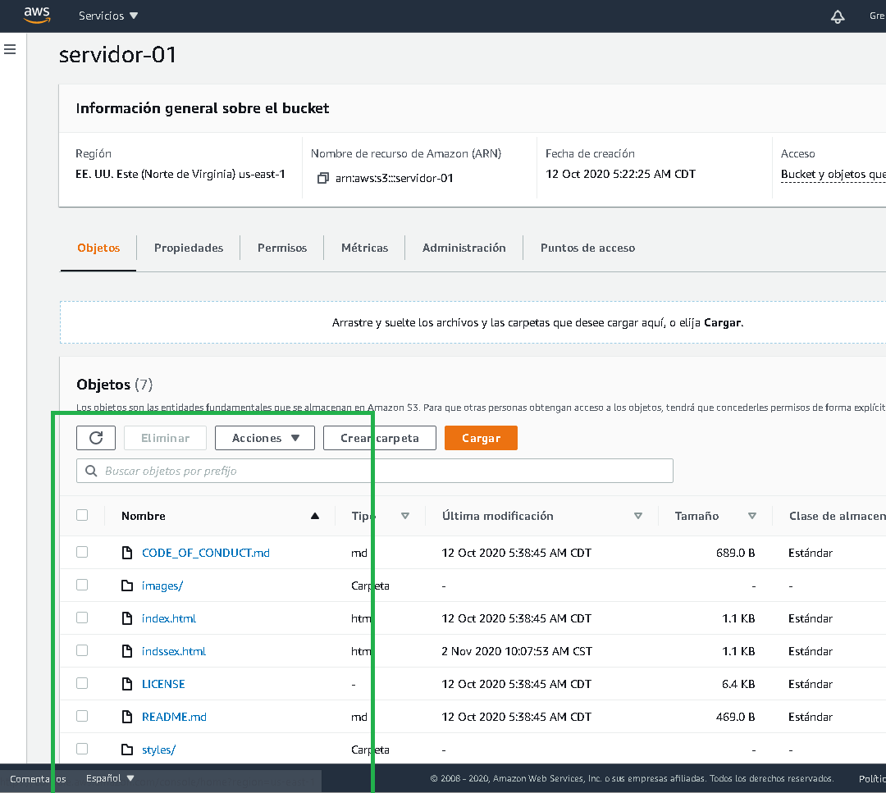
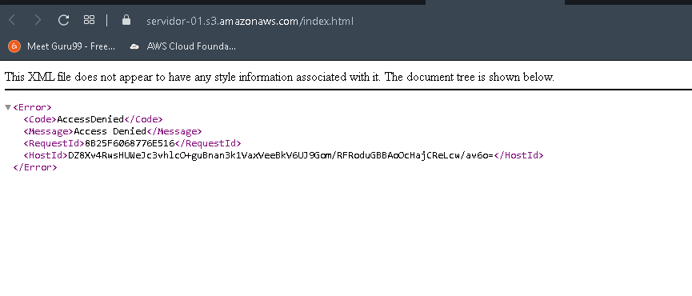
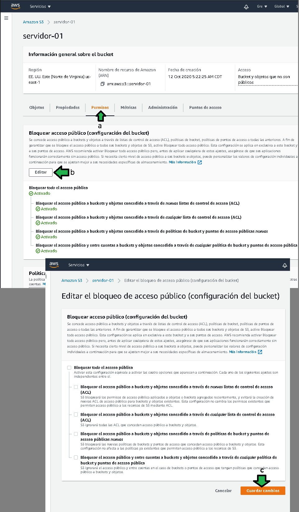

# Ejemplo 3 - Servidor web estático

## 1. Objetivo 
- Poner en marcha un bucket S3 como un servidor web estático.

## 2. Requisitos 
- Git instalado localmente. [¿Cómo instalar git?](https://git-scm.com/book/en/v2/Getting-Started-Installing-Git).
- [Repositorio en local]( https://github.com/mdn/beginner-html-site-styled).

## 3. Desarrollo 

1. Ingresar a la consola de AWS y seleccionar **S3**.

</img>

2. Dar click en **nuevo bucket**.

</img>

3. Seleccionar un nombre para el bucket, recordar que el nombre debe ser único es decir que no se haya repetido en ninguna otra cuenta de AWS.

</img>

4. Dejar la configuración de acceso por **defecto**

</img>

### A continuación estableceremos etiquetas para nuestro bucket.

6. Dar click en **Crear bucket**

</img>

### Observa la generación del bucket:

</img>

7. Descargar el zip del [repositorio](https://github.com/mdn/beginner-html-site-styled), descomprimir el contenido.

</img>

8. Dar click en **Cargar**

</img>

9. Arrastrar los archivos y carpetas, si no se arrastran las carpetas no pueden ser seleccionadas. Dar click en **Cargar**

</img>

>💡**Nota:**
>
>Los archivos serán cargados y se podrán ver en la consola de AWS S3.

</img>

Al dar click en el archivo **index.html** se visualizan una serie de propiedades (metadatos), entre ellas se tiene la **URL del objeto**

</img>

Al dar click en la URL tenemos el siguiente error.

</img>

**No te preoucupes.** Aún faltan pasos antes de que el archivo sea visible desde internet.

### Los pasos siguientes son:

10. Regresando al nivel de bucket (a), dar click en propiedades (b), seleccionar **Alojamiento de sitios web estáticos**
</img>

11. Establecer la configuración de alojamiento estático (a), proporcionar el nombre del archivo que será servido por default (b), click en guardar (c).

</img>
 
 12. A nivel bucket pasar a **Permisos** (a), editar (b) y desactivar la opción bloquear todo acceso público (c), guardar cambios.
 
 </img>

13. En información general a nivel de bucket (a), seleccionar todos los archivos (b), después click en **Hacer público**.

</img>

14. Hechos los  pasos anteriores la página web esta lista para ser servida.

</img>

