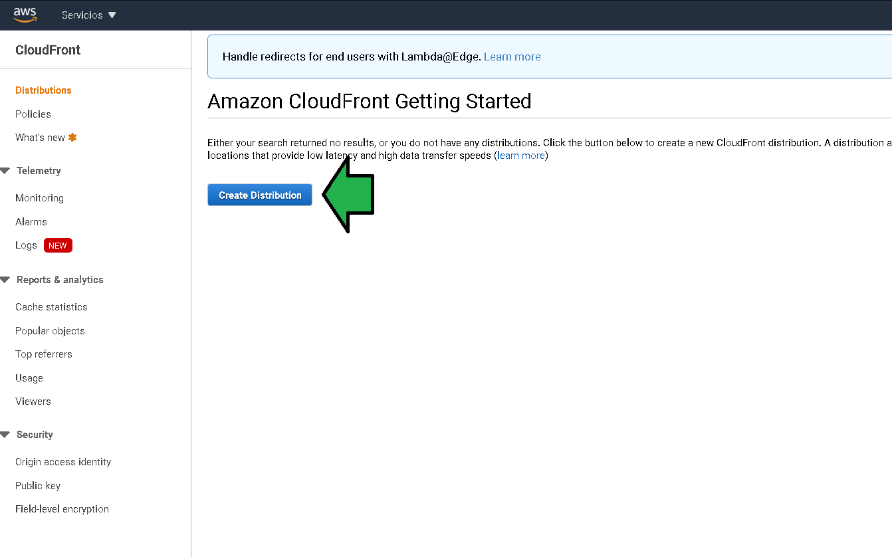
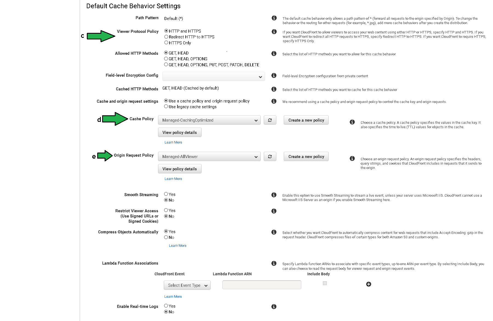
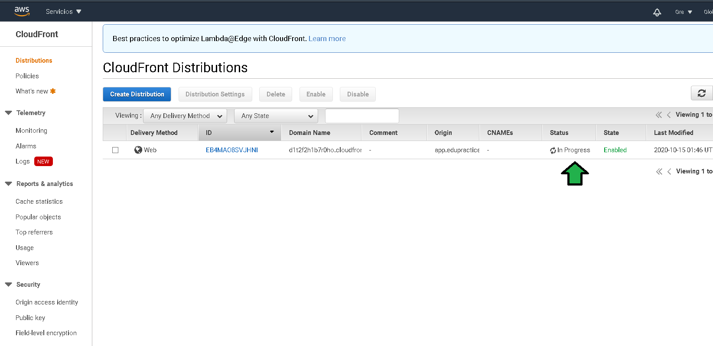

# Ejemplo 1 - Hosting con Cloud Front

## 1. Objetivo 
- Servir el contenido del bucket que hostea la página web con CloudFront.

## 2. Requisitos 
- Acceso a una cuenta de AWS por medio de AWS Console

## 3. Desarrollo 

1. Acceder a la AWS console, buscar el servicio **Cloudfront**.

</img>

2. Seleccionar:

</img>

3. Comenzar con la configuración.

</img>

4. Hay varios parámetros a configurar, se señalan los más icónicos.
- a) Se debe el origen de los datos del dominio, en este caso el bucket con el sitio previamente configurado.
- b) Se actualizará la política de acceso al bucket, así, Cloud Front puede acceder a los datos del bucket S3.

</img>

- c) Especificar acceso HTTP y HTTPS.
- d) Se especifica una política de caché, la política de cache dicta el tiempo en que CloufFront servirá archivos desde el propio CloudFront antes de ir a traer los archivos desde el bucket S3, esto es lo que hace que las peticiones al CloudFront sean más rápidas, un request en lugar de recorrer grandes distancias hasta la ubicación del bucket recorre una menor distancia hasta un [Edge location de CloudFront](https://aws.amazon.com/es/about-aws/whats-new/2018/01/cloudfront-adds-six-new-edge-locations/). Por defecto son 24 horas.
- e) Las políticas de solicitud de origen gobiernan cómo CloudFront transmite metadatos en tiempo de solicitud a su origen cuando se realiza una solicitud de origen (una pérdida de caché o una revalidación). Ejemplos de esto son los encabezados geográficos y los encabezados de tipo de dispositivo que CloudFront puede generar a partir de datos proporcionados por el cliente, como la dirección IP y el encabezado del agente de usuario.

</img>

- f) Price Class define que Edge Locations copiarán el contenido del origen, cada Edge Location cuenta con precios distintos, el Price Class seleccionado impactará en el precio pero también en la latencia de los usuarios, en general si se agregan más Edge Locations habrá menos latencia al contenido de los usuarios pero el precio del servicio aumentará.
- g) Dejar el dominio por el momento en blanco, eventualmente se editará esta opción para asignar un dominio propietario junto con un certificado SSL/TLS. 
- h) Seleccionar el certificado por defecto.
- i) Especifica la versión del protocolo HTTP a ser usado, se recomienda seleccionar la compatibilidad para la [versión 2](https://developers.google.com/web/fundamentals/performance/http2).
- j) Define que archivo debe ser servido por defecto en caso de hacer el request al dominio raíz.
- k) Por último se define el estado del la distribución, se deja como habilitado para utilizar en cuanto este listo.

</img>

5. La distribución de CloudFront comienza a ser creada, después de unos 5 minutos estará lista. 

</img>

6. Abrir el detalle de la distribución, seleccionar el dominio, pegarlo en el navegador.

</img>

7. Después de algunos minutos se tendrá el sitio web servido con Cloudfront.

</img>