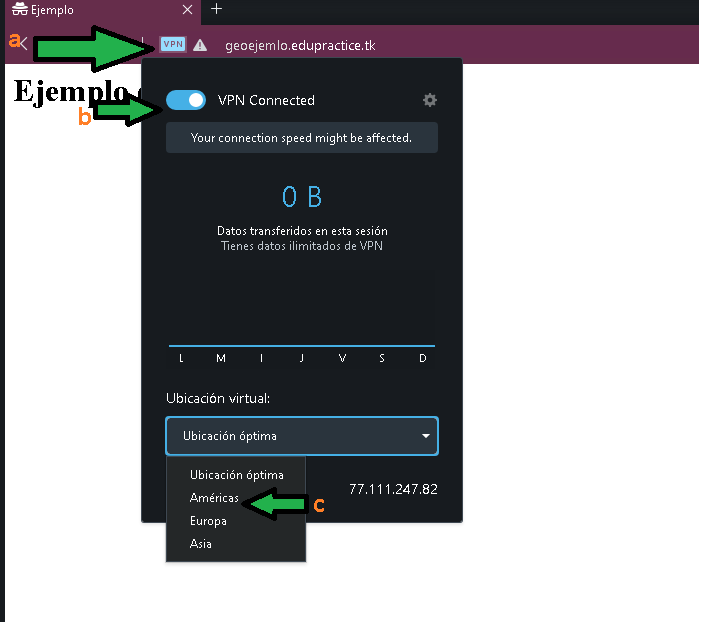
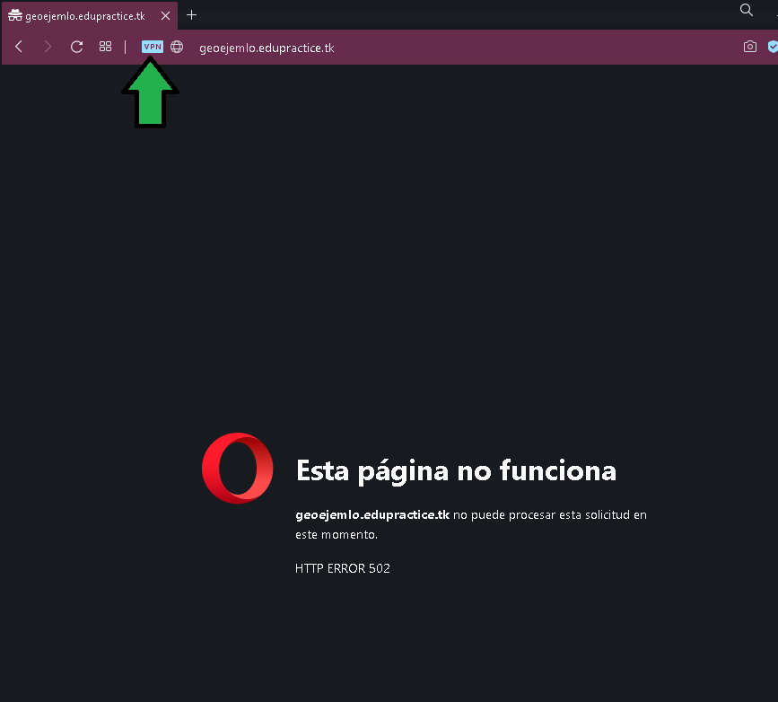

# Ejemplo 2

## 1. Objetivo 
- Bloquear peticiones que no se hagan desde México configurando el servicio Route53.

## 2. Requisitos
- Acceso a AWS Console.
- Conocimiento básico sobre como funciona el protocolo DNS.
- Una página hosteada en S3, el nombre del bucket debe coincidir con el subdominio para hacer pruebas `geoejemlo`, así el bucket debe  llamarse para este ejemplo `geoejemlo.<sudominio>`
- Navegado Opera instalado.

## 3. Desarrollo 

1. Acceder al servicio **Route53**.

</img>

2. Seleccionar **Zona alojada**

</img>

3. Seleccionar el dominio.

</img>

4. Seleccionar **Crear un registro**

</img>

5. Seleccionar **Geolocalización**

</img>

6. Establecer el subdominio (a), luego seleccionar "Definir un registro de geolocalización" (b).

</img>

7. Configurar el registro de geolocalización como:
a) Seleccionar a donde será redirigido el tráfico, en este caso S3.
b) Seleccionar la región donde se encuentra el bucket deseado
c) Seleccionar el bucket.
d) Establecer la ubicación permitida.
e) Establecer un nombre representativo del registro.

</img>

8. Configurado el registro habrá que crearlo dando click en **Crear registros**.

</img>

Segundos después se notifica la creación del registro.

</img>

9. Acceder al subdominio en un navegador en una sesión de incógnito.

</img>

10. Activar la VPN del navegador seleccionando **Americas**, con ello se verá como al acceder desde una IP de otro país no hay acceso. 

</img>

Activada la VPN y refrescando pantalla se ve no hay acceso.

</img>

Accediendo a [iplocation](https://www.iplocation.net) se ve que la dirección IP está fuera de México.

</img>

