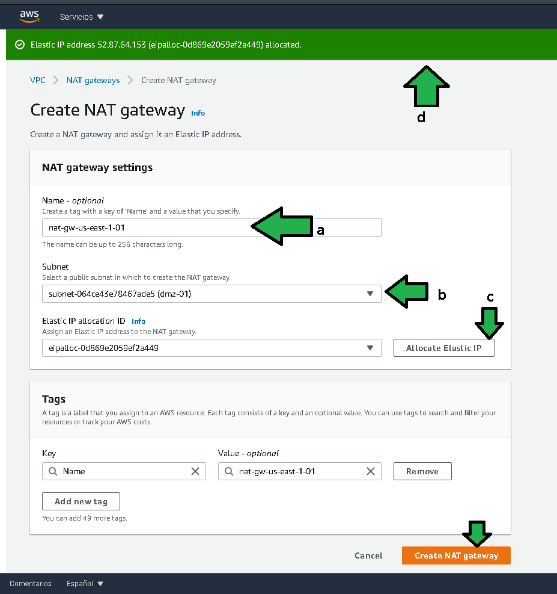
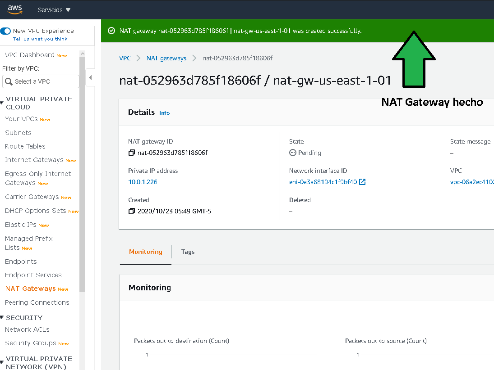
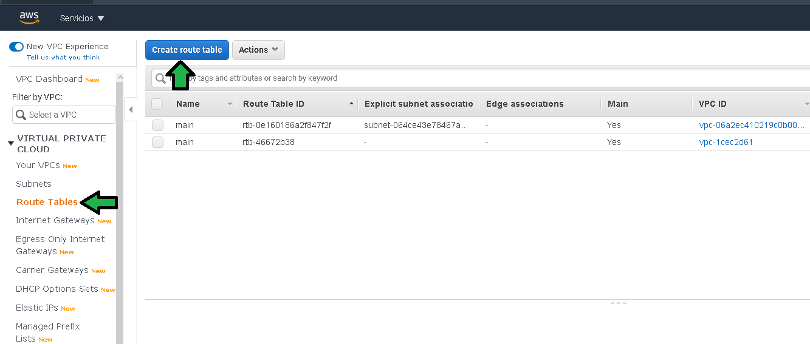
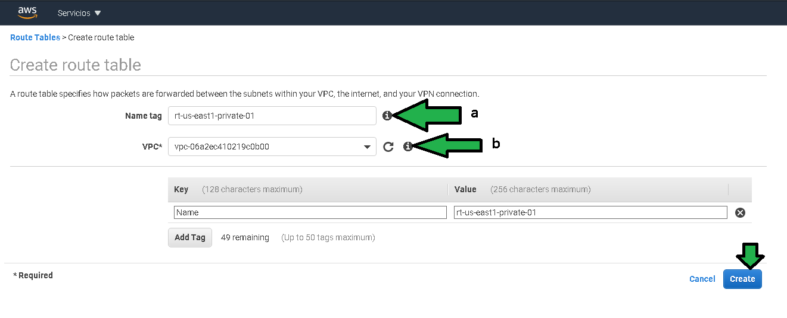
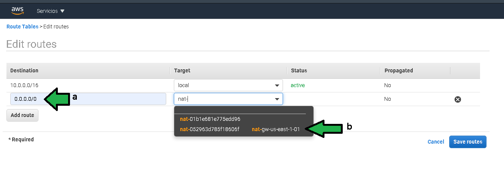
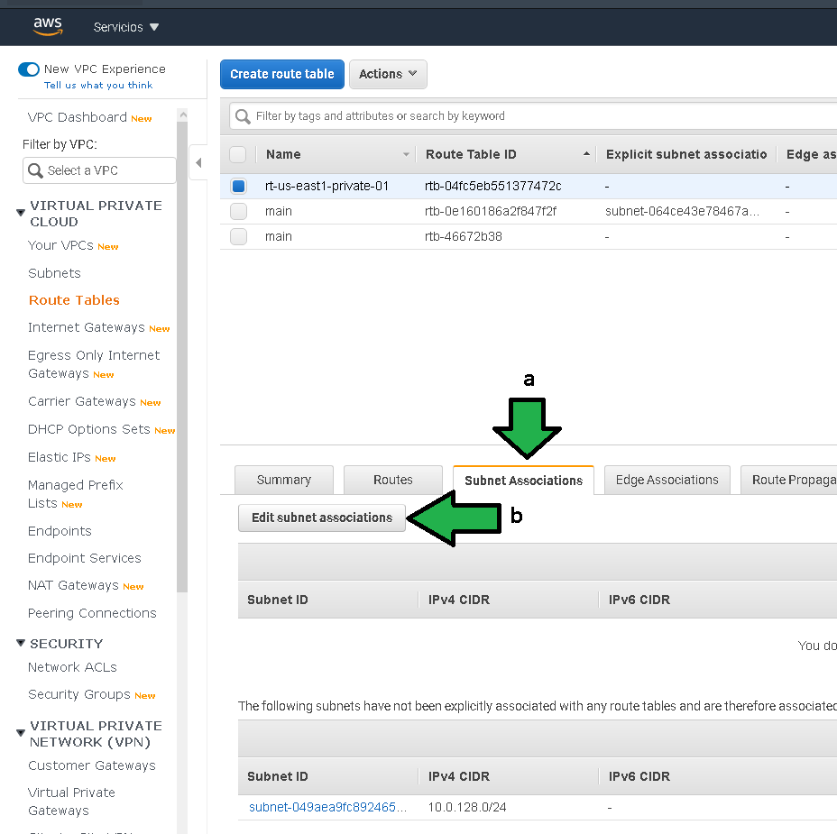
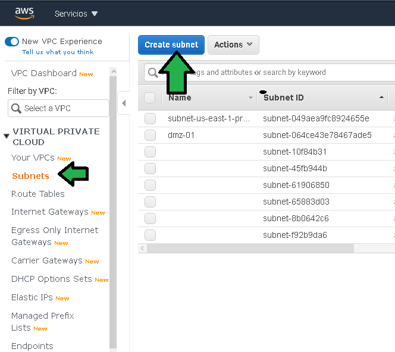
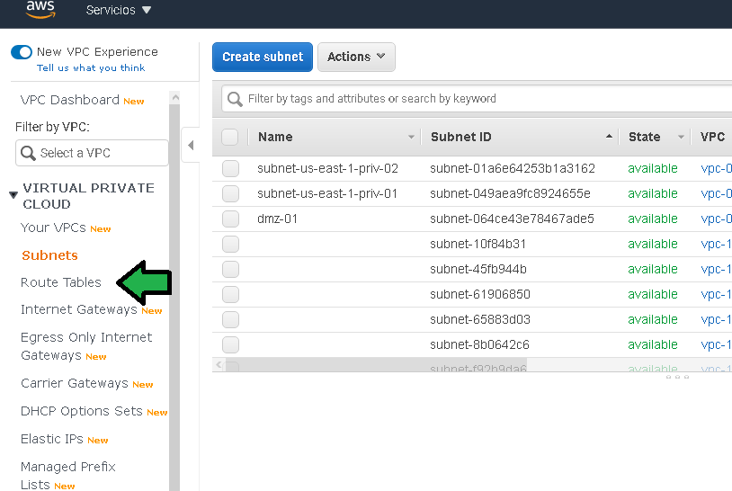
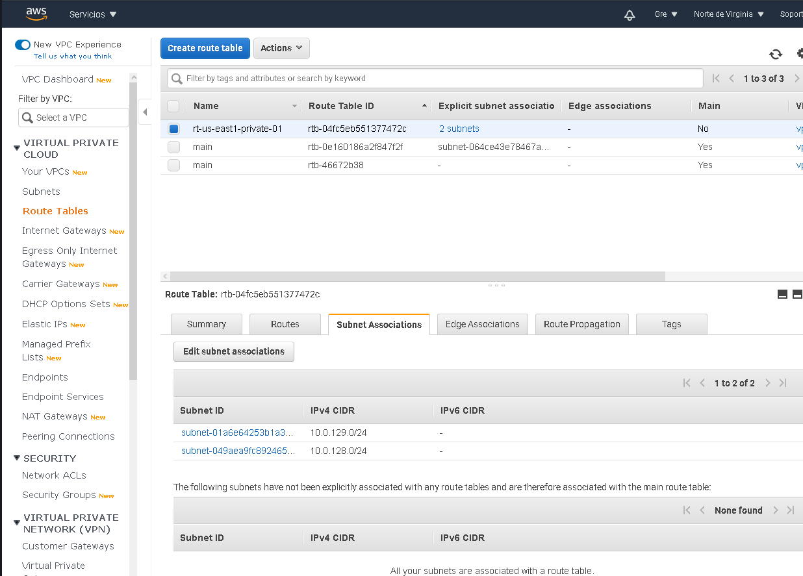

# Ejemplo 3 - Creación de VPC: Private Subnet, NAT gateway & Elastic IP

## 1. Objetivo

- Crear la subred privada para la VPC

## 2. Requisitos 

- Acceso a `AWS Console`.
- Diagrama del proyecto a la mano.
- Haber completado el `Ejercicio 02`

## 3. Desarrollo 

El siguiente paso es generar un par de subredes privadas, para ello hay que generar un , las subredes privadas no tienen acceso desde internet directo.

Para generar una subred privada se deben seguir los siguientes pasos:

1. Ingresar al servicio de VPC, ir a la sección en el menú "Subnets" y luego click en "Create subnet"

2. Configurar:

  **a.** Establecer un nombre descriptivo a la subred.

  **.** Seleccionar la VPC donde se asociará la subnet privada, seleccionar la VPC recién creada.

  **c.** Esta vez no se le dejará la decisión a AWS de que zona de disponibilidad usar. Seleccionar la primera en la lista.

  **d.**  Se debe establecer el tamaño del bloque de direcciones IP que contendrá la red privada. Hay que notar que el bloque comienza en la dirección 128, la idea es dejar los primeros (0-127) 128 bloques disponibles para redes publicas y los restantes (128-256) para redes privadas.  

3. Para que las subredes tengan acceso a internet con el fin de instalar software o parches de seguridad es necesario habilitar un **NAT Gateway**, para lo cual ir al menú **NAT Gateway** después click en **Create NAT gateway**.

4. Configurar el NAT Gateway con lo siguiente:

  **a.** Se debe establecer un nombre descriptivo para el Nat Gateway. 

  **b.** Seleccionar la subred **pública**.
  
  **c.** En NAT Gateway requiere una dirección IP pública, para generarla dar click en **Allocate Elastic IP**

  **d.** Generada la IP aparecerá un mensake de confirmación y dar  
   Click al final en **Create NAT gateway**.

5. Ya generado el NAT Gateway, habrá que decir como redireccionar el tráfico que no es de red interno hacia el NAT Gateway, para lo que hay que generar un nuevo router, dar click en el menú "Route Tables".

6. Se debe agregar una nueva tabla de routeo en "Create route table"

7. Configurar con:

  **a.** Agregar un nombre descriptivo a la tabla de routeo.
  
  **b.** Seleccionar la VPC a la que se asociará el router, seleccionar la VPC recién creada.

8. Creado el router se debe configurar para redirigir el trafico. Seleccionar el nuevo router y dar click en **Edit routes**

9. Configurar las rutas como:

  **a** Agregar la IP 0.0.0.0/0 con la que se especifica que cualquier tráfico que no sea perteneciente a la red de la VPC sea manejado por esta nueva regla.

  **b** Seleccionar el NAT Gateway recién creado.

10. Ahora se debe asociar explícitamente al Router la subred para que maneje su tráfico.

  **a.**  Dar click en la pestaña **Subnet Associations**.

  **b.** Dar click en **Edit subnet Associations**.

12. Seleccionar la subred privada manejada por esta tabla de routeo.

Se debe generar una segunda subred en una zona de disponibilidad distinta al paso 2 inciso c) en la generación de la subred privada.

Para generar la segunda subred:

1. Click en **Create Subnet**

2. Configurar la subred como:

  **a.** Asignar un nombre a la subred.

  **b.** Seleccionar la VPC a la que estará asociada la subred.

  **c.** Seleccionar una zona de disponibilidad distinta a la zona de disponibilidad de la red privada creada previamente.

  **d.** Se asigna el bloque de direcciones IP que la subred tendrá, para se asigna el bloque 129, recordar que del bloque 128 al 256 se designa para subredes privadas.

3. Ir al la sección re tablas de routeo.

4. Editar la asociación de la subred a la tabla de routeo que manejará el trágico hacia el NAT Gateway.

5. Se debe seleccionar la nueva subred privada.

El estatus del proyecto es el siguiente hasta este punto. Prácticamente todo el esquema de red esta listo para seguir construyendo sobre el.

