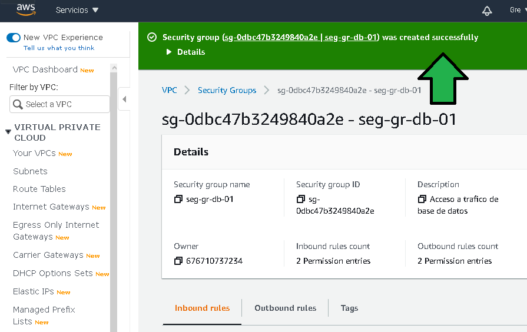

# Reto 1

## 1. Objetivo 
- Agregar Security Groups.

## 2. Requisitos 
- Acceso a AWS Console.
- Haber completado el `Ejercicio 3`

## 3. Desarrollo

Se configurarán los grupos de seguridad que darán acceso al tráfico de red a las instancias EC2 y las instancias RDS.

1. Seleccionar **Security Groups**.

2. Click en **Create Security Group**.

3. Configurar el grupo de seguridad como:

  **a., b.** Establecer un nombre descriptivo así como una descripción

  **c.** Seleccionar la red VPC a la cual pertenecerá la regla de seguridad.

  **d., e..** Establecer el tipo de tráfico permitido de entrada hacia AWS desde una fuente (source).

  **f., g.** Establecer el tráfico que se permitirá de salida y hacia donde se podrá conectar desde AWS, se recomienda dejar abierto el tráfico por temas de actualizaciones y descarga de software.

4. Generar un nuevo grupo de seguridad para el tráfico de base de datos de Postgres.

  **a., b.** Establecer un nombre descriptivo así como una descripción del grupo de seguridad.

  **c.** Seleccionar la red VPC a la cual pertenecerá la regla de seguridad.

  **d., e.** Establecer el tipo de tráfico permitido de entrada hacia AWS desde una fuente (source), para este caso se permitirá acceso de Postgres (puerto 5432) desde cualquier origen.

  **f., g.** Establecer el tráfico que se permitirá de salida y hacia donde se podrá conectar desde AWS, se recomienda dejar abierto el tráfico por temas de actualizaciones y descarga de software.

5. Generar un nuevo grupo de seguridad para el tráfico de conexión SSH.

  **a., b.** Establecer un nombre descriptivo así como una descripción del grupo de seguridad.

  **c.** Seleccionar la red VPC a la cual pertenecerá la regla de seguridad.

  **d., e.** Establecer el tipo de tráfico permitido de entrada hacia AWS desde una fuente (source), para este caso se permitirá acceso SSH (puerto 22) desde cualquier origen.

  **f., g.** Establecer el tráfico que se permitirá de salida y hacia donde se podrá conectar desde AWS, se recomienda dejar abierto el tráfico por temas de actualizaciones y descarga de software.

