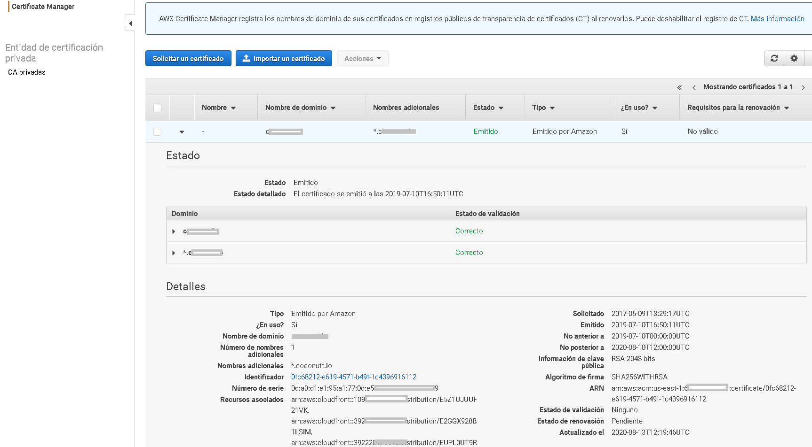
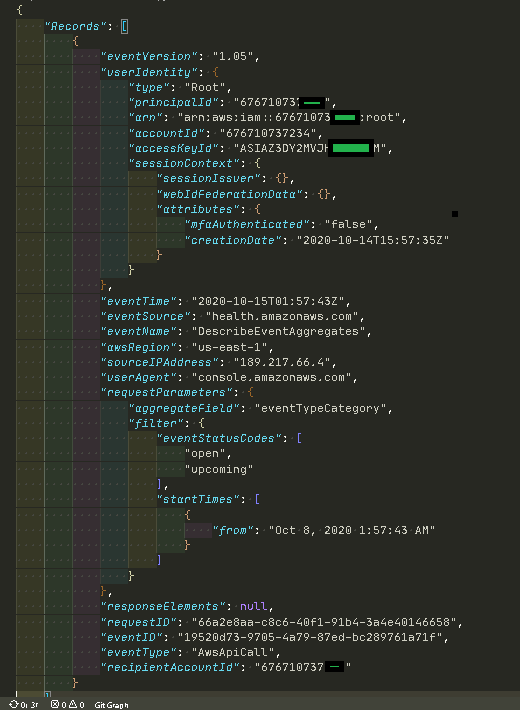
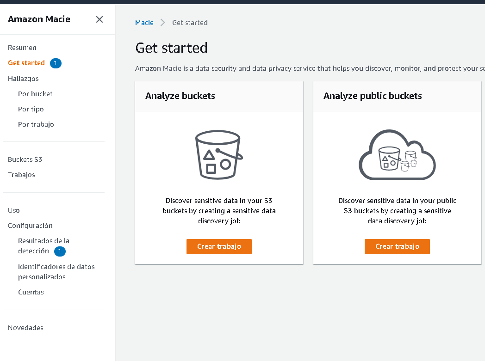
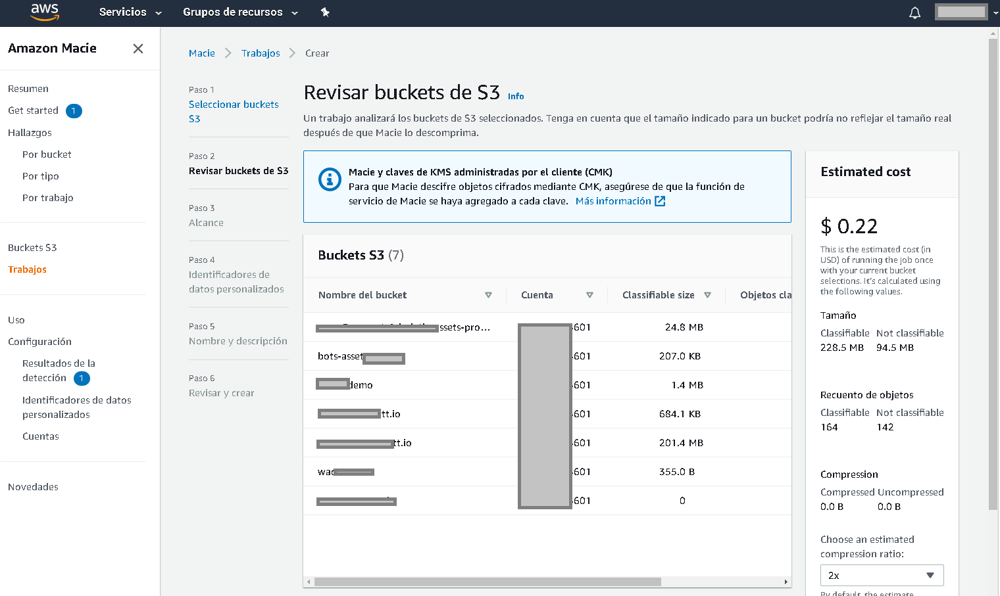

# Prework Sesión 6

## Introducción
La seguridad siempre es importante a tomar en cuenta al usar e implementar cualquier software. Las plataformas de nube de cualquier proveedor no son la excepción, desarrollar estrategias de monitoreo, detección de intrusos, cifrado de información y gestión de accesos son el bastión para la implementación de políticas de seguridad definidas por las organizaciones.

### 1. Objetivo 🎯
- Conocer cuáles son los principales servicios de AWS relacionados con tópicos de seguridad. 

### 2. Instrucciones 📋
- Se revisarán los conceptos básicos sobre seguridad en AWS, atender los enlaces externos para tener más contexto al respecto.

# Seguridad a nivel de cuenta

Al generar una cuenta de AWS se genera con una cuenta root, es una cuenta administradora que tiene por defecto acceso a todos los servicios con todos los permisos en cada uno.

- La primera recomendación es asegurar la cuenta con un MFA (multi factor authentication).
- La siguiente es no utilizar la cuenta root para hacer operaciones BAU (business as usual) del día a día, es mejor generar un usuario con permisos limitados a lo necesario para administrar la cuenta, así si llega a ser comprometida los daños pueden ser menores.
- Se debe establecer una política de seguridad acorde a la organización, habilitando longitudes mínimas, tipos de caracteres que deben contener las contraseñas, políticas de vencimiento para renovación de la contraseña, prohibir la reutilización contraseñas, todo ello ayudará a que la cuenta no sea comprometida.
- Al acceder a los servicios por medio del AWS SDK o AWS CLI no se recomienda embeber las credenciales de acceso en la aplicación, en su lugar se deben usar los roles de AWS IAM para delegar permisos a las aplicaciones.

# Shared Responsibility Model

AWS comparte junto con los administradores de las cuentas la responsabilidad de mantener las aplicaciones funcionando correctamente.

AWS se compromete a mantener la infraestructura funcionando, las redes, discos duros, electricidad, enlaces de baja latencia, hypervisores, etc. Por parte de los administradores de una cuenta AWS recae el cifrado de archivos en transferencia y reposo, parches de sistemas operativos, backups, segregación de permisos, gestión de cuentas. El ejemplo más icónico es una instancia EC2, la instancia debe ser manejada por el administrador, el administrador configura quién tiene acceso a qué puertos de la instancia, cuanto storage se le provisionará, que sistema operativo tendrá, a qué red o redes y con qué otras instancias se podrá comunicar, en qué zona de disponibilidad esta la instancia ejecutándose, el cifrado de datos también es definido por esa figura.

# Identidad y gestión de usuarios
El proceso de identificación, autenticación y autorización a personas, aplicaciones y sistemas es critica para garantizar seguridad en cualquier organización.
Establecer y gestionar las funciones y privilegios de acceso de los usuarios de la red debe proporcionar a los administradores las herramientas y tecnologías para realizar un seguimiento de las actividades del usuario y para hacer cumplir las políticas de seguridad continuamente.
En el campo de TI a este proceso se le conoce como `Identity and access management` (AWS tomó el término y lo hizo un producto, no hay que confundirlos).

# Amazon Identity and Access Management (IAM)

Aquí se pueden configurar las cuentas que podrán acceder a los recursos de AWS por medio de AWS Console, AWS CLI y AWS SDK. IAM no solo controla la autorización también controla la autenticación, esto es una herramienta clave (no es la única) a la hora de cumplir con regulaciones tanto internas como externas a la organización como  [PCI DSS](https://www.pcisecuritystandards.org/pci_security/)
Los conceptos clave para entender IAM son:

* - Políticas (Policies): Responde a la pregunta ¿A qué debo dar permiso acceder?, una política define los `servicios` a los cuales se tendrá permitido acceder, las `acciones` que puede hacer en el servicio como lectura y/o escritura (cada servicio tiene su set de acciones permitidas), también se deben definir los `recursos`, los recursos especifican de manera muy granular dentro de un servicio (por ejemplo S3) que no se permita el acceso a todos los buckets de S3 existentes si no solo dar acceso a buckets muy específicos (aunque se puede dar acceso a todos) normalmente por medio del ARN del recurso (ejemplo del arn de un bucket real arn:aws:s3:::aws-athena-query-results-001513791584-us-east-1) y finalmente se especifican las `condiciones`, cuando una cuenta de consola, cli/sdk generan un acción (como leer un archivo) esta petición (`request`) lleva un contexto, es decir lleva junto con la acción información extra, en concreto La acción de la operación, el recurso, datos de entorno coo dirección ip, user agent, SSL y la hora y fecha. Con esos datos de contexto se puede definir por ejemplo que solo sea aplicable la política siempre que se quiera acceder al bucket desde una IP específica.
Así cuando se quiere escribir (acción) el archivo en un bucket (recurso) de S3 (servicio) AWS verifica la autenticación, después procesa el contexto de la petición para ver si la política debe aplicar o no, evalúa la política que será aplicada (se reevalúan las políticas ya que múltiples políticas pueden ser aplicadas a un mismo recurso), una vez hecho todo esto se determina si la acción es una acción autorizada, de no serlo se rechaza la ejecución.

* - Roles: No solo es posible conceder acceso a AWS por medio de credenciales específicas, se puede conceder acceso a entidades como otros servicios de AWS y Otras cuentas de AWS, el caso de uso: hay una lambda diseñada para tomar archivos previamente alojados en S3, los procese y finalmente guarde todo en base de datos cada 15 minutos, en ese caso se diseña un rol específico donde por medio de una política asociada a ese rol le dé acceso al bucket de S3 en cuestión únicamente.

* - Usuarios (users): Básicamente es la representación de una persona en una aplicación. No es en el sentido estricto un usuario, se puede ver como una entidad que puede acceder a un recurso de AWS ya sea por medio de la consola, del cli/sdk u ambos. AWS también llama a estas figuras `principals`.

* - Grupos (groups) : Por buena práctica de seguridad se deberían crear tantos usuarios como accesos por distintas entidades requieran acceso a los recursos, lo que fácilmente se puede salir de control, por ello los grupos se vuelven una herramienta valiosa para pues permiten asociar políticas y usuarios (entiéndase usuario al concepto anterior), en resumen, se le da la directiva a AWS: "a este conjunto de usuarios agrupados en este grupo se requiere aplique esta serie de políticas", el caso de uso: se genera un rol de auditor, donde a ese sol le asocian políticas necesarias para restringir el acceso a los recursos de AWS, después se concede acceso a varios de esos usuarios que deberían cada uno de ellos tener su propia cuenta de usuario, así, en lugar de asociar una política (o varias) a cada usuario basta con solo asociar al usuario al grupo y en automático le aplicarían todas las políticas asociadas al grupo. Cabe señalar que los grupos no pueden contener a otros grupos, solamente usuarios, aunque un usuario si puede pertenecer a múltiples grupos. Un grupo nunca accede de manera directa a los recursos de AWS, simplemente es aun entidad que ayuda a la administración de permisos.

# TODO Una ilustracion que ejemplifique estos conceptos

# Autenticación y autorización

- AWS Directory Service
Tradicionalmente en entornos Windows el producto estrella para temas de autenticación y autorización es Windows Active Directory.
Microsoft Active Directory es un servicio que permite guardar objetos de tipo usuario, equipos (hosts) y grupos para administrar la autorización y autenticación a una red.
Para poder iniciar sesión en la red es necesario que el host se una al dominio previamente con ayuda de un administrador de Active Directory, una ve hecho eso un usuario que también debe estar dado de alta en el dominio puede iniciar sesión.
Active Directory es una pieza delicada en la infraestructura si el servicio falla o se pierde se pierde acceso prácticamente a todas las aplicaciones y servicios que requieran autenticación y autorización. 
Amazon ha lanzado un servicio de Active Directory administrado (PaaS), AWS se encarga de desplegar el dominio
en 2 zonas de disponibilidad, configura la replicación, gestiona parches de seguridad de los Controladores de dominio (un controlador de dominio es donde se hostea Active Directory).

El siguiente es un esquema típico de AWS Active Directory

- AWS Organizations
AWS Organizations permite agrupar varias cuentas de AWS en una única cuenta administradora, así las empresas que brindan servicios pueden tener a su cargo las cuentas de sus cliente con sus propias políticas de control de servicio (SCP) que dictan cuales son los permisos máximos en los en la organización.
Las Unidades Unidades Organizacionales (OU) junto con las Cuentas (Accounts) son las piezas claves que hacen de las organizaciones una herramienta poderosa en cuanto a la gestión se refiere. La función de la OU es agrupar Accounts, las OU pueden tener dentro otras OU con otras Accounts, a cada OU se le puede asociar una SCP para regular los permisos de los usuarios a la organización.

- AWS Single Sign-On
Es posible brindar acceso a cuentas de AWS por medio de AWS Organizations sin tener que usar cuentas que distintas a las que ya se utilizan en un Active Directory empresarial. El entorno Active DIrectory por medio de AWS Single Sign-On puede extenderse para brindar acceso ademas de cuentas de AWS  a servicios como Gsuite, Dropbox, Office 365, Slack, Github, Salesforce, Jira, Zendesk por mencionar algunos.
AWS Single Sign-On es un proveedor de identidad ([IdP](https://www.cloudflare.com/learning/access-management/what-is-an-identity-provider/)),  compatible con el estándar SAML encargado de proveer credenciales de autorización a los proveedores de servicios (a las aplicaciones como Slack o GSuite).
La mejora en seguridad aumenta, cuando un usuario final tiene que recordar o manejar varias claves para distintas herramientas que usan tienden a usar la misma clave o en el peor de los casos escribirla y dejarla a la vista de cualquiera. Un servicio unificado de autenticación  con acceso a otras herramientas hace la vida más fácil, recuerda y maneja una única contraseña.

# Amazon Cognito
AWS Cognito permite conceder acceso a recursos de AWS a los usuarios por medio de la generación de tokens a través de terceros.

Al momento de configurar un pool de usuarios de Cognito (un pool es una configuración dada de autenticación) es posible especificar quien será el proveedor de servicios de autenticación, si es Facebook por ejemplo se debe especificar el [Facebook AppID](https://webkul.com/blog/how-to-generate-facebook-app-id/) para que Cognito confíe en los tokens que esta app mandará. Una vez autenticado Cognito verificará los niveles de acceso apropiados generando un token temporal para poder acceder al recurso de AWS dado.

# Amazon Inspector
Amazon inspector permite verificar las vulnerabilidades en las instancias EC2. Las vulnerabilidades que pueden ser detectadas tienen que ver con las prácticas de redes que se están implementando por ejemplo el número de puertos abiertos a las instancias, también es posible verificar vulnerabilidades dentro del host o instancia, para lo cual Amazon Inspector debe instalar un agente (software) en la instancia que estará haciendo el análisis y reportando a Inspector sobre las vulnerabilidades halladas. Se pueden definir las instancias a mantener vigiladas por medio de TAGS, hay que tener cuidado, por default selecciona todas las instancias que se tengan en la región lo que puede resultar en costos un tanto elevados, es importante configurar la periodicidad con la que el agente escaneara por vulnerabilidades para no elevar demasiado los costos.
En el dashboard se tienen los reportes en formato PDF, es un reporte muy completo, explica cada vulnerabilidad, la severidad y una posible solución a cada vulnerabilidad.

# Arquitecturas para recuperación a desastres

Cuando todo va mal, desastres naturales, ataques de ramsomware, o simplemente un empleado enojado borra información deliberadamente, cada uno de esos escenarios son escenarios que solo en las peores pesadillas pasan, pero también pasan en la vida real, aquí no hay que preguntarse si pasará, si no cuando pasará. 
Dicho eso la arquitectura de las aplicaciones deben estar orientadas para ser fuertes ante ataques o accidentes.
En AWS hay 5 pilares fundamentales para cumplir. Seguridad, flexibilidad, excelencia operativa, eficiencia de rendimiento y optimización de costos. En la práctica dos conceptos moldean mucha de la arquitectura con capacidad de recuperación de desastres, son el RTO y el RPO.
El RTO (Recovery Time Object) es el tiempo que tarda en el caso de un desastre en reconfigurar todo y volver a operar, dependiendo la aplicación puede ir desde minutos hasta días.
El RPO (Recovery Point Object) dicta el periodo de tiempo entre el último respaldo conocido funcional (los respaldos deben ser probados para asegurar son respaldos usables) hasta una falla, dependiendo del giro no pasa nada si se pieden días de datos, bajo este escenario si la falla pasa el miércoles y se tiene un respaldo del sábado de la semana pasada está bien, por otro lado en aplicaciones bancarias, ¿imaginar que se perdieran transacciones?, en ese caso el RPO debe ser muy pequeño, incluso al orden de segundos.
El RTO indica la rapidez con la que se requiere recuperarse después de sucedida la falla, el RPO define la frecuencia con la que se necesitan hacer copias de seguridad.
AWS brinda la flexibilidad necesaria para disminuir el RPO y el RTO. Backups de instancias EC2 se pueden hacer directamente en el servidor y al final transferir los archivos a un bucket S3, otra posibilidad es utilizar Snapshots de la maquina virtual con intervalos de tiempo definidos, si sucede algo se puede volver a la última versión de la instancia EC2, indudablemente la replicación y configuración de las aplicaciones en servidores en distintas zonas de disponibilidad ayudará a la hora de recuperación, la última estrategia podría llegar a tener un RTO muy pequeño al tener replicada la infraestructura en distintas zonas de disponibilidad listas para entrar a operar si así se requiriera. Otra tendencia que puede reducir el RTO es la llamada IaaC (Infrastructure as a Code), en AWS la herramienta AWS Cloud Formation da la capacidad de definir infraestructuras completas con redes configuradas, instancias de distintos tamaños, balanceadores de cargas, roles, etc en un solo archivo de definición en formato json. Literal tareas que pueden llevar semanas tradicionalmente, con Cloud Formation se pueden aprovisionar infraestructuras completas en horas. En Bases de datos RDS, AWS también brinda mecanismos de respaldo automatizados basados en snapshots de la instancia RDS, en caso de un problema se puede regresar al último snapshot disponible.

# Protección de infraestructura a ataques

Hay métodos de protección a infraestructura generales agnósticos de la nube usada que ayudarán a mejorar y disminuir la probabilidad de algún ataque informático.

Parches de seguridad a servidores:
El software se encuentra en constante evolución y el sistema operativo no es la excepción, con el paso del tiempo se van encontrando vulnerabilidades en los sistemas operativos que un atacante puede utilizar para vulnerar las aplicaciones ejecutadas en él.
AWS Systems Manager ayudará con el proceso de aplicación de parches al ser la herramienta de automatización de tareas sobre recursos de AWS.

Hardening de servidores:
Al tener un servicio ejecutándose es necesario asegurarse de contar con buenas prácticas para mantener todo el software usado seguro, ya que muchas veces los sistemas operativos o servicios instalados como Postgres no se instala por default con las mejores prácticas de seguridad. Un ejemplo es hacer hardering a un servidor [Nginx](https://www.acunetix.com/blog/web-security-zone/hardening-nginx/).

Principio de mínimos permisos:
Es necesario evitar ejecutar las aplicaciones, bases de datos, servidores web y sistema operativo por mencionar algunos con credenciales que sean root o permisos elevados, en el caso de base de datos por ejemplo se recomienda crear un usuario con permisos restringidos para no eliminar una base de datos o crear nuevos usuarios.
En el caso de las instancias de EC2 se debe tener cuidado con la llave de acceso al servidor no se vea comprometida, en caso de ser comprometida se tiene que seguir un proceso difícil y lento para asegurar el servidor, básicamente implica generar una nueva instancias de EC2 y mover el disco duro (EBS ) de la vieja instancia a la nueva instancia.
A nivel de Nube es necesario establecer políticas y roles con [mínimos permisos](https://searchsecurity.techtarget.com/definition/principle-of-least-privilege-POLP), por ejemplo, si creamos un bucket S3 para que una aplicación lo consuma se debe restringir el acceso solo a ese bucket con el permiso de solo lectura.

Listas de acceso y denegación por IP:
En el nivel de red es necesario proveer las direcciones IPS a los firewalls que no debe dejar pasar o que permita el paso, también se recomienda restringir los puertos abiertos.
Una política de acceso restringido da buenos resultados en la práctica, se establece en firewall que ninguna IP sea permitida y se pueden ir agregando las IP permitidas poco a poco.
En AWS se puede lograr este control configurando ACLs y Security Groups en la sección VPC.

Monitoreo: 
¿Cómo saber si la infraestructura esta bajo ataque? Siempre se debe contar con logs que capten evidencia de toda o gran actividad que las aplicaciones tienen. También es importante monitorear los "signos vitales" de los servidores como la Memoria RAM, uso de red, uso de CPU, con lo que es posible tener pistas al ver comportamientos anómalos, ej: se incrementa el uso de red considerablemente en una hora en la madrugada desde una IP específica, eso ya podría representar una señal de alarma.
CloudWatch de AWS permite recolectar toda esta información con la posibilidad de establecer alarmas para dar aviso a administradores y personal de DevOps no limitándose a solo instancias EC2 si no a otros servicios críticos como Amazon RDS, DynamoDB, incluso es posible monitorear logs dentro de los sistemas operativos, para tal se debe instalar CloudWatch Agent, un software que enviará una copia del log o logs que a monitorear centralizadamente, es posible ir mas allá, se pueden monitorear sistemas on premise con el agente. Ya con los logs en CloudWatch es posible configurar alarmas que notifiquen ante actividad sospechosa. 

# Web application firewall

AWS WAF
Un WAF es un elemento capaz de evitar ataques a la infraestructura y aplicaciones. ¿Como lo logra?, monitorea el tráfico http y en base a patrones específicos, listas de direcciones IP, payloads específicos, cabeceras, localización, numero request por segundo,  tiene la capacidad de deducir un ataque. Ejemplo: SQL Injection, este tipo de ataques se hacen poniendo parámetros muy específicos en la URL como `https://insecure-website.com/products?category=Gifts'+OR+1=1--` donde `+OR+1=1` es la parte añadida maliciosa a la URL en búsqueda de un acceso no autorizado.
Con AWS se puede integrar un WAF a los balanceadores de carga rápidamente pues ya se cuenta con un conjunto de reglas de seguridad con patrones específicos de ataque por direcciones IP, ataques a sistemas operativos, ataques a aplicaciones PHP, ataques a sitios WordPRess, patrones que cumplen OWASP y si eso no es suficiente por medio del Marketplace se pueden adquirir soluciones mas complejas con fabricantes reconocidos en la industria como [F5 Networks](https://aws.amazon.com/marketplace/pp/B0779MPHVH).

AWS Shield
En sus 2 capas de servicio ofrece el servicio para detección y protección ante ataques de denegación de servicio (DDoS). Ofrece 2 capas, la primera es la Standard solo se tiene el monitoreo de flujo y protección básica a DDoS, la otra es la capa Advanced (con costo de $3000 USD/mes) ofrece además detección y mitigación a medida,  detección en múltiples capas, reportes y analítica, soporte 24/7, servicio AWS WAF y AWS Firewall Manager sin costo adicional principalmente. 

# Protección de datos en tránsito

AWS Certificate Manager: Aquí se generan certificados SSL/TLS para los dominios, asegurando que el tráfico en la red sea cifrado, los certificados pueden ser usados por AWS Load Balancer, Amazon CloudFront y API Gateway, en general solo funciona con soluciones de tipo PaaS, si se requiere un certificado SSL/TLS para ponerlo dentro de una instancia EC2 no es posible, ya que Amazon no da la opción de descargar estos certificados, en ese caso se puede usar [Lets Encrypt](https://letsencrypt.org/getting-started/). Por ello a la hora de trabajar con ellos por por ejemplo en Cloud Front, simplemente aparecerá un Dropdown donde se escogerá alguno de los que esten  disponibles. Para generar los certificados se debe primero comprobar ser el administrador o propietario del dominio, esto se logra agregando un registro en el DNS o por medio del envío de un email a administrator@your_domain_name, hostmaster@your_domain_name, postmaster@your_domain_name, webmaster@your_domain_name, admin@your_domain_name.

# Protección de datos en reposo

- AWS CloudTrail
Es una herramienta muy similar a CloudWatch en cuanto a monitoreo se refiere, hasta ahí terminan las similitudes, CloudTrail está enfocado en guardar un registro sobre todas las acciones que generen una petición a los servicios de AWS por medio de su API ya que cada acción generada desde AWS CLI o AWS SDK para desarrolladores acaban haciendo una petición al API.
Cada registro contiene datos importantes para tener la trazabilidad completa de las acciones, contiene la IP pública, la cuenta, región, fecha principalmente. Los datos se guardan en un bucket S3 por lo que no hay problema en cuanto el tamaño de la cantidad de datos recolectados.

La siguiente es una traza de log de ClouTrail donde se pueden notar todas la información útil en auditorías, detección de intrusos y análisis forense después de un incidente.

- Amazon Macie
Tener un bucket  de S3  brinda mucha flexibilidad a la hora de guardar archivos, es un servicio con una capacidad de almacenamiento enorme y de precios muy reducidos lo que lo hace un servicio muy socorrido. ¿Se sabe cuáles son los activos almacenados en ese bucket?, con facilidad puede llegar el punto en que es inmanejable la cantidad de información almacenada lo que hará imposible revisar que la información no sea sensible o si lo es que estar conscientes de ello.
Macie es una herramienta que escanea cada bucket en búsqueda de información sensible brindando un reporte con las observaciones que encuentre.

- Key Management Service (KMS)
Aquí se pueden gestionar llaves criptográficas de cifrado [simétrico y asimétrico](https://www.ssl2buy.com/wiki/symmetric-vs-asymmetric-encryption-what-are-differences), ya sea generadas por mismo AWS o se pueden importar claves propias en el caso de ser requerido.
Hay una lista extensa de servicios con los que KMS puede integrarse dentro del ecosistema de Amazon para flexibilidad y facilidad del administrador, por citar algunos se tiene a Amazon Relational Database Service (RDS), Amazon S3, Amazon CloudWatch Logs, Amazon Glacier ,Amazon Simple Notification Service (SNS), Amazon Simple Queue Service (Amazon SQS), Amazon EBS, AWS Storage Gateway entre los más representativos. Muchas veces el tema de cifrado se da por temas regulatorios o de certificaciones (por ejemplo PCI) para algunos tipos de datos se exigen tener estándares de cifrado. Se recomienda como en todo servicio de AWS revisar bien el esquema de precios y como este impactará en la solución.

- AWS Cloud HSM
Módulo de seguridad de hardware [(HSM)](http://salmoncorp.com/producto/hardware-security-module-hsm-2/) administrado en la nube de AWS, tradicionalmente los HSM son hardware que se usa en organizaciones para proteger claves criptográficas. Están especialmente diseñados para ser eficientes matemáticamente ante los cálculos que involucra el cifrado, descifrado firma y comprobación de firmas que los algoritmos exigen. Es Hardware especialmente diseñado para ser resistentes a modificaciones de hardware no autorizadas. La solución de AWS es poner a disposición un HSM como PaaS para facilidad de uso, el inconveniente para muchos es el precio, pues por un mes de uso ronda en alrededor a Septiembre del 2020 en unos 22,606 MXN al mes.

- AWS Security Hub
Se pueden tener reportes sobre el estado del cumplimiento de mejores prácticas de seguridad para cumplir con PCI DSS v3.2.1, escaneo para cumplimiento de las prácticas recomendadas de seguridad v1.0.0 fundamentales de AWS, y cumplimiento de indicadores de referencia v1.2.0 de CIS para AWS. Después de Habilitar Security Hub se tiene un reporte con las observaciones listas para poder ser parchadas.

