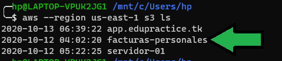
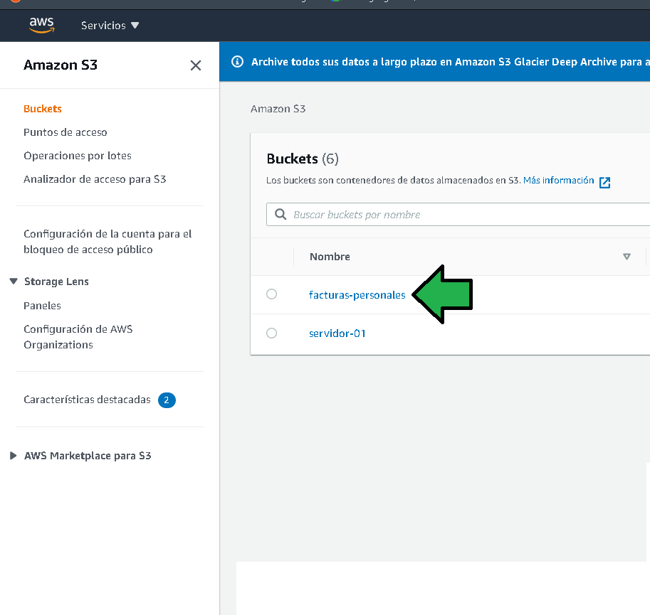
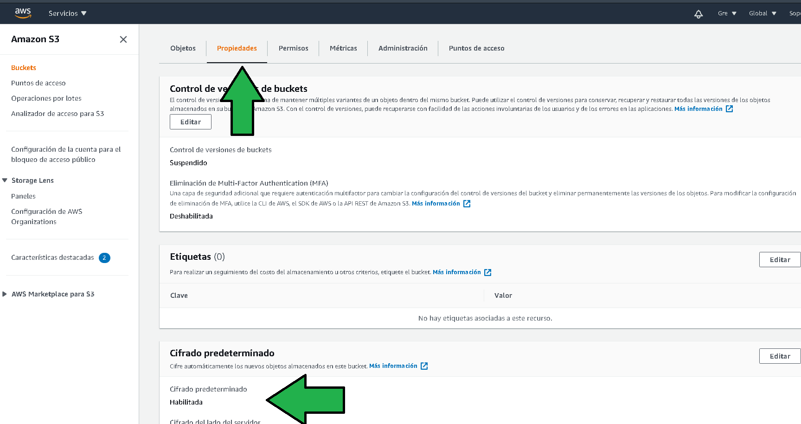
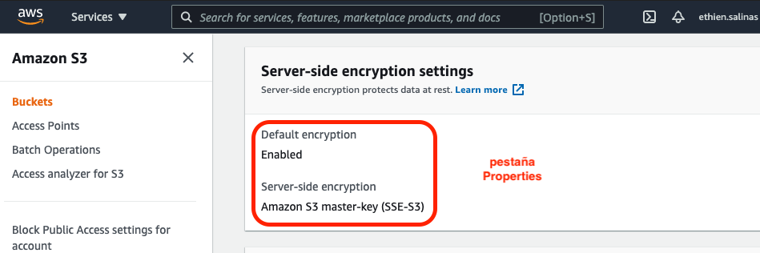
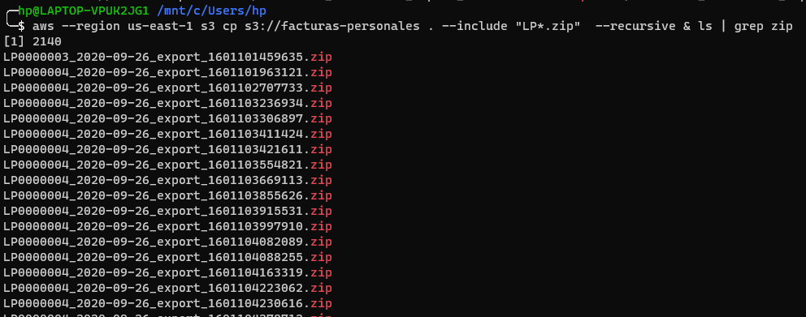
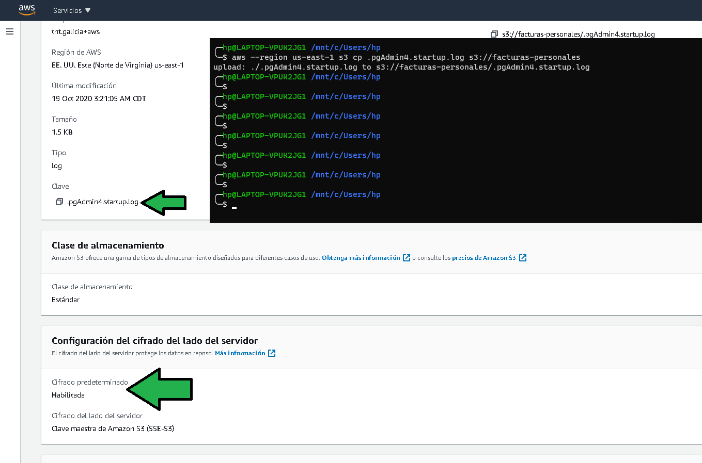

# Ejemplo 2

## 1. Objetivo 
- Conocer como se pueden asegurar los datos de reposo en un bucket por medio del cifrado.

## 2. Requisitos
- AWS CLI instalado y configurado.
- Acceso a AWS Console.
- Un bucket S3 con algunos archivos que simularán ser archivos con información sensible.

## 3. Desarrollo 
El proceso de cifrado será dividido en dos fases para un bucket sin cifrado. Se comenzará especificando la política de cifrado de nuevos archivos que se suban al bucket, esta política no afectará a los archivos que ya existan en él.
Una vez configurado el bucket habrá que cifrar todos los datos ya existentes en él.

1. Acceder a la linea de comandos. Listar todos los buckets solo para corroborar cual será cifrado. Es recomendable especificar la región del bucket.

```ssh
aws --region us-east-1 s3 ls
```

</img>

2. Configurar la política de cifrado para nuevos archivos especificando el nombre del bucket y el tipo de cifrado que tendrá el bucket con el comando:
```ssh
aws --region us-east-1 s3api put-bucket-encryption --bucket facturas-personales --server-side-encryption-configuration '{"Rules": [{"ApplyServerSideEncryptionByDefault": {"SSEAlgorithm": "AES256"}}]}'
```

3. Al ingresar a la consola de AWS al entrar a las propiedades del bucket se verá la siguiente opción habilitada indicando que el bucket cifrará los archivos nuevos que sean depositados.

</img>

</img>

4. Al ver el detalle de los archivos se puede ver que los archivos existentes aun no son cifrados.

</img>

5. Para cifrar los archivos se ejecuta el comando

```ssh
aws --region us-east-1 s3 cp s3://facturas-personales s3://facturas-personales --sse AES256 --recursive
```

</img>

6. Al verificar el archivo en la consola se puede ver que ya está cifrado.

</img>

7. Los archivos pueden ser descargados con el mismo comando de AWS CLI o desde la consola de AWS.

</img>

Los archivos pueden ser abiertos sin ningún problema.

</img>


8. Se sube un archivo para comprobar el cifrado con el comando:
```ssh
aws --region us-east-1 s3 cp .pgAdmin4.startup.log s3://facturas-personales
```

</img>

Es de notar que los archivos se están cifrado de manera transparente al subirlos y descargarlos.