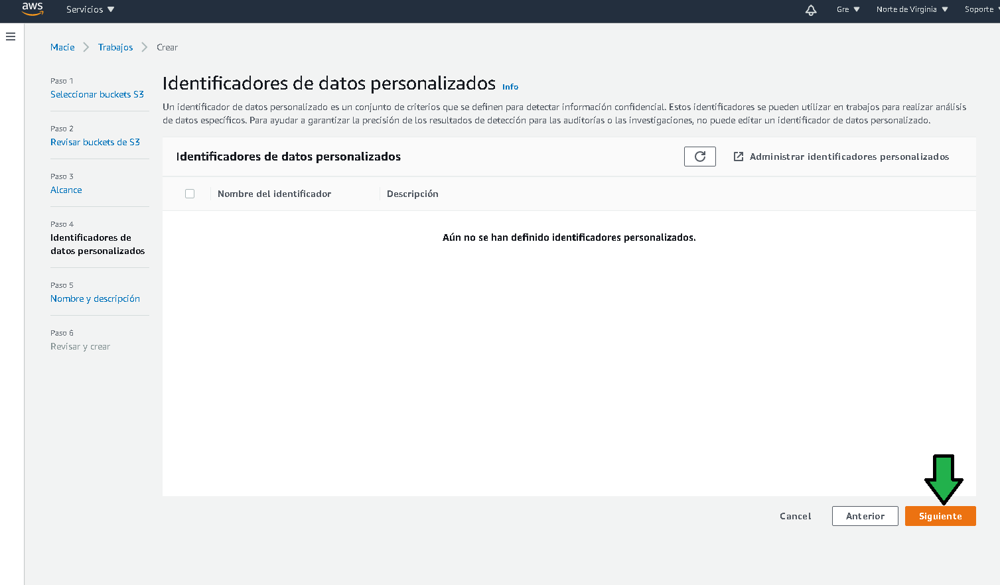
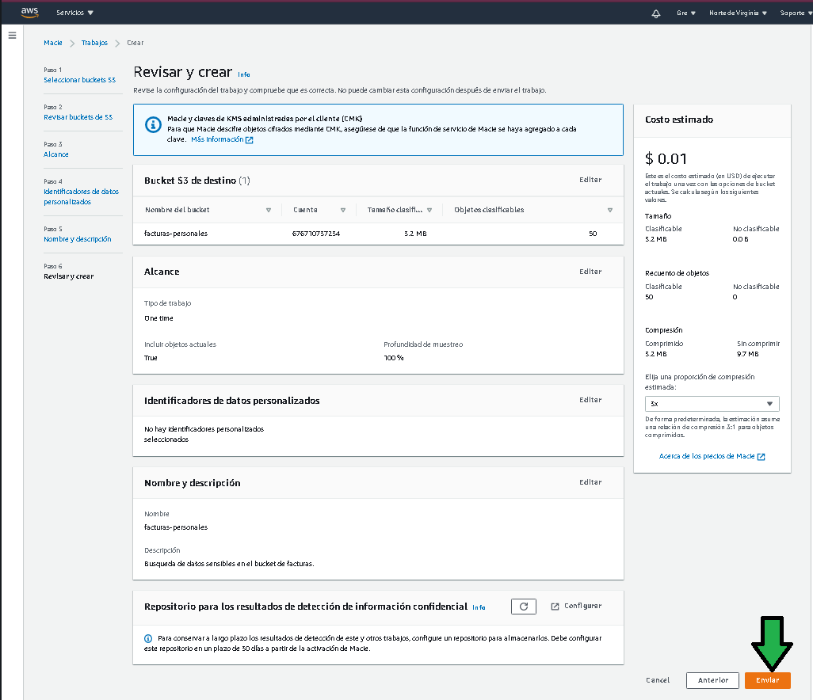

# Ejemplo 3 

## 1. Objetivo 
- En un bucket S3 buscar información sensible.

## 2. Requisitos 
- AWS CLI instalado y configurado.
- Un bucket S3 con algunos archivos que simularán ser archivos con información sensible.

## 3. Desarrollo 

1. Ingresar a la consola de AWS buscando el servicio Amazon Macie.

</img>

2. Habilitar Macie, al habilitarlo se genera un rol con la política necesaria para que el servicio acceda al servicio S3.

</img>

</img>

3. Al habilitar el servicio, Macie  da un reporte de los buckets a los que tiene acceso. Habrá que ejecutar un trabajo de escaneo

</img>

4. Se debe seleccionar el o los buckets para ser analizados.

</img>

5. Confirmar el bucket y el costo estimado.

</img>

6. Para no incurrir en costos periódicos se deberá seleccionar como trabajo único.

</img>

7. En la siguiente pantalla se pueden escoger identificadores personales, son patrones basados en regex o palabras clave que deben ser identificados como información sensible, por defecto Macie ya detecta nombres,direcciones y números de tarjetas de crédito.

</img>

8. Se asigna un nombre y descripción para el trabajo.

</img>

9. Se revisan los datos configurados, de ser correctos se finaliza la configuración.

</img>

10. El trabajo comienza a ejecutarse.

</img>

11.  Completado el trabajo se tendrá acceso a un reporte de hallazgos.

</img>

12. Verificando el contenido del archivo se puede ver que son 4 nombres encontrados y reportados.

</img>

> 💡**Nota:**
>
> Hay que aclarar sobre el costo de Macie, a diferencia de otros servicios de AWS, Macie cobra 10 centavos de dólar por el simple hecho de haber dado de alta un bucket en el servicio, si se agregan 10 buckets se cobrarían 10 dólares al fianl de mes, esos 10 dólares son independientes de las tareas de ejecucion de Macie, dependiendo de la cantidad de datos procesados en GB en cada tarea de búsqueda será el monto dle cobro, se cobra 1 dólar por cada GB de datos procesados, así si cada uno de esos 10 buckets tiene 2 GB de datos para procesar, se estarían pagando 20 dólares de procesamiento de datos, para al final en total pagar 10 dólares por los 10 buckets dados de alta y otros 20 por los 20 GB de datos procesados dando un total de 30 dólares al final de mes. 