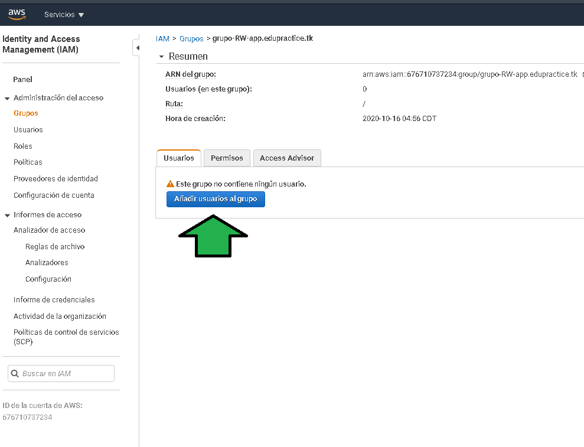
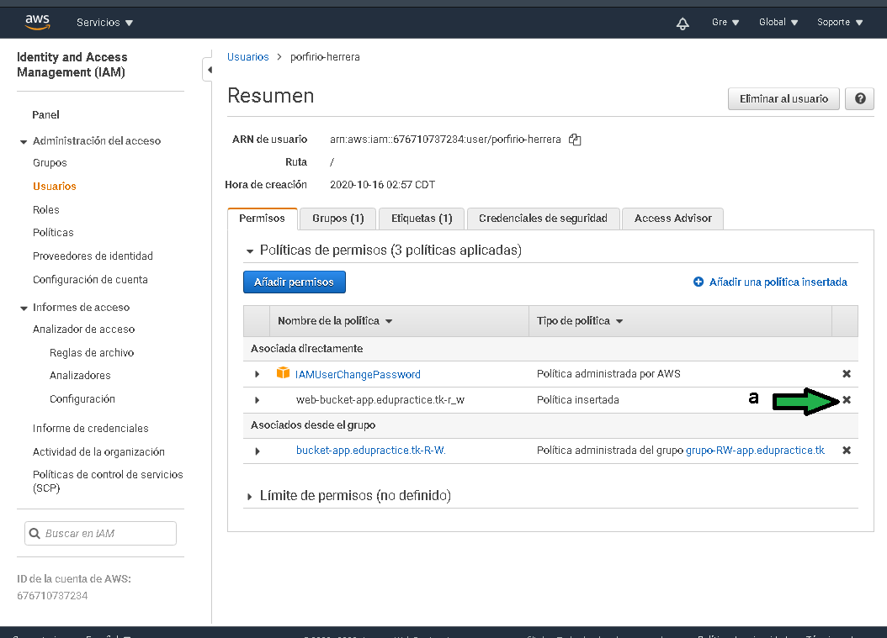

# Postwork: Creación de política en IAM

## 1. Objetivo
- Establecer una administración mantenible de políticas y usuarios.

## 3. Desarrollo 
Una política insertada es una política que no puede ser rehusada ya que solo está disponible para el usuario para la que se generó. En el escenario que se deban agregar 20 usuarios para administrar el contenido del bucket configurado como servidor web habría que ir en cada usuario agregando la política, si la política se requiere cambiar en el futuro habrá que ir en cada usuario cambiando a política proceso en el cual es muy propenso a error humano pudiendo no aplicar correctamente las políticas de acceso o denegación a algún usuario. Se generará un grupo, a ese grupo se agregará una política, así si se requiere usar esa política solo habría que agregar a los 20 usuarios al grupo sin necesidad de ir definiendo la política usuario por usuario.

## 2. Requisitos
- Una cuenta de usuario de IAM con una **política insertada**, es decir una política agregada directamente al usuario.

#### Comencemos 👨‍💻

1. Ingresar a IAM, usuarios y seleccionar le usuario con la política insertada. Expandir la política insertada y copiar el contenido JSON de la política.

</img>

2. Dirigirse al menú de políticas y luego dar click en "crear una nueva política", con ello se generará una política que puede ser reutilizada.

</img>

3. Dar click en JSON, copiar la política previamente copiada y dar click en "Revisar política".

</img>

4. AL pasar a revisión se debe especificar el nombre de la política y una descripción, la descripción debe ser lo suficientemente detallada para saber a que aplica la política y para que fue diseñada.

</img>

5. Creada la política habrá que dirigirse a **Grupos**

</img>

Dar click en **Crear grupo**

6. Establecer un nombre al grupo.

</img>

7. Se busca la política recién creada para asociarla al grupo.

</img>

8. Revisar que la política asociada es correcta, después dar click en **Crear grupo**

</img>

9. Ingresar al grupo recién creado, para agregar usuarios. Todos los usuarios agregados tendrán aplicada la política asociada al grupo, basta con sacar al usuario del grupo para que la política deje de aplicarle.

</img>

</img>

10. Al ingresar el usuario se observa aún la política administrada, también se observan las políticas aplicadas al usuario por medio de la pertenencia a grupos de IAM. Ya se puede eliminar con seguridad la política insertada (a) con ello se ha generado una estructura de permisos bastante mantenible.

</img>

11. Se comprueba que el comportamiento de los permisos del usuario sigan siendo los correctos después de eliminar la política insertada. **¡Éxito!**

</img>

</img>
