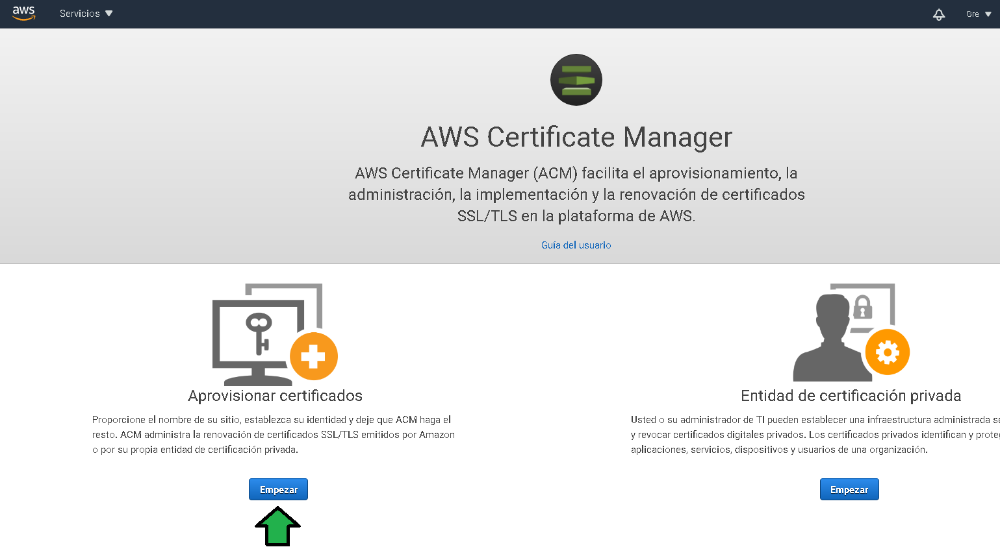
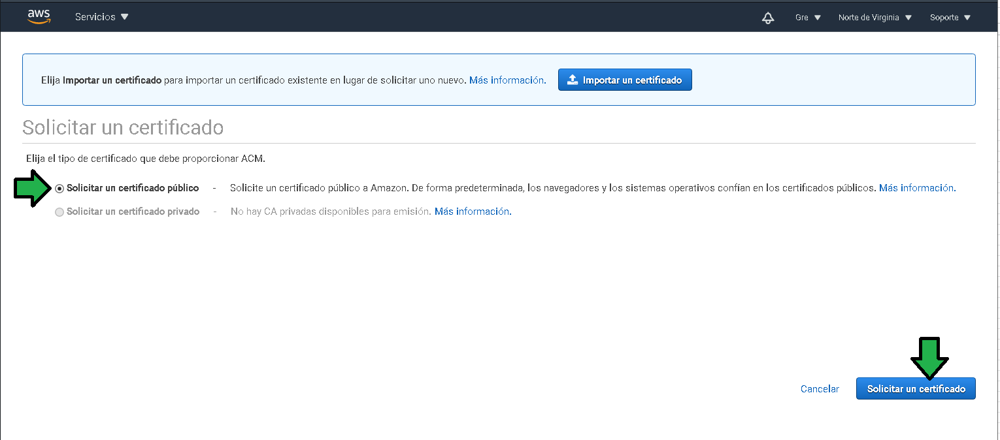
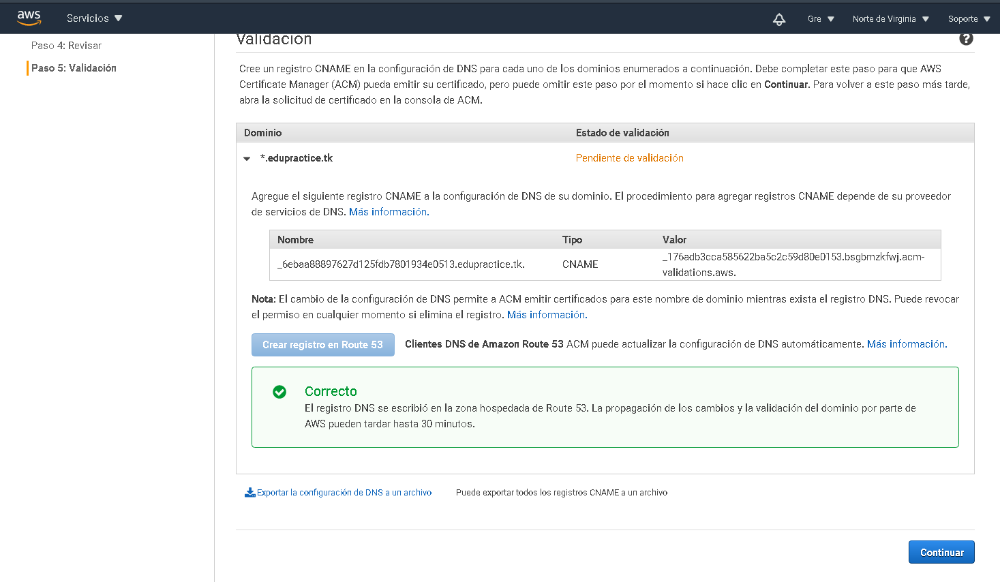
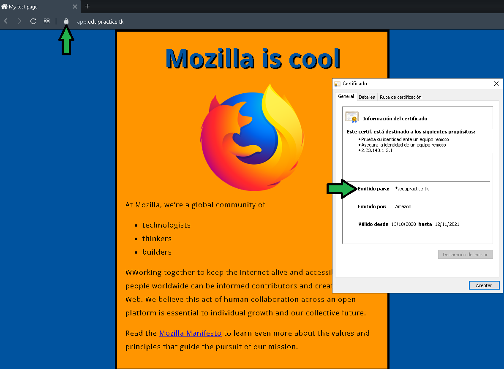

## Postwork

## 1. Objetivo 
- Asegurar el cifrado de información en tránsito para el bucket configurado como servidor web estático de la sesión 2.

## 2. Requisitos 
- Acceso a una cuenta de AWS por medio de AWS Console

## 3. Desarrollo 

Para asegurar el tráfico sobre el protocolo https se generará un certificado de seguridad. Para ellos seguir los pasos:

1. Acceder a la Consola de administración, seleccionar **Certificate Manager**

2. Seleccionar **Aprovisionar certificados**

3. Seleccionar **Solicitar un certificado público**

4. Se deberá especificar el o los subdominios para los que el certificado será emitido, como ejemplo se emitirá un certificado wildcard para el dominio edupractice.tk

5. Antes de seguir con la generación del certificado se debe comprobar la propiedad del dominio, en este caso se hará la comprobación por medio de un registro en el DNS.

6. Especificar las etiquetas que el recurso tendrá, útiles a la hora de analizar costos o administrar recursos.

7. Revisar el o los dominios para los que se solicitará el certificado, proceder con la solicitud

8. Las instrucciones para comprobar la propiedad del certificado son generadas, en el caso de manejar el DNS con Route 53 el registro CNAME es generado automáticamente, en caso de no manejar el DNS con Route 53 se tendrá que generar el registro CNAME de forma manual con los valores que aparecen en las instrucciones.

9. El registro DNS se genera y el certificado será generado al cabo de unos minutos.

![pw-certificado-emitido.png]img/(pw-certificado-emitido.png)

El paso siguiente: Ya se cuenta con un sitio servido por Cloudfront, para asegurar el tráfico https es necesario hacer los siguientes pasos:

1. Acceder en la consola de administración seleccionando **CloudFront**.

2. Click en la distribución previamente hecha para editar su configuración.

3. Click en **Edit**

4. Configurar como:
a) Establecer el subdominio `app`, en este caso `app.edupractice.tk`.
b), c) Seleccionar un certificado custom, escoger el recién generado.
d) Seleccionar soporte SNI.
e) Seleccionar la familia de protocolos criptográficos recomendados.

Se tiene ya configurada la distribución con soporte HTTPS.

----------------

Se debe activar el soporte SSL en la configuración de DNS.

1. Ir a Route 53.

2. Seleccionar las zonas alojadas.

3. Seleccionar el dominio

4. Seleccionar el dominio (a), click en **Editar**

5. Configurar el registro como:
a) Seleccionar CloudFront.
b) Seleccionar la región de la distribución de CloudFront.
c) Seleccionar la distribución.

El registro es actualizado

En un navegador ingresar la URL del subdominio, al accederlo se puede observar el certificado de seguridad habilitado.

