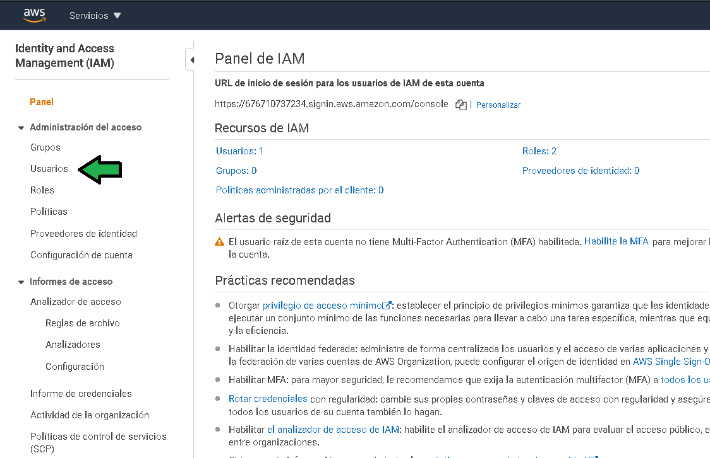
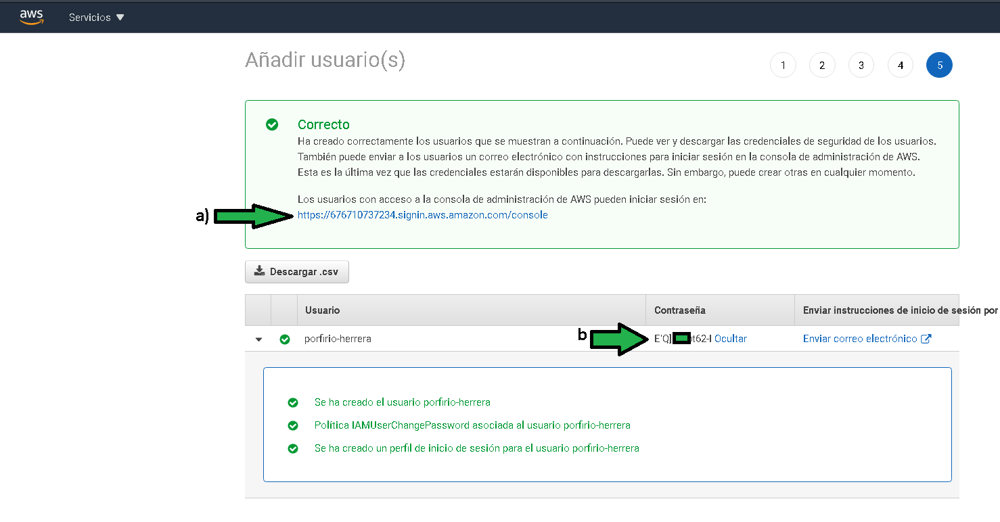
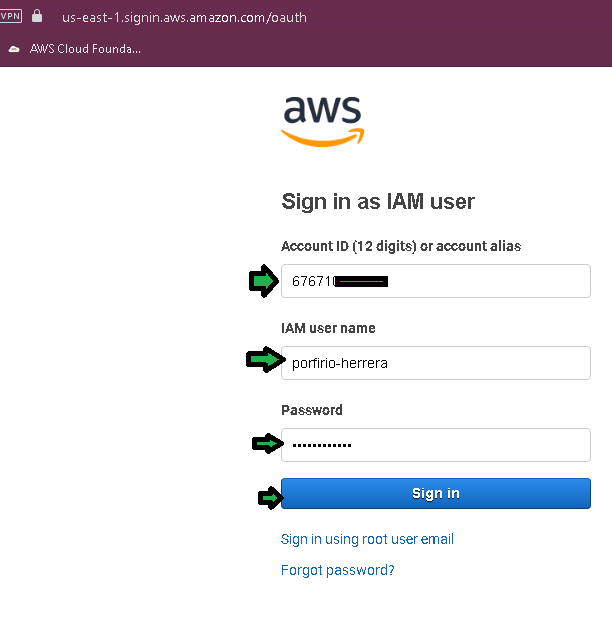
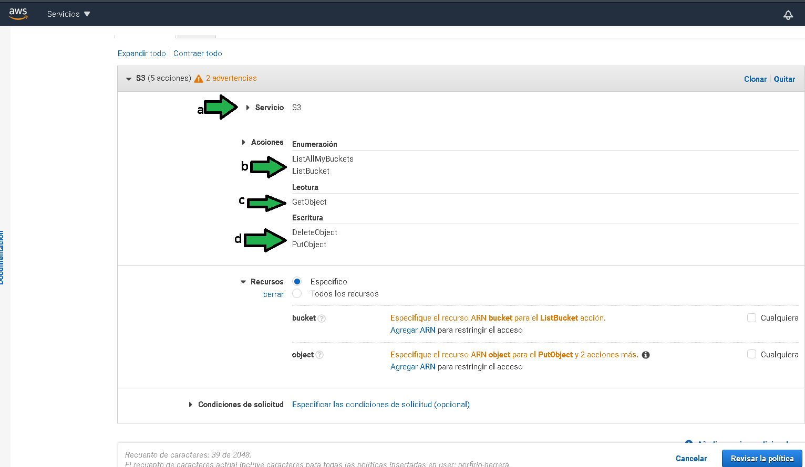
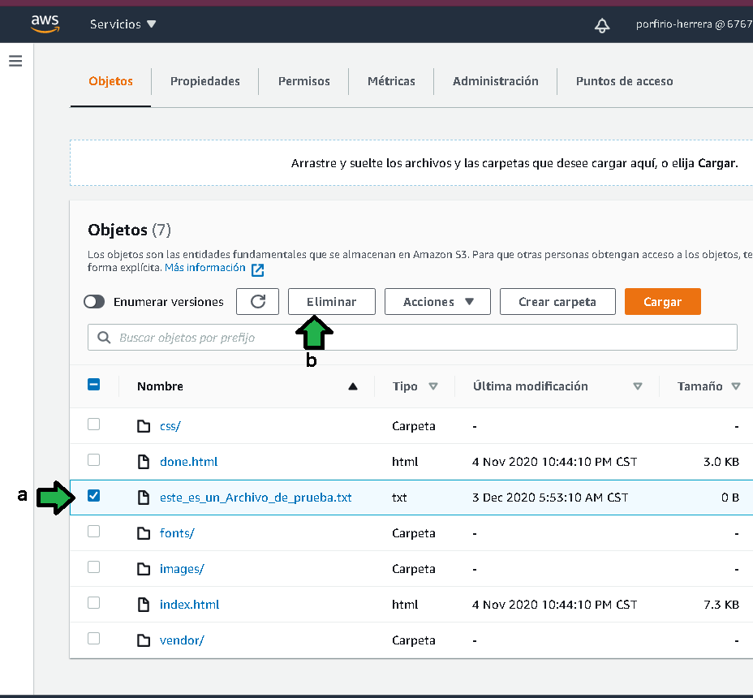

# Ejemplo 1 

# 1. Objetivo 🎯
- Conceder acceso restringido al bucket que funciona como web server para solo poder eliminar o agregar objetos a modo de mantenimiento de la página web servida por él. Así a quien se le conceda acceso podrá dar mantenimiento a la web sin comprometer la seguridad de la cuenta de AWS. 

# 2. Requisitos 📌
- AWS CLI instalado configurado y funcionando.
- Un bucket previamente configurado como servidor web estático funcional.

# 3. Desarrollo 📑

1. Ingresar a la consola de administración de AWS para acceder al servicio IAM.

2. Ingresar a la sección de usuarios para crear un nuevo usuario.

3. Click en "Añadir usuario(s)"

4. Agregar el nombre del usuario (a), especificar que se dará acceso a la consola de administración de AWS (b), especificar la generación de una contraseña aleatoria para la cuenta (c), las contraseñas aleatorias son difíciles de recordar se puede dar la opción para el usuario modifique su propia contraseña en el inicio de sesión con la contraseña aleatoria (d)

5. Por el momento no se agregará un permiso, pasar a la siguiente sección.

6. Establecer por lo menos una etiqueta que ayude a identificar la cuenta.

7. Generar el usuario.

8. Se muestra la url para el portal de login (a) al igual que la contraseña (b), se deben hacer llegar al usuario.

---------------

1. Una vez el usuario tiene sus credenciales se intenta acceder:

2. Se pedirá cambiar la contraseña por una contraseña personalizada.

3. Iniciada la sesión ingresar a S3 para verificar los permisos de la cuenta. Se comprueba la identidad de la sesión en la parte superior de la consola de administración.

4. Sin embargo al ingresar se aprecia un error, ¿a que se debe?, la cuenta generada no se le especificó ninguna política (permisos) por lo cual la política por defecto es de denegación.

 
[Documentación](https://docs.aws.amazon.com/IAM/latest/UserGuide/reference_policies_evaluation-logic.html#AccessPolicyLanguage_Interplay)

---------------------------
1. Regresar a la cuenta administradora en AWS Console para modificar el usuario (a,b) y asignar los permisos adecuados para generar y eliminar archivos del bucket dando click en "Añadir una política insertada" (c)

2. Especificar el servicio sobre el que actuará la política (a) en este caso es S3, se especifica también permiso para que el usuario pueda ver todos los buckets (b), se especifica que se pueden leer los elementos dentro de un bucket (c), se especifica se puedan generar o eliminar elementos del bucket (d) 

3. En la parte de "Recursos", se debe especificar el ARN del bucket al cual se permitirá el acceso, ya que el requerimiento es solo dar acceso al bucket que sirve como servidor web, a los otros buckets de la cuenta el usuario no debe tener acceso. Ir a "Agregar ARN" (a) y luego especificar el nombre del bucket al que se permitirá acceso (b).

4. Ahora se debe especificar a que objetos dentro del bucket aplicará la política (a), para este caso definir el nombre del bucket (b) y especificar la aplicación de la política a todos los objetos del bucket (c).

5. Se verifica de primera vista si la política es correcta, si es así pasar a la fase de "revisión"

6. En la etapa de revisión se debe especificar un nombre a la política (a), finalmente dar click en "Crear una política"

7. Se ve agregada la política, no se agrega con el cubo amarillo como la otra política, el cubo amarillo señala políticas que ya están pre definidas en IAM, la recién generada es una política a medida por ello no muestra el ícono del cubo amarillo.

-------------------------------

1. De regreso en la cuenta del usuario, al acceder a S3 ya se listan los buckets. 
(a) Acceder al bucket al que se aplicó la política de acceso 

2. Es posible ver todos los archivos del bucket, probar cargar un archivo (a) en el bucket.

3. Se verifica que la carga es exitosa (a), probar ahora la eliminación del archivo (b).

Se comprueba la eliminación exitosa.

5. Solo para probar, se tratará de acceder a los datos de otros buckets, el acceso es denegado.

