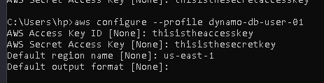
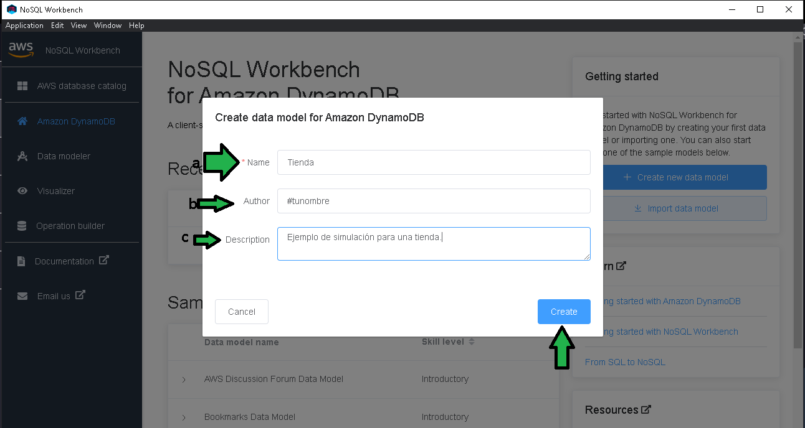
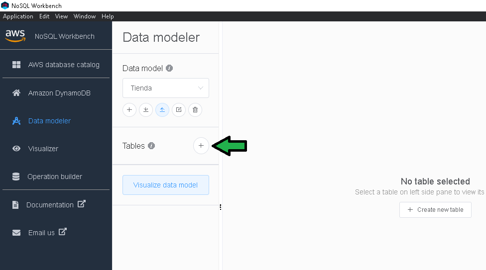
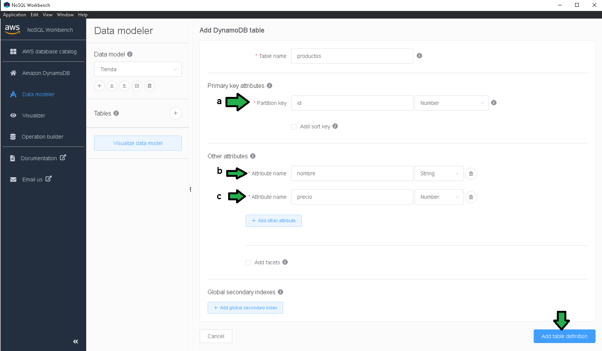
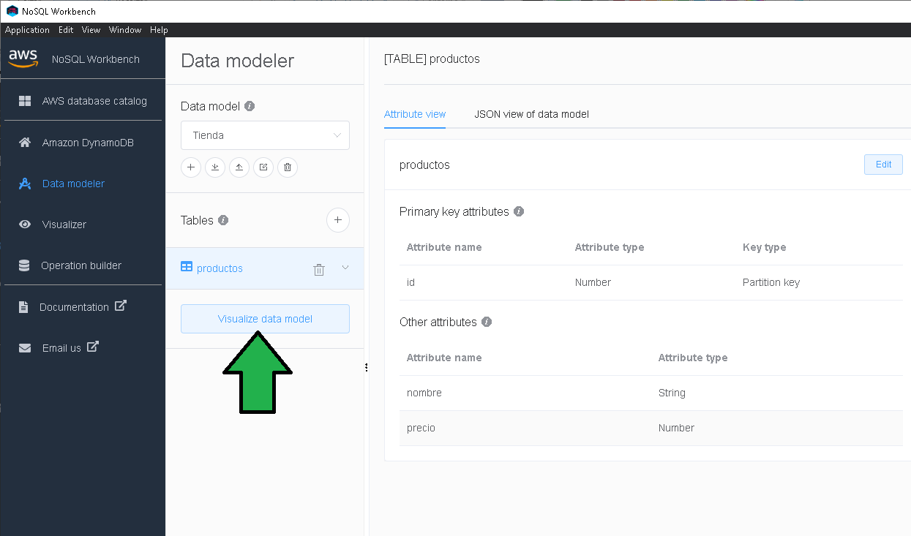
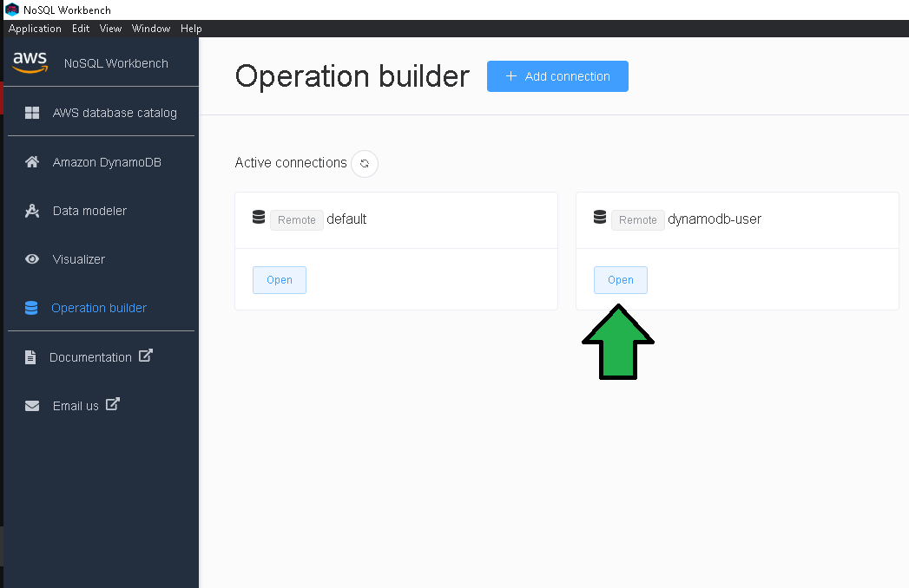
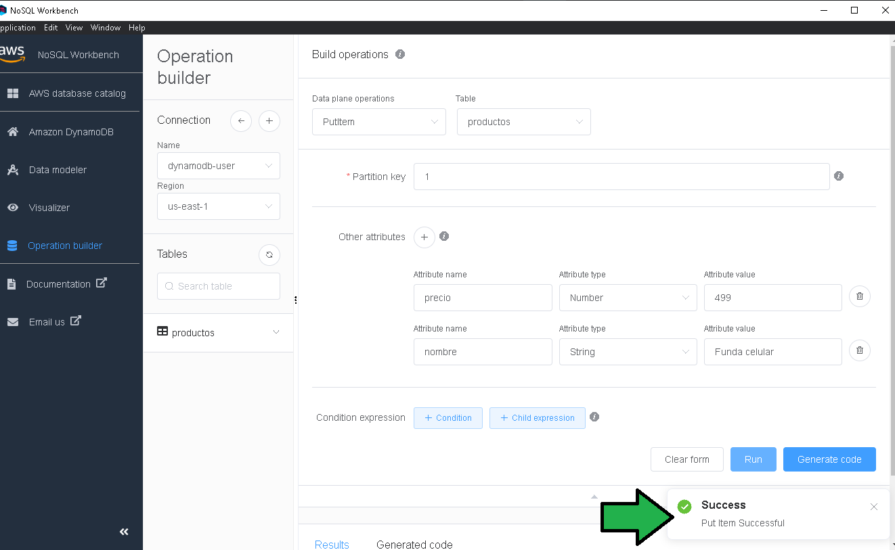
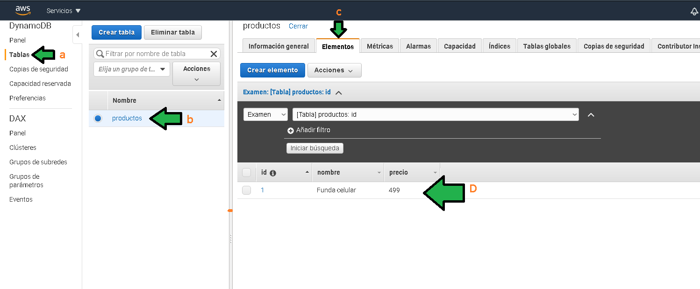

# Ejemplo 1

## 1. Objetivo 
- Uso básico de DynamoDB como base de datos no relacional por medio de interfaz gráfica.

## 2. Requisitos 

- Credenciales IAM con acceso mediante programación con acceso a DynamoDB, las credenciales deben ser dadas de alta en AWS CLI con el comando `aws configure`

</img>

Así se puede dar del alta la nueva cuenta de IAM en AWS CLI (especificar las llaves propias)

</img>

- NoSQL Workbench [instalado](https://docs.aws.amazon.com/amazondynamodb/latest/developerguide/workbench.settingup.html).

## 3. Desarrollo 

1. Ejecutar NoSQL Workbench
NoSQL Workbench es una herramienta diseñada por AWS como una interfaz gráfica para la administración de DynamoDB y Keyspaces. Para comenzar a administrar una base de datos DynamoDB hacer click en **Launch**.

</img>

2. Seleccionar **Create new data model**.

</img>

3. Configurar la creación del nuevo modelo con:
a) Establecer el nombre del modelo, para este ejemplo se simulará una tienda.
b) Es opcional colocar el nombre del autor.
c) Es recomendable colocar una descripción.

</img>

4. Para crear una tabla llamada `productos` dar click en "+"

</img>

5. Configurar la nueva tabla como:
a) Establecer la llave identificadora.
b) Agregar un atributo para `nombre` del producto.
c) Agregar un atributo para el `precio` del producto.
Click en agregar **Add table definition**

</img>

Click en **Visualize data model**.

</img>

6. Para persistir el cambio ya en AWS (hasta ahora la tabla está solo configurada en la herramienta NoSQL Workbench) hacer click en **Commit to Amazon DynamoDB**

</img>

7. Seleccionar la cuenta de AWS creada en IAM y dada de alta en AWS CLI, click en **commit**.

</img>
La tabla es generada.

8. Seleccionar la conexión con la que se podrán hacer las acciones básicas CRUD sobre la tabla.

</img>

9. Seleccionar la acción deseada (a), seleccionar la tabla que se desea modificar (b), establecer el ID del documento (registro) siendo el ID único, establecer los atributos del documento (c), ejecutar run.

</img>
 
 La inserción del documento fue hecha.
 
</img>

10. Para comprobar que los datos están persistidos en DynamoDB buscar el servicio DynamoDB.

</img>

11. Seleccionar "Tablas" (a), luego la tabla "productos" (b), seleccionar "elementos" (c), finalmente se puede visualizar el elemento generado (D).

</img>
