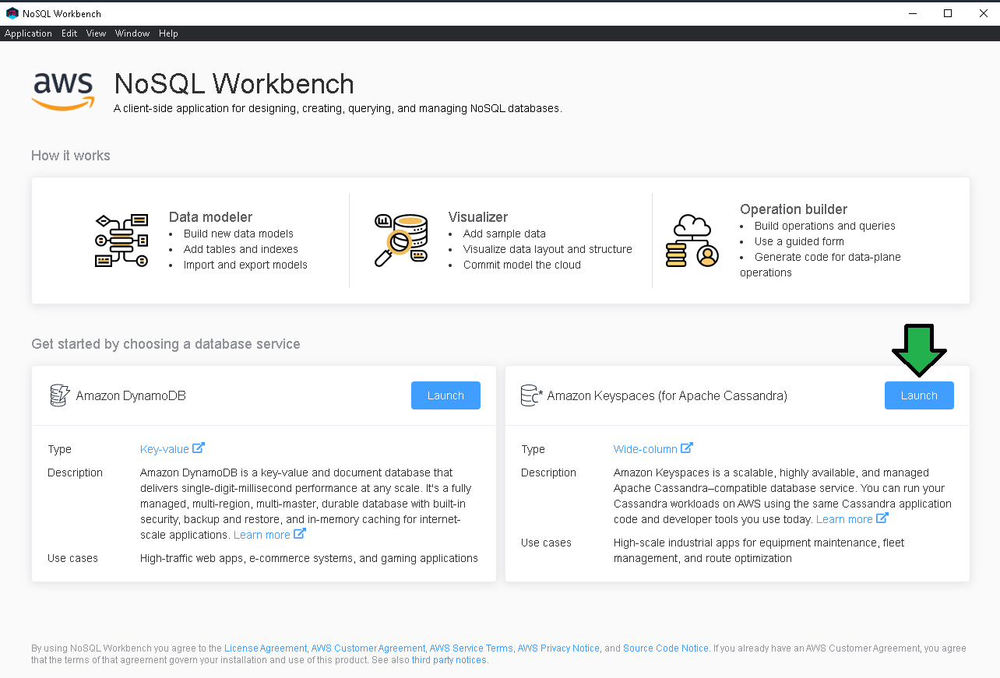
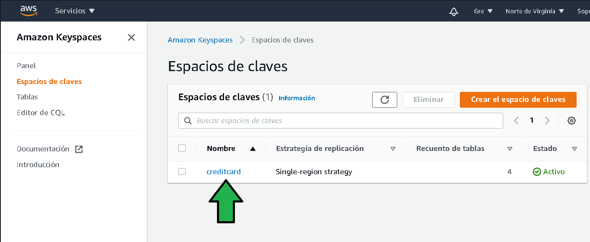
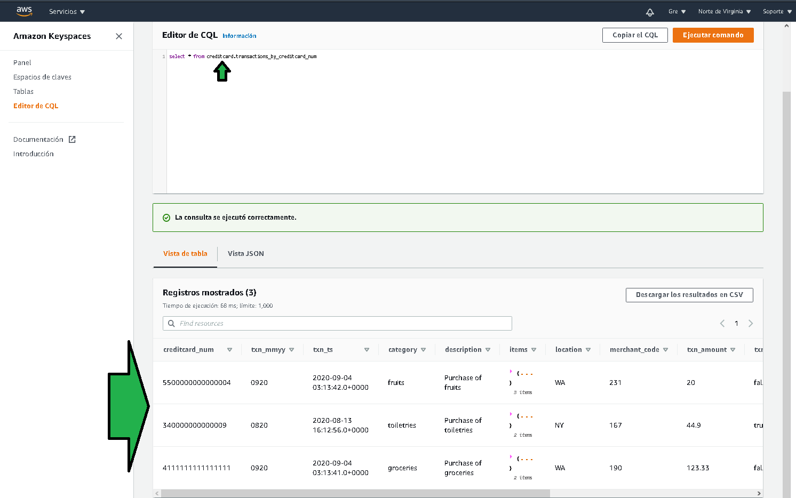

# Ejemplo 2

## 1. Objetivo 
- Administración de datos para la base de datos de AWS compatible con Cassandra; Amazon Keyspaces.

## 2. Requisitos
Credenciales IAM con acceso mediante programación con acceso a AWS Keyspaces, las credenciales deben ser dadas de alta en AWS CLI con el comando `aws configure`

</img>

Así se puede dar del alta la nueva cuenta de IAM en AWS CLI (especificar las llaves propias)

</img>

- NoSQL Workbench [instalado](https://docs.aws.amazon.com/amazondynamodb/latest/developerguide/workbench.settingup.html).

## 3. Desarrollo 

1. Abrir NoSQL Workbench, seleccionar "Launch" en la seccion de Amazon Keyspaces.

</img>

2. Para este ejercicio, se seleccionará una base de datos pre definida, seleccionar "Credit Card".

</img>

3. Se podrán observar las tablas de la base de datos de tarjetas de crédito, click en "Visualizer".

</img>

4. Para persistir estas tablas en AWS Keyspaces click en "Commit Amazon Keyspaces".

</img>

5. Descargar el [certificado de conexión](https://www.amazontrust.com/repository/AmazonRootCA1.pem), con el certificado de conexión seleccionar (b) las credenciales IAM (a).

</img>

Tardará un par de minutos en generar el espacio de claves y tablas.

</img>

Para editar datos se hará por medio de la consola de comandos CQL (Cassandra Query Language ).

6. Ir a la consola de AWS Keyspaces.

</img>

7. Al dar click en tablas se pueden observar las tablas donde se guarda la información, estas tablas ya vienen pre cargadas con información.

8. Click en **Editor CQL**

9. Ejecutar el comando `select * from creditcard.transactions_by_creditcard_num` (a,b), CQL es muy similar a SQL de otras bases de datos. Se visualiza un error al ejecutar la consulta (c), al query se debe agregar un `keyspace`, ¿cuál keyspace debo agregar?, click en "Espacios de claves" (c) para descubrirlo.

</img>

10. El keyspace para este caso es `creditcard`.

</img>

11. Ejecutar el query `select * from creditcard.transactions_by_creditcard_num` agregando el keyspace `creditcard`. Al ejecutar la consulta se pueden ver datos retornados.

</img>
