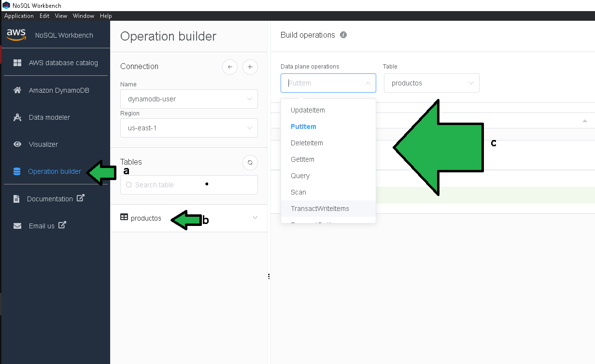

# Reto 1

## 1. Objetivo 
- Familiarizarse con la administración de una base de datos DynamoDB haciendo uso de un CRUD básico (Create, Retrieve, Update, Delete).

## 2. Requisitos 
- AWS CLI configurado con unas credenciales IAM con acceso de Lectura  y escritura en DynamoDB.
- NoSQL Workbench instalado.
- Una tabla generada con Operation builder.

## 3. Desarrollo 

Abrir NoSQL, seleccionar **Operation builder** (a), seleccionar la tabla (b) sobre la que se trabajará, seleccionar las acciones sobre la tabla (c), en esta última seleccionar **UpdateItem**, **DeleteItem** y **GetItem**.

</img>

