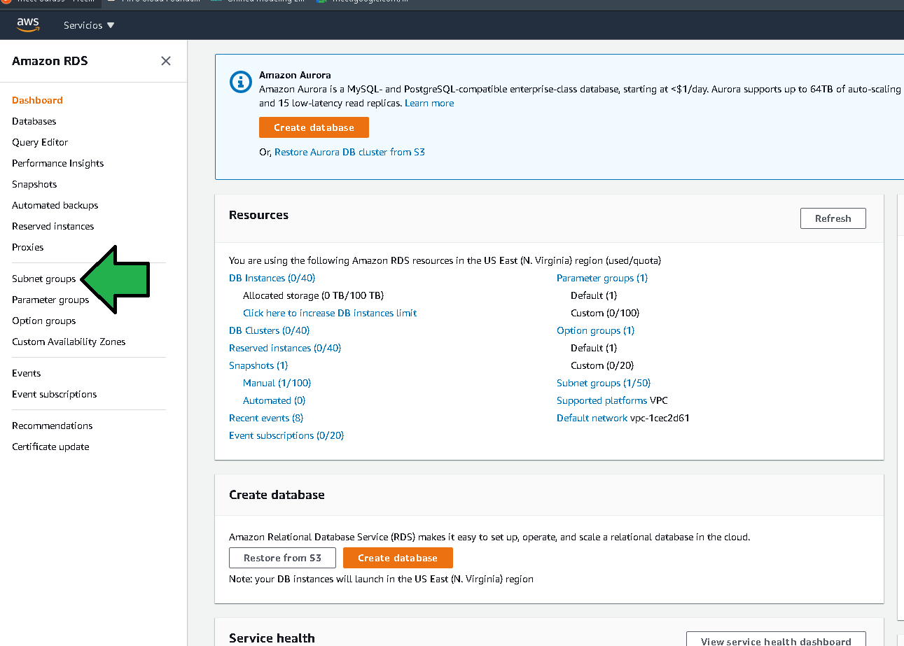
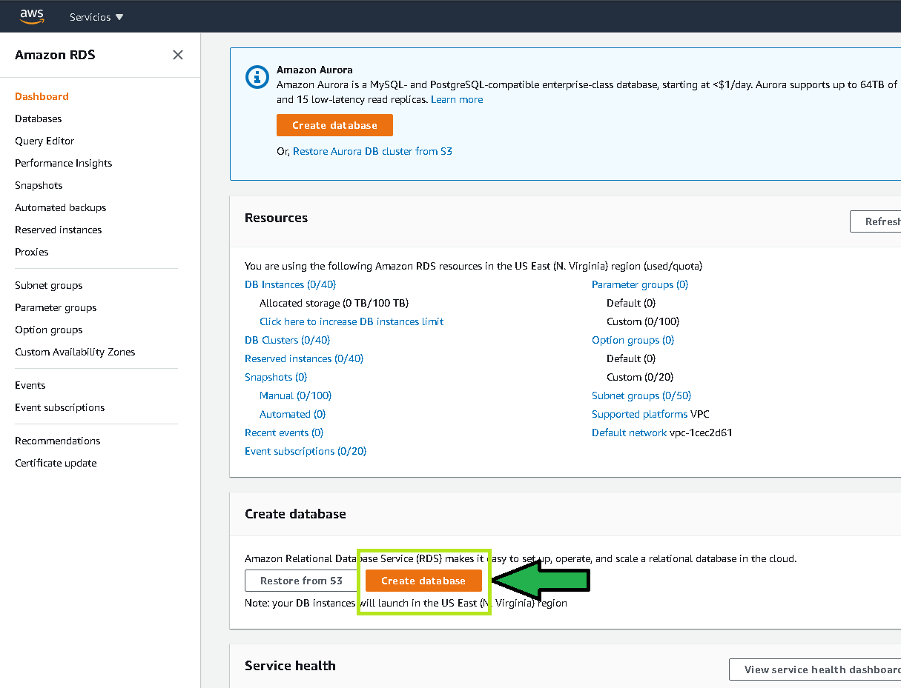
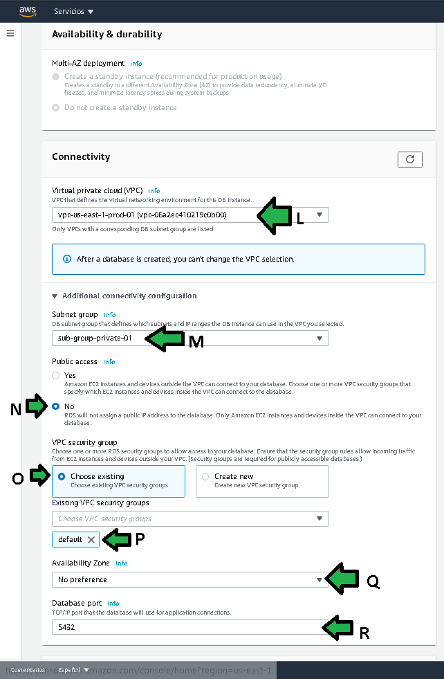

# Postwork Sesión X

# 1. Objetivo 🎯
- Generar una instancia de base de datos administrada para el guardado de datos de la aplicación.

# 2. Requisitos 📋
- Acceso con AWS Console.
- Una VPC configurada con dos subredes privadas en diferentes zonas de disponibilidad.

# 3. Desarrollo 📑

1. Buscar en los servicios dentro de la consola de administración de AWS el servicio RDS.

2. Un grupo de subredes  es una colección de subredes (normalmente privadas) que se crean para una VPC. Cada grupo de subredes de base de datos debe tener al menos una subred en al menos dos zonas de disponibilidad en la región de AWS. Para generar un nuevo grupo de subredes dar click en "Subnet groups", después en "Create DB Subnet Group"

3. Se configura el grupo de subred como:
a) Se debe especificar un nombre descriptivo.
b) Se debe agregar una descripción.
c) Seleccionar la VPC a la cual estará asociado.
d) Seleccionar las zonas de disponibilidad donde se tienen configuradas las subredes privadas.
e) Seleccionar finalmente las zonas de subred privadas donde se desea que AWS conecte las instancias RDS que usen este grupo de subred.

4. Generado el grupo de subred dar click en "Dashboard" para comenzar la creación de la instancia de base de datos.

5. Dar click en "Create database".

6. Para configurar la base de datos seleccionar las siguientes opciones:
a) Standard create para explorar varias de las opciones de configuración a la hora de crear una instancia de RDS.
b) Seleccionar el tipo de base de datos "PostgreSQL"
c) Seleccionar la versión de Postgres.

d) Para este caso de prueba seleccionar "Free tier", al generar una base de datos ara producción se deberá seleccionar "Production", Free tier solo esconde o deja inaccesible varios tamaños de instancia limitando a una instancia pequeña
e) Se debe especificar un identificador de la instancia, debe ser un valor descriptivo para facilitar la búsqueda en el dashboard al tener administrando múltiples instancias.
f) Especificar el usuario por defecto master de la base de datos, en este caso "postgres".
g) Establecer una contraseña para el usuario por defecto.

h) Establecer el tamaño de la instancia, hay una buena oferta entre tamaños de instancia, por haber seleccionado "Free tier" se limita a db.t2.micro con 1 vCPU y 1GiB de RAM.
i) Seleccionar disco de estado sólido de propósito general como storage.
j) Seleccionar el tamaño de disco duro que tendrá la instancia de base de datos.
k) Para este caso deshabilitar el auto escalado del tamaño de disco duro de la instancia.

L) Escoger la red VPC donde será conectada la instancia de base de datos.
M) Seleccionar el grupo de subred a la que se asociará la base de datos.
N) Eliminar el acceso público a la base de datos. Para que una instancia de base de datos sea de acceso público, las subredes del grupo de subredes de base de datos deben tener un Internet Gateway.
O), P)  Por el momento seleccionar como grupo de seguridad (el grupo de seguridad puede ser visto como un firewall) llamado "default", este grupo será cambiado en un paso posterior.
Q) Dejar que AWS seleccione la Zona de disponibilidad donde conectará la instancia de base de datos.
R) Seleccionar el puerto de conexión de la base de datos.

s) Seleccionar como se podrá acceder a la base de datos, en este caso "Password authentication".
t) Establecer un nombre descriptivo de la base de datos (es diferente al identificador que es útil solo para el dashboard de RDS), el nombre será parte de la cadena de conexión.
u) Deshabilitar los backups por el momento, en un entorno de producción deben ser habilitados y configurados.
v)  Deshabilitar las métricas de rendimiento,  en un entorno de producción deben ser habilitadas y configuradas.

w) Deshabilitar el monitoreo mejorado,  en un entorno de producción deben ser habilitado y configurado.
x) Deshabilitar los logs,  en un entorno de producción deben ser habilitados y configurados.
y) No permitir que se haga upgrade de la versión de la base de datos.
z) Deshabilitar las ventanas de mantenimiento.
1a) Proteger ante borrado accidental, se recomienda siempre debe ser habilitado aunque sean instancias de prueba.

7. Se Genera la instancia de base de datos al cabo de algunos minutos.

8. Creada la instancia, ir a "Databases" (a), se verifica que la instancia fue creada b), se puede observar el host o dominio DNS que servirá para conectarse a la instancia c), para corroborar las contraseñas dar click en "View credential details" d).

Copiar los datos de a) y b), mantenerlos presentes en todo momento.

¡Listo!, finalmente se ha avanzado un peldaño mas en la realización del proyecto. El diagrama queda como sigue.

