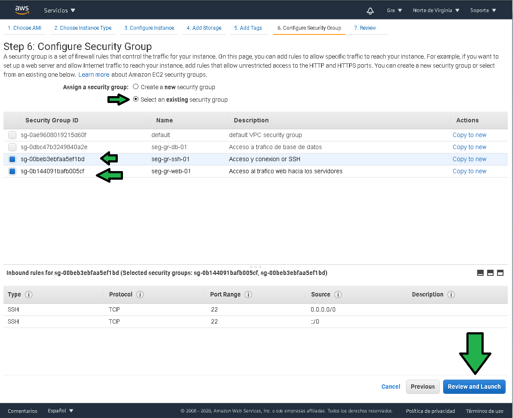

# Ejemplo 2 

## 1. Objetivo 
- Conocer el bastión básico para la ejecución de cómputo en la nube con EC2. 


## 2. Requisitos 
- Acceso a la consola de AWS (log)
- Una base de datos RDS generada, tener contraseña, usuario, url (Endpoint ) de la instancia.
- Tener grupos de seguridad de tráfico de entrada a puertos 22, 80, 443, 5432.
- Certificado de seguridad en Amazon Certificade Manager.

## 3. Desarrollo 

1. En el panel de EC2, dar click en "Lanzar la instancia".


2. Seleccionar la siguiente AMI.


3. Seleccionar el tamaño de la instancia, para este ejercicio t2.micro esta bien.


4. Configurar la instancia como:
a) Establecer el número de instancias en **2**.
b) Seleccionar la VPC con la que se ha venido trabajando.
c) Seleccionar una de las subredes públicas.
d) Establecer asignación de IP pública al momento de generarse la instancia.


e) Establecer el comportamiento del apagado de la instancia como "Stop"
f) Habilitar la protección contra borrado accidental (se recomienda siempre habilitarla).
g) Establecer la ejecución en hardware compartido.
h) Establecer comandos que se deben ejecutar al momento de crear la instancia, copiar y pegar los siguientes comandos (debe ir desde el # hasta la última palabra).
```ssh
#!/bin/bash
sudo yum update -y
sudo amazon-linux-extras install -y docker
sudo yum install -y postgresql
sudo service docker start
sudo usermod -a -G docker ec2-user
sudo systemctl enable docker
```


5. Establecer el storage que tendrán las instancias, habilitar el borrado en terminación, al momento de eliminar la instancia también se eliminará el volumen.


6. Establecer Tags para facilidad de administración.


7. Establecer los grupos de seguridad (firewall a nivel de instancia) definiendo el tráfico permitido a las instancias. En este caso SSH, HTTP y HTTPS.




8. Verificar las configuraciones y lanzar las instancias.


9. Generar la llave de conexión nueva (a), establecer el nombre de la llave (b), descargar la llave (c) sin la llave no se podrá conectar a la instancia por SSH, finalizar en "Launch Instances" (d).


Después de algunos momentos las instancias son generadas.

