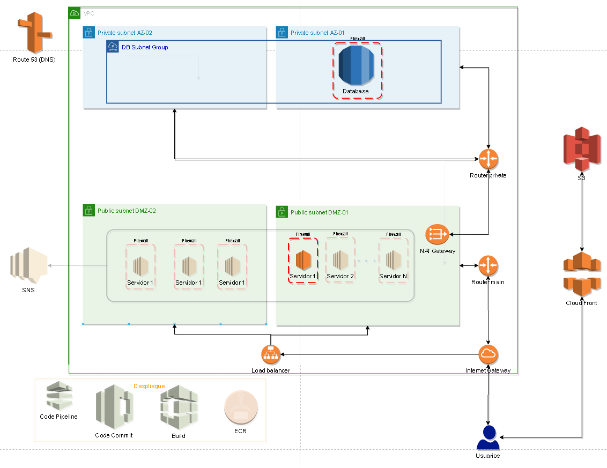
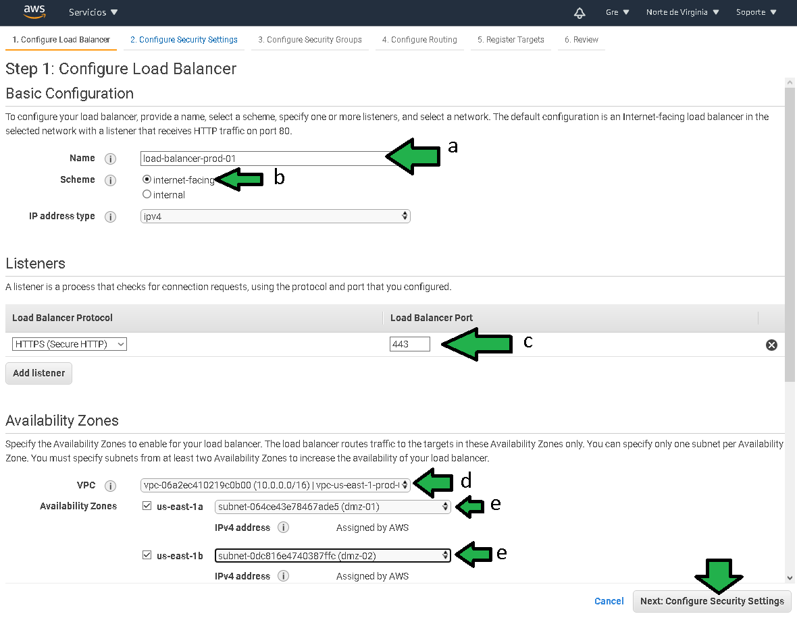

# Ejemplo 2: Load Balancer

## 1. Objetivo 
- Conocer la configuracion para usar un balanceador de carga.

## 2. Requisitos 
- Acceso a la consola de AWS (log)
- Una base de datos RDS generada, tener contraseña, usuario, url (Endpoint ) de la instancia.
- Tener grupos de seguridad de tráfico de entrada a puertos 22, 80, 443, 5432.
- Certificado de seguridad en Amazon Certificade Manager.
- [Postman](https://www.postman.com/product/rest-client/) instalado para verificar el funcionamiento de la API.

Toca dar de alta el balanceador de carga, se encargará de despachar las solicitudes a cada una de las instancias lanzadas.

1. En el panel del servicio EC2, seleccionar "Balanceadores de carga" (a), después "Create Load Balancer" (b).

2. Seleccionar el balanceador de carga de tipo **Application**

3. Configurar el balanceador con:
a) Establecer un balanceador de carga.
b) Establecer un balanceador de carga de cara hacia internet
c) Seleccionar el tráfico https
d) Seleccionar la red VPC con la que se ha venido trabajando
e) Seleccionar las subredes públicas de cara a internet.

4. Seleccionar el certificado de seguridad.

5. Seleccionar el permiso para tráfico https.

6. Establecer el **target group**, básicamente con esto se le indica al balanceador de carga cuales son las instancias EC2 a las que debe ser redirigido el tráfico.

a), b) Especificar un nuevo target, dar un nombre específico al target para fácil administración.
c) especificar que se darán de alta en el grupo instancias.
d), e) Especificar protocolo y puerto al cual será redirigido el tráfico hacia las instancias.
f) Para este caso especial por el tipo de programa que se usará, especificar el protocolo http y la ruta `/api/v1/` como path para verificar que el servicio se este ejecutando.

 
7. Agregar las instancias que se agregaran al target group para redirigir el tráfico web.
a) Seleccionar las instancias.
b) Agregar las instancias al balanceador.

Pocos segundos después el balanceador es generado.

 