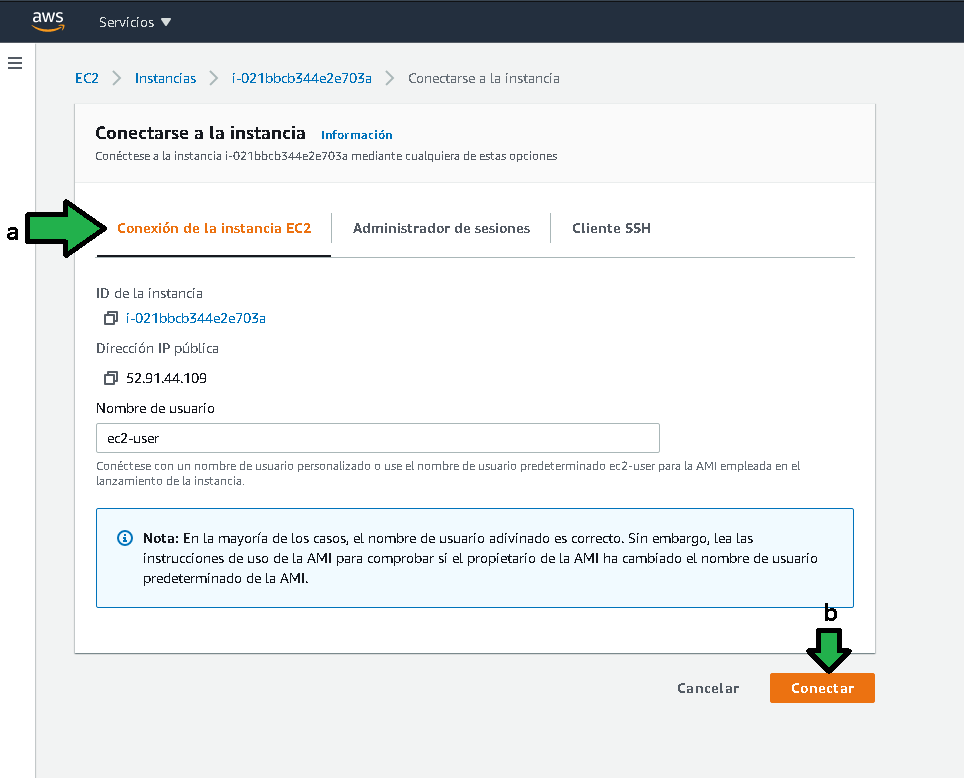
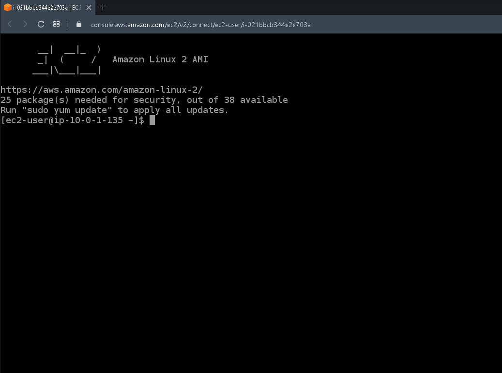
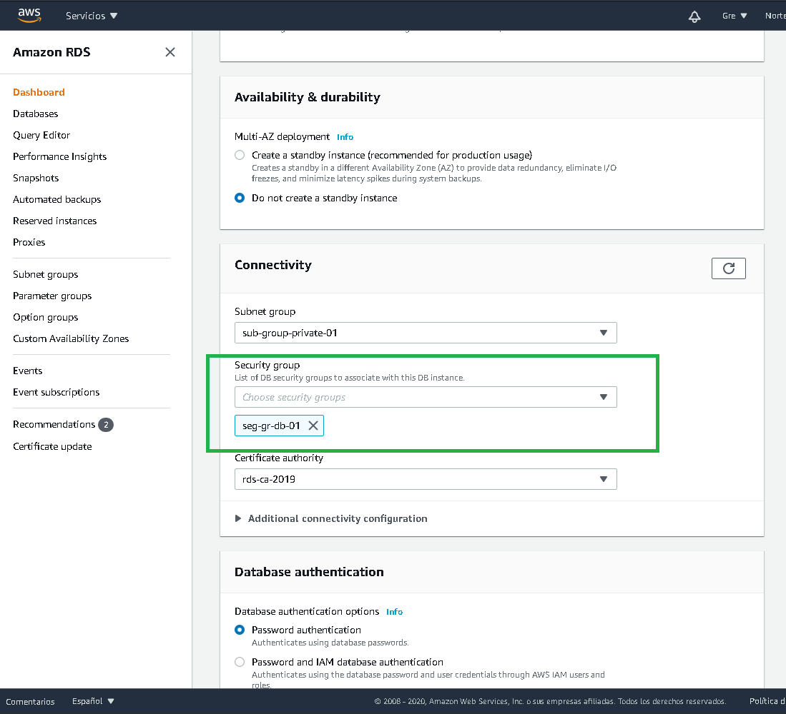
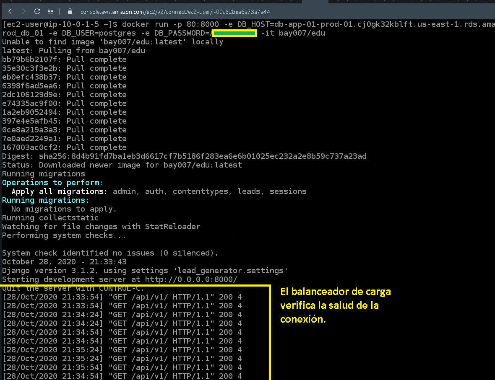
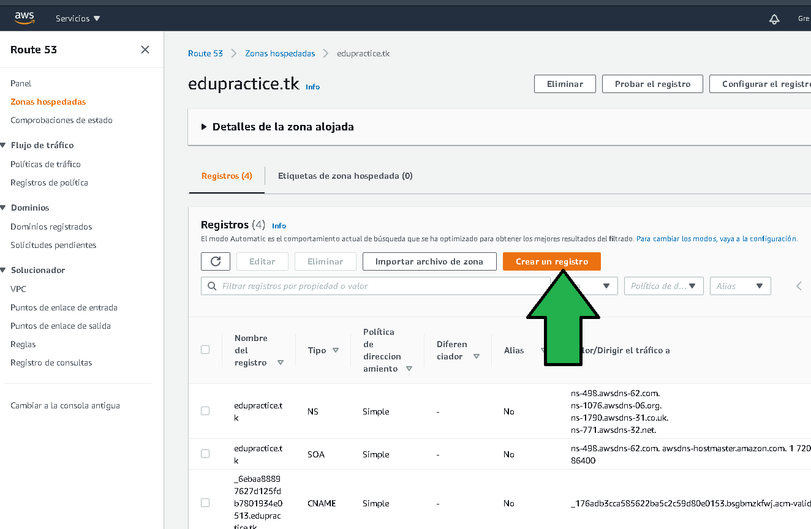
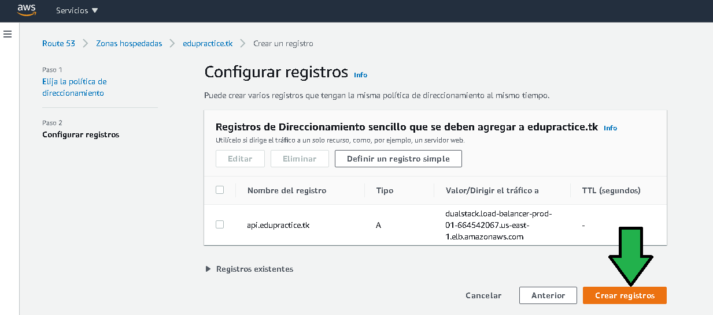
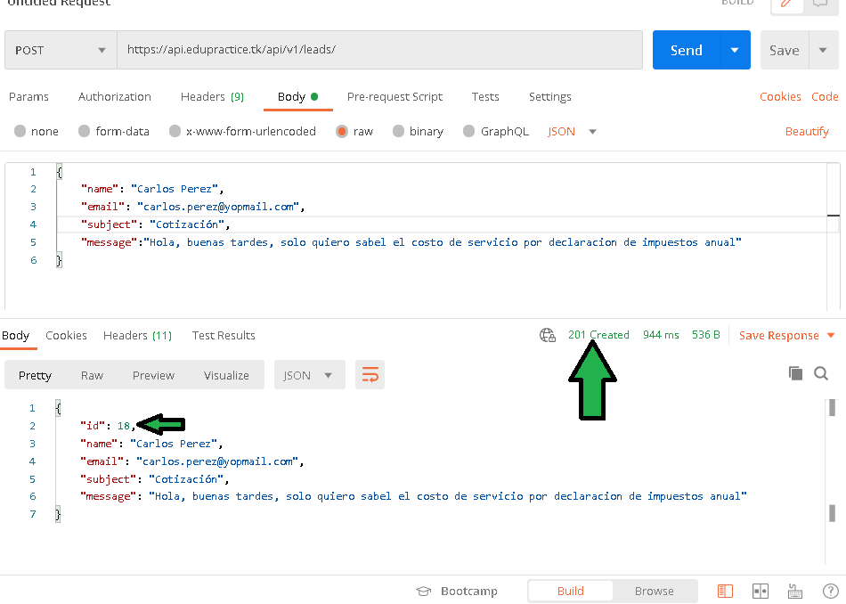

# Ejemplo 4 

## 1. Objetivo 
- Configurar las redes para conexión a base de datos


## 2. Requisitos 
- Acceso a la consola de AWS (log)
- Una base de datos RDS generada, tener contraseña, usuario, url (Endpoint ) de la instancia.
- Tener grupos de seguridad de tráfico de entrada a puertos 22, 80, 443, 5432.
- Certificado de seguridad en Amazon Certificade Manager.
- [Postman](https://www.postman.com/product/rest-client/) instalado para verificar el funcionamiento de la API.

Generado el balanceador de carga ahora hay que desplegar el código que ejecutará cada una de las instancias.
1. Para ingresar a la instancia hay que ir al panel de EC2, luego a la sección "Instancias", dar click en una instancia (b) y dar click en "Conectar" (b)


2. Seleccionar "Conexión de la instancia EC2" (a), luego "Conectar" (b).




La conexión se establece en unos segundos a una consola bash conectada a la instancia.



3. Habrá que corroborar el acceso a la base de datos generada con anterioridad.
Para lo cual habrá que ejecutar el comando 
```ssh
psql -h <endpoint del host> -U <usuario_de_base_datos>
```

Ejemplo: 

**¡En este caso hay un problema!**, no se logra la conexión con la base de datos, al no lograr conexión, lo primero que hay que hay que verificar son los grupos de seguridad, recordar que los grupos de seguridad actuan como un firewall, para lo que habrá que dirigirse a la sección de RDS.


- Click en **Databases**


- Seleccionar al instancia y luego dar click en **Modify**


- Hacer scroll hasta la parte de **Connectivity**, aquí se observa el problema, se tiene un grupo de seguridad por defecto, habrá que cambiar el grupo para explícitamente permitir el tráfico al puerto 5432.


- Se selecciona el grupo de seguridad adecuado para el tráfico de Postgres en el puerto 5432.


- Hacer scroll al final de la pantalla y dar click en **Continuar**


- Especificar que los cambios se generen inmediatamente, luego dar click en **Modify DB instance**.


- El cambio es prácticamente instantáneo.
 


Regresando a la linea de comandos (si deja de responder solo refrescar pantalla con F5) se puede corroborar la conexión a la instancia de base de datos, incluso se pueden listar las bases de datos, tener el nombre de la base de datos en cuenta.


4. Para seguir con el ejemplo, se deberá ejecutar en la linea de comando el siguiente comando
```ssh
docker run -p 80:8000 -e DB_HOST=db-app-01-prod-01.cj0gk32kblft.us-east-1.rds.amazonaws.com -e DB_NAME=clientes_prod_db_01 -e DB_USER=postgres -e DB_PASSWORD=<el-password-de-la-base> -it bay007/edu
```

docker run: Indica que se deberá ejecutar un comando de docker
En las variables de entorno DB_HOST, DB_NAME, DB_USER, DB_PASSWORD se deberán establecer los parámetros propios para la conexión con la base de datos.


Ejecutado el comando se tendrá un contenedor de Docker con el código fuente funcionando.


5. La ejecución del contenedor de Docker se debe efectuar en la otra instancia de EC2, para lo que hay que conectarse a ella y ejecutar el mismo comando de Docker del paso 4.


Pasados algunos minutos se comienza a observar tráfico hacia la instancia EC2 y en consecuencia a los contenedores ejecutándose. Este tráfico es generado por el balanceador de carga probando la salud del servicio.




6. Ahora como paso siguiente se se debe configurar el balanceador de carga con un subdominio, ya que las peticiones web no llegarán directamente a las instancias de EC2 y a los contenedores que estan dentro de ellas, quien recibe el tráfico HTTP y HTTPS será el balanceador de carga, y para poder llegar a él se debe configurar un subdominio, para lo cual se debe ir al servicio Route 53.


7. Click en **Zonas alojadas**


8. Entrar al  dominio para su modificación.


9. Click en **Crear registro**



10. Seleccionar **Direccionamiento sencillo**


11. Click en **Definir un registro simple**


12. Configurar el registro como:
a) Establecer el subdominio como `api`
b) Buscar el servicio de "Balanceo de carga clásico y de aplicaciones"
c) Seleccionar la región donde se encuentra el balanceador de carga.
d) Seleccionar el balanceador de carga, hay que notar el dominio del balanceador, por ello importante nombrar los recursos.
e) Definir redirigir el tráfico a IPv4
f) Deshabilitar la opción.


13. Click en **Crear registros**



Segundos después el registro es creado


14. Cinco minutos después de generado el registro al hacer ping ya hay una resolución del subdominio `api`, esperar hasta que el ping tenga resolución a una IP. (Notar que el balanceador no responderá al ping, es normal ya que el balanceador solo tiene permitido por el grupo de seguridad y la propia configuracion del balanceador majenar tráfico de los puertos 80 y 443 es decir HTTP y HTTPS)


15. Con Postman se comenzará la prueba de funcionamiento de la API. 
a) Seleccionar el protocolo POST.
b) Establecer la la URL a la que se hará el request, conformada por `https://` más el subdominio recién configurado en Route 53 más el path `/api/v1/leads/` (poner atención en la diagonal al final).
c) Establecer la petición como `raw`.
d) Establecer el tipo de petición como `JSON`.
e) Establecer el cuerpo del mensaje como:
```json
{
    "name": "Carlos Perez",
    "email": "carlos.perez@yopmail.com",
    "subject": "Cotización",
    "message":"Hola, buenas tardes, solo quiero saber el costo de servicio por declaración de impuestos anual"
}
```
f) Generar la petición.


Hecha la petición se ve el código de estatus 201 lo que indica que el registro fue creado en la base de datos, además del ID que la base ha asignado al registro.



Viendo la consola se puede ver la petición recién hecha.


