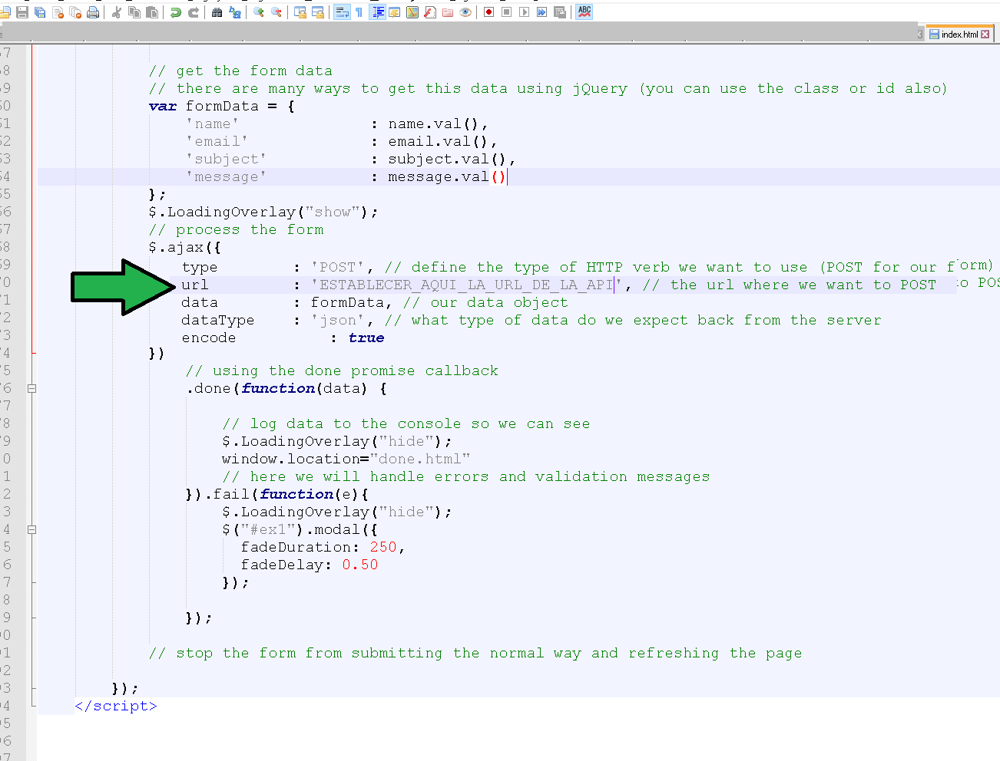
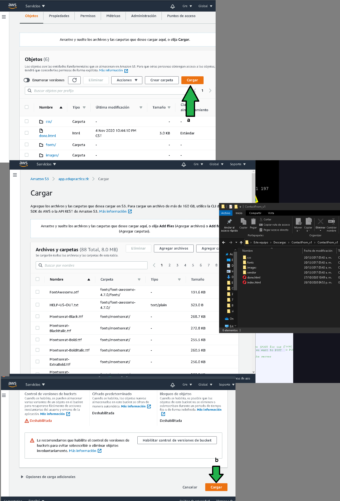
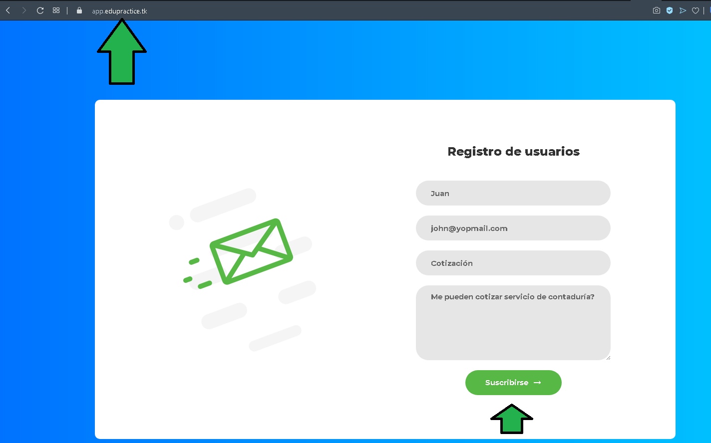

# Ejemplo 5

## 1. Objetivo 
- Conjuntar múltiples servicios operando para dar vida a un aplicativo completo. 

## 2. Requisitos 
- Acceso a la consola de AWS (log)
- Una base de datos RDS generada, tener contraseña, usuario, url (Endpoint ) de la instancia.
- Tener grupos de seguridad de tráfico de entrada a puertos 22, 80, 443, 5432.
- Certificado de seguridad en Amazon Certificade Manager.
- [Postman](https://www.postman.com/product/rest-client/) instalado para verificar el funcionamiento de la API.

Ya corroborado el funcionamiento de la API, se procede con la [descarga del código fuente HTML](assets/contact_form.zip) que estará de cara al usuario final.

1. Con el código fuente descargado, descomprimir el zip, abrir el archivo `index.html` en un editor como Notepad, Vim, VSCode, SublimeText, Atom, Notepad++ o cualquier otro.
2. Ir a la siguiente sección de código para establecer la URL de la API, misma que fue usada en Postman.

En el ejemplo trabajado se tiene la URL, el alumno deberá establecer la URL con su propio dominio.

Se guarda el archivo.

3. Subir los archivos al bucket S3.

4. Seleccionar el bucket que hostea la página web.

5. Dar click en "Cargar" (a), arrastrar los archivos y carpetas, dar click en "Cargar" (b).

6. Ya subidos los archivos, acceder al subdominio `app`, se debe visualizar un formulario de captación de datos que al modificar la URL ya guardará los datos en la base de datos. 

Al hacer click en **Suscribirse** los datos serán guardados.

**🎉¡Felicidades!**, ha sido un trabajo arduo llegar hasta este punto, el estado del proyecto es el siguiente:

