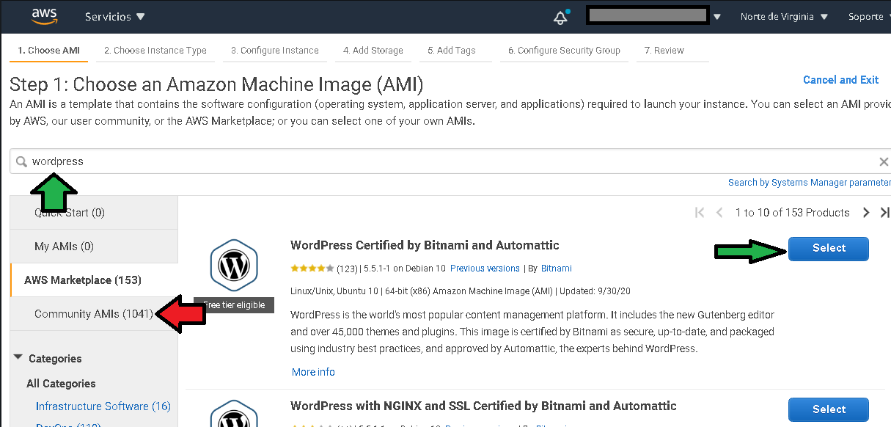
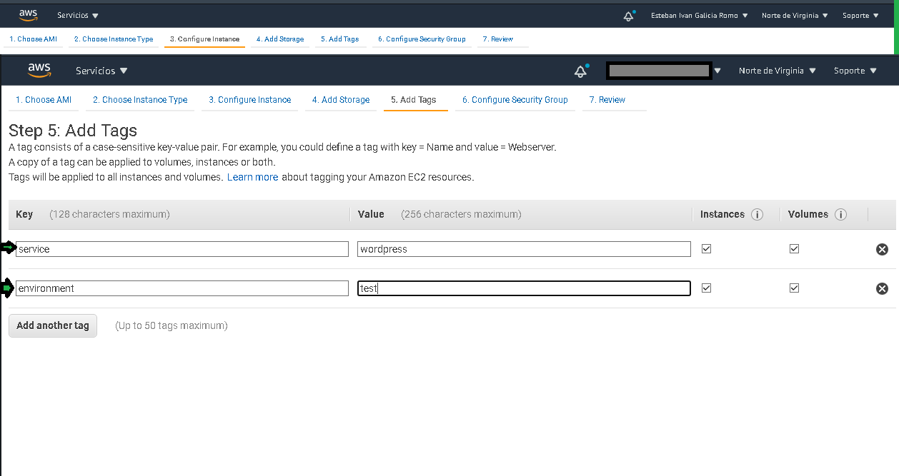
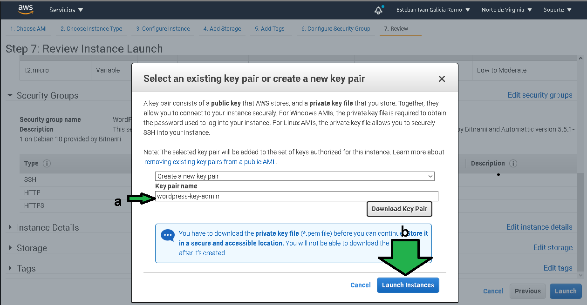
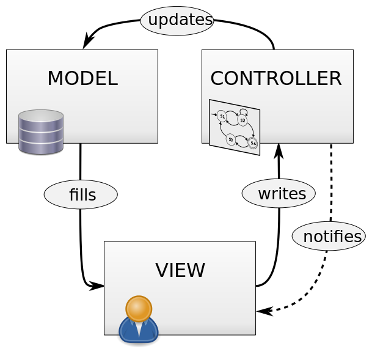
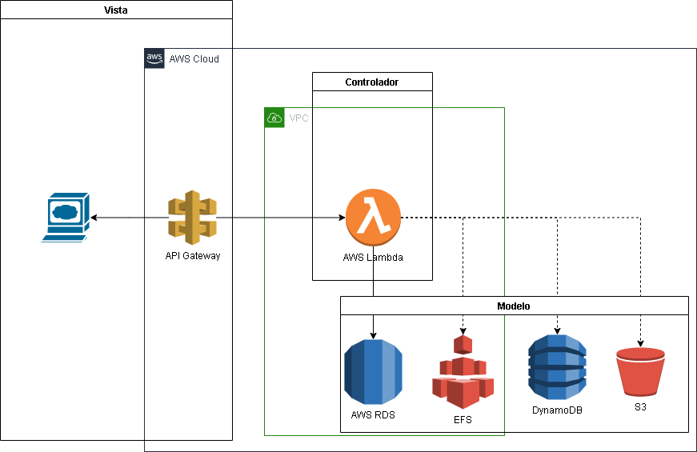
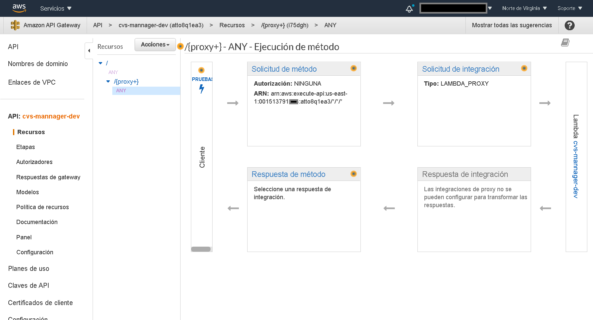
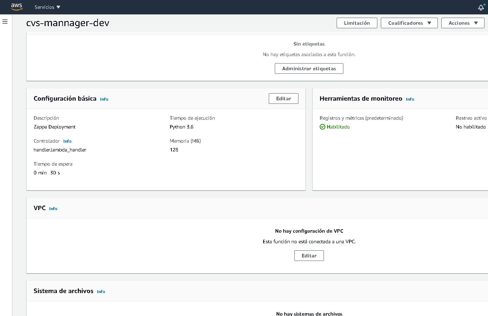
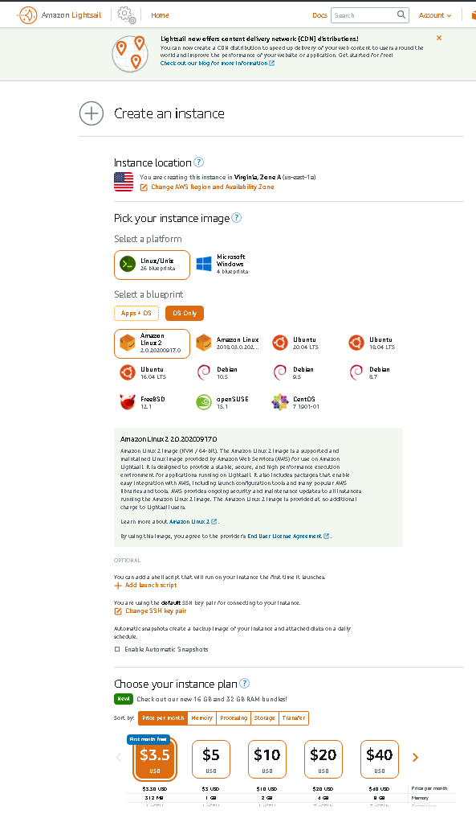
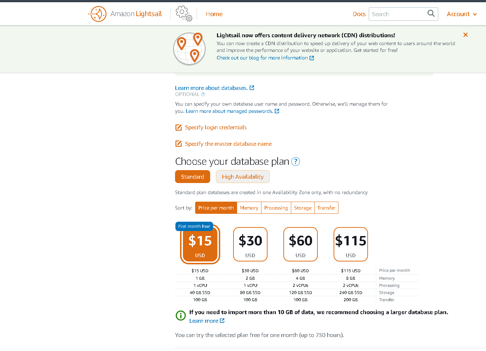

# Prework Sesión X

## Introducción
Cómputo compartido ha sido uno de los principales motivantes para la evolución de lo que hoy conocemos como nube. Cada proveedor de nube ofrece formas diversas de cómputo en la nube más allá de máquinas virtuales, el modelo de ejecución serverless ha adquirido buena popularidad en los últimos cuatro años.
El como una aplicación será desplegada, administrada, escalada y mantenida será dictado en gran medida por el tipo de cómputo seleccionado y las necesidades específicas del negocio a soportar. 

### 1. Objetivo 🎯
- Brindar las habilidades para ejecutar software en la nube de AWS desde el hágalo por usted mismo hasta seleccionar una solución preconfigurada lista para ejecuatarse.

### 2. Instrucciones 📋
- Buscar un lugar libre tranquilo libre dde notificaciones de dispositivos electrónicos.
- Leer con atención.

### 3. Desarrollo 📑

# Amazon Elastic Compute Cloud (EC2)
Amazon Elastic Compute Cloud, o Amazon EC2, un servicio web que proporciona capacidad de cómputo en la nube segura y escalable.
EC2 proporciona infraestructura que se ejecuta en la nube y funciona como un centro de datos que se ejecuta localmente. Es ideal para empresas que necesitan  flexibilidad y rendimiento al mismo tiempo.
En concreto EC2 permite rentar un servidor remoto para ejecutar aplicaciones con una gama de diversas capacidades. Puede rentarse bajo un esquema bajo demanda por hora, # tipos_de_renta.
En EC2 se maneja el término _instancia_ para referir a un servidor virtual conformado de red, memoria, almacenamiento y CPU,
Otro término importante es AMI (Amazon Machine Image). AMI puede ser visto como una plantilla para la creación de servidores, las plantillas vienen configuradas con un sistema operativo y de ser requerido software específico, se pueden encontrar imágenes para desplegar una instancia Ubuntu 18, aunque también se halla una AMI con Ubuntu 18 y Postgres entre otras.
Las instancias pertenecen a la categoría IaaS, por lo que se tiene el control hasta del propio sistema operativo, con lo cual se tiene la flexibilidad de instalar prácticamente cualquier software, desde una base de datos de cualquier proveedor como Oracle, MySql, Postgres o SQL server de Microsoft, un CMS como Wordpress, un LMS como Moodle, un servidor web como Apache o Nginx, prácticamente cualquier software puede ser instalado en una instancia de acuerdo al sistema operativo y recursos con los que se provisione. Esta flexibilidad es la que le da la connotación `elastic`, puede cubrir los requerimientos de la organización mas grande y exigente con necesidades demandantes de CPU, RAM, almacenamiento y red hasta las pequeñas empresas. La flexibilidad esta dada también por los mas de 200 tipos de instancias disponibles para escoger, están pensadas para estar optimizadas en memoria, red, cómputo intensivo o propósito general.

##  Amazon EC2: Tipos de servicios
Las instancias de propósito general tienen un equilibrio en velocidad de red y memoria ideal para ejecutar web servers, contenedores y entornos de desarrollo.
Otro tipo son las instancias optimizadas en informática, las aplicaciones recomendadas son machinne learning, servidores de vídeo juegos, motores de publicidad dirigida, creación de modelos científicos, análisis de datos distribuidos por mencionar algunos.
Las instancias optimizadas para memoria son especialmente útiles para ejecutar Redis, Memcached, analytics para dashboards de BI, clusters Hadoop/Spark, base de datos como MongoDB y Cassandra.
Otro tipo son las instancias de informática acelerada, capaces de operar con aplicaciones de deep learning, simulaciones científicas, finanzas, reconocimiento de voz, en general, todo lo que sobrepase el poder de una CPU y requiera una GPU.
Por último las bases de datos optimizadas en almacenamiento, ideales para cargas de trabajo con demandantes requerimientos de escrituras y lecturas en disco como bases de datos relacionales, bases de datos NOSql, almacenamiento de datos.

# Creando un servidor web usando EC2: Despliegue de instancias

Al desplegar una instancia se debe tener presente la aplicación que se le dará, no es lo mismo escoger una instancia para WordPress para la intranet de una organización que poner WordPress para un sitio de noticias.
El sitio de noticias tendrá cientos de usuarios consultando el blog al mismo tiempo, y por ser del giro de noticias, no es viable que el sitio se caiga pues afectaría la reputación de la marca, hay que pensar en una estrategia de replicación en múltiples zonas de disponibilidad, también importante tomar en cuenta dónde están ubicados físicamente los usuarios finales del servicio que ejecute la instancia así poder seleccionar la región apropiada para el despliegue de la instancia (1), seleccionar en el menú "instancias" y seleccionar "Launch instance" (3).

Se debe seleccionar en la siguiente sección el tipo de AMI apropiada para la aplicación, se debe seleccionar una AMI con solo el sistema operativo, también se puede escoger una con software específico, bastará con teclear en el buscador lo que se requerirá como ejemplo se instalará un blog de WordPress.
NOTA: Se debe tener especial cuidado con las las imágenes de de comunidad (marcadas en rojo) según se alerta en el [siguiente artículo](https://medium.com/mitiga-io/security-advisory-mitiga-recommends-all-aws-customers-running-community-amis-to-verify-them-for-5c3e8b47d2d8).

Seleccionada la AMI el paso siguiente es escoger el tipo de instancia que se ajusta a los requerimientos, primero se muestra un previo sobre los precios y tipo de instancia, al pasar el previo seleccionar el tipo de instancia, es importante tomar nota de los precios, AWS presenta los precios por hora, de primera mano pueden parecer pequeños, así que siempre es recomendable hacer los cálculos necesarios para tener el precio por mes, eso da una mejor idea cuanto costará la instancia. Como ejemplo, se selecciona la instancia  t2.micro.
Previo:

Catálogo de instancias:

Ahora seleccionar el número de instancias a desplegar (a),
en que red VPC y la subred a la que se conectará en este caso asignaremos una IP publica para tener acceso desde internet (b),  seleccionar el tipo de comportamiento que tendrá la instancia al apagar, se puede detener la instancia (y en consecuencia el costo de la hora de instancia, aunque el storage aún sigue cobrándose) o se puede dar por `terminated`, es decir, al apagarla será eliminada (c). Se recomienda poner la instancia con protección contra `termination`, es decir protección contra borrado accidental (d).

Paso siguiente: Seleccionar el o los volúmenes EBS que serán asociados a la instancia. La capacidad debe ser definida (a), el tipo de disco duro a utilizar (b), especificar si se desea eliminar el volumen al eliminar la instancia (c), y si se requiere cifrar el disco con una llave de cifrado previamente definida en AWS KMS (d).

Se debe asignar algunas etiquetas a la instancia, es especialmente importante al usar la herramienta _Cost Explorer_ al analizar la factura del final de mes.

Definir el tipo de tráfico, las direcciones IP de origen, los puertos permitidos a modo de firewall es necesario para mejora de seguridad de la instancia. Al haber seleccionado una AMI para WordPress ya tiene predefinidas algunas reglas, el puerto 80 y 443 son para conexión de los usuarios finales, el 22 para la administración de la instancia por SSH.

El último paso es escoger una llave criptográfica para la conexión por ssh a la instancia (no importa si es una AMI de sistema operativo o una con software precargado). En este ejemplo se generará una llave nueva (a). Lanzaremos el proceso de instalación (b).

La instancia ya tiene asignada una dirección IP (b) y un dominio DNS (a) para los usuarios finales. La IP es una IP efímera, estará disponible hasta que se reinicia la instancia, al reiniciar se asignará una nueva IP. 

Hechos los pasos anteriores el blog está listo, al ser una instancia con software precargado no hubo necesidad de instalar WordPress ni la base de datos ni configurar nada dentro de la instancia.

# AWS Elastic Beanstalk:
Hay organizaciones realmente pequeñas, el personal de desarrollo de software es muy reducido, tan reducido que no cuenta con el personal y la experiencia ni el tiempo para generar una infraestructura completa para el despliegue de un aplicativo web.
Si consideramos que para desplegar un aplicativo web hay que tener por lo menos una instancia EC2, dentro de la instancia hay que instalar el software necesario para que la aplicación funcione, por otro lado generar la base de datos en otra instancia EC2, configurarla y monitorearla. Ambas entidades hay que conectarlas por red, y en caso de tener altos picos de transacciones en el aplicativo web por temporalidad como el Buen Fin en México se tendría que añadir en ese caso a la infraestructura un balanceador de carga con provisión de mas instancias EC2 para soportar el tráfico.
Todo ese trabajo consume tiempo y puede ser retador para personal con poca experiencia en manejo de infraestructura.
Beanstalk se hace cargo de toda esa complejidad dejando el camino libre para el desarrollador de aplicaciones de hacer su especialidad, programar o si el personal es poco ahorrar tiempo a la hora de montar infraestructura.
Soporta lenguajes de programación basados en .NET Core en Linux y Windows, Docker, GlassFish, Go, Java, Node.js, Python, PHP, Ruby y Tomcat.

Es posible generar múltiples aplicaciones, en cada una de ellas hay varias configuraciones que se pueden afinar dependiendo de los requerimientos del aplicativo.

Después de algunas configuraciones esta lista una aplicación web desplegada.

La forma anterior de trabajo de Beanstalk es un _Entorno de servidor web_, en este modo Beanstalk se prepara para recibir peticiones http o https para procesarlas y regresar una respuesta al usuario final.
Otra forma de trabajo soportada es _Entorno de trabajo_ , en este modo Beanstalk no esperará por información proveniente de un request http, esperará por un mensaje depositado en una cola de mensajes (AWS SQS), para ejemplificar, imaginar una aplicación web donde se carga un archivo csv con la información de toda la nómina de una empresa para ser procesada, una forma de procesar la petición es en cuanto el servidor web la capte sea comenzada a procesar y se responda al cliente en el navegador hasta que el proceso termine este proceso en particular puede llevar unos 30 minutos en procesar, ¿que pasa si el usuario web refresca la pestaña del navegador o simplemente la cierra? el proceso fallará. La otra opción es que el servidor web reciba la petición para el procesado del archivo, en cuanto el servidor web capta el archivo lo copia a un bucket de S3 pues el archivo puede pesar varios MB, una vez copiado se manda un mensaje a SQS con el ARN del archivo y se responde al usuario final con un mensaje avisando que los datos fueron recibidos, serán procesados y al finalizar el procesado será enviado un email, así el usuario final puede seguir utilizando la aplicación web para otras tareas, en segundo plano una instancia configurada en modo worker de Beanstalk toma la información de SQS donde se encuentra el archivo, toma el archivo y comienza con el procesado del archivo, media hora después notifica al usuario final por email de la finalización del proceso. 

# Serverless AWS Lambda y API Gateway

Serverless o serverless computing o Function as a Service (FaaS), término ha venido ganando popularidad y relevancia en los últimos años por los beneficios que pueden ser explotados de este modelo de aprovisionamiento de infraestructura para las aplicaciones.
.
Serverless promete generar infraestructuras sin administración, sin monitoreo, sin necesidad de estimación de recursos antes o después del despliegue, no hay necesidad de auto escalado para soporte de altas tasas de peticiones, en caso de pocas peticiones no hay que gastar dinero manteniendo un servidor tradicional siempre encendido, serverles se adapta a las peticiones recibidas y en AWS los costos pueden bajar mucho.
Para ilustrar como funciona serverless consideremos un ecomerce basado en la arquitectura presentación, lógica y datos (Model-View-Controller )

El modelo se encarga de la persistencia de datos como una base de datos, la vista presenta los datos al usuario final como una página web, y el controlador se encarga de la lógica de negocio.

En el patrón de arquitectado serverless las capas en AWS quedan como:

El elemento central es el controlador, API Gateway recibirá las peticiones del cliente, las redireccionará a la Lamba indicada siendo el servicio  Lambda encargado de ofrecer el poder de cómputo para ejecutar la lógica requerida de la petición, dependiendo de requerimiento el resultado puede ser almacenado en RDS, EFS, DynamoDB o S3.
¿Por que se refiere a la _Lambda indicada_? La arquitectura serverless contempla no una única entidad para le procesado de información, pueden haber múltiples lambdas sirviendo cada una en algo específico pero en conjunto operan para dar vida al aplicativo. Una lambda se puede encargar de presentar una lista de ordenes de compra de una empresa para que sean aprobadas por el director financiero, ya aprobadas otra lambda se puede encargar del procesamiento de las ordenes y detonación de los siguientes pasos, generación de archivos o guardado en la capa modelo de la información.

API Gateway es un servicio administrado PaaS para la creación, administración, protección y monitoreo de una API RestFul o con web sockets. Es un servicio con soporte para cientos de miles de peticiones por segundo por lo que no hay que preocuparse por el escalado en horas pico de operación o eventualidades por temporalidad.
Es cobrada por el número de peticiones hechas y la cantidad de datos en GB de transferencia de datos, se paga por lo usado sin un mínimo.

AWS Lambda es el servicio de ejecución de código fuente con pago por tiempo de ejecución, característica que lo hace flexible ante cargas de trabajo cambiantes, no se cobra si no se usa el servicio aunque existan Lambdas desplegadas. El servicio se encarga del escalado y provisionamiento (en el provisionamiento se debe especificar por lo menos la cantidad de memoria y el timeout antes de que la lambda se finalice), es un PaaS, solo hay que subir el código a la Lambda y en caso de subir la carga de trabajo el servicio automáticamente subirá el numero de Lambdas que dan servicio.

Lambda no solo esta limitada a trabajar con Eventos de API Gateway, puede ser disparada para ser ejecutada ante eventos de otros servicios como S3 al momento de subir un archivo, se puede configurar con CloudWatch para ejecutar una Lambda en periodos de tiempo específicos.

Hay consideraciones importantes a tomar en cuenta al trabajar con API Gateway y Lambda:

- API Gateway tiene un tiempo máximo de timeout de 30 segundos, si la Lambda u otro servicio tarda mas de 30 segundos en procesar el request API Gateway devolverá un error al cliente.
- Lambda permite guardar información en disco duro no mayor a 500 MB de manera totalmente temporal en el directorio /tmp. Al finalizar el procesamiento Lambda elimina la información de este directorio, si se requiere persistencia de archivos se deberá usar S3 o EFS, si se opta por EFS se debe especificar la VPC y la subred a la que Lambda debe conectarse.
- Lambda al ejecutarse por primera vez o después de 5 minutos de inactividad puede tardar algunos segundos en estar disponible (cold start), una vez ejecutada las siguientes peticiones serán mucho mas rápidas de servir (hot start). [A continuación](https://blog.octo.com/en/cold-start-warm-start-with-aws-lambda/) un excelente artículo que habla del fenómeno en profundidad.

# Amazon Lightsail
El servicio de servidores virtuales (VPS) de bajo costo y fácil administración, ideal para empresas pequeñas, entusiastas probando el cómputo en la nube y estudiantes,  para aplicaciones como blogs, pequeños ecomerce, CMS, LMS a baja escala.
A diferencia de EC2 Lightsail provee una serie de planes predefinidos en precio dependiendo de las capacidades de la instancia en memoria, storage, CPU y/o transferencia de datos, los planes tienen costo fijo por mes.
Cuenta con opción a despliegue de software preconfigurado (Wordpress, LAMP, Node.js, Joomla, Magento, MEAN, Drupal, GitLab, Nginx, Django, Plesk y cPanel) o solo sistema operativo (Amazon Linux, Amazon Linux 2 , Ubuntu 20.04, 18.04  y 16.04, Debian 9.5 y 8.7, FreeBSD, OpenSUSE y Centos.).

Es posible conectar instancias de Ligthsail a otros servicios de AWS conectando a una VPC.
Ligthsail también cuanta con la opción de despliegue de bases de datos con planes fijos en precio, por el momento cuenta solo con los motores Postgres y MySQL.

# Despliegue de soluciones predefinidas (marketplace) 

Miles de soluciones de software al alcance de pocos clicks, ¿se requiere un servidor Wordpress?, ¿qué tal un servidor Django?, ¿un SQL Server en Windows? y ¿qué hay de una aplicación Citrix?. Miles de aplicaciones estan listas para ser desplegadas, lo mejor, es posible escoger el tamaño de instancia EC2 donde se desea que funcionen.
Empresas como ZOHO Corporation Private Limited ,ADARA Inc.,Aviatrix Systems, Inc.,CloudGuard Dome9, Cloud Compliance,F5 Networks ,OpenVPN Inc.,Unisys Corporation,Pyxsoft PowerWAF,Citrix ,Hyperglance, A10 Networks,aiScaler,Cisco ,Kemp Technologies,Tyk Technologies Ltd,MapR Technologies, Cloud Infrastructure Services ,Radware, DataSunrise Database and Data Security,Symantec, NGINX ,Sophos,SANGFOR,AppEx Networks, Barracuda Networks ,IXIA,Juniper Networks,Cisco Stealthwatch Cloud, Fortinet Inc. ,MEGAZONECLOUD Corporation, IBM Security, Edgenexus,Pulse Secure LLC, 9STAR, Palo Alto Networks, netCUBED,ADEO Imaging, Cognosys Inc.,TrueStack,Lumeta, a Firemon Company, BT Diamond IP, Zscaler, Aurora,Cohesive Networks, Array Networks, TurnKey GNU/Linux,Bricata,Mphasis ponen al alcance sus productos listos para desplegar en la infraestructura AWS, en términos de licenciamiento ya dependerá de los términos y condiciones de cada herramienta, hay soluciones que ya traen los costos de las licencias incluidos en el costo por hora de instancia, por el contrario, hay soluciones donde debes adquirir una licencia con la marca o un proveedor, licencia que tiene un costo independiente a lo que son las horas de instancia de EC2.
AWS también te da la posibilidad de vender soluciones por medio de AWS marketplace, generando tus propias Amazon Machine Images (AMI) pueden ser puestas a disposición en el marketplace para que otros las puedan consumir.