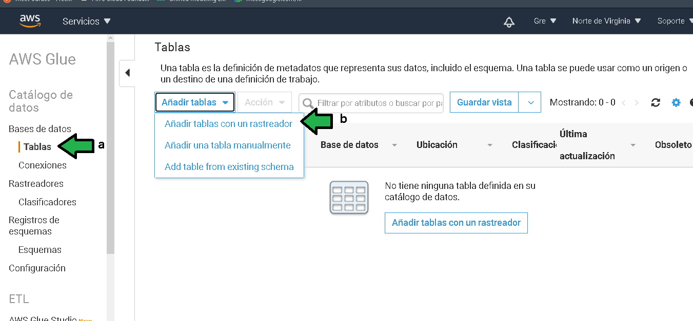
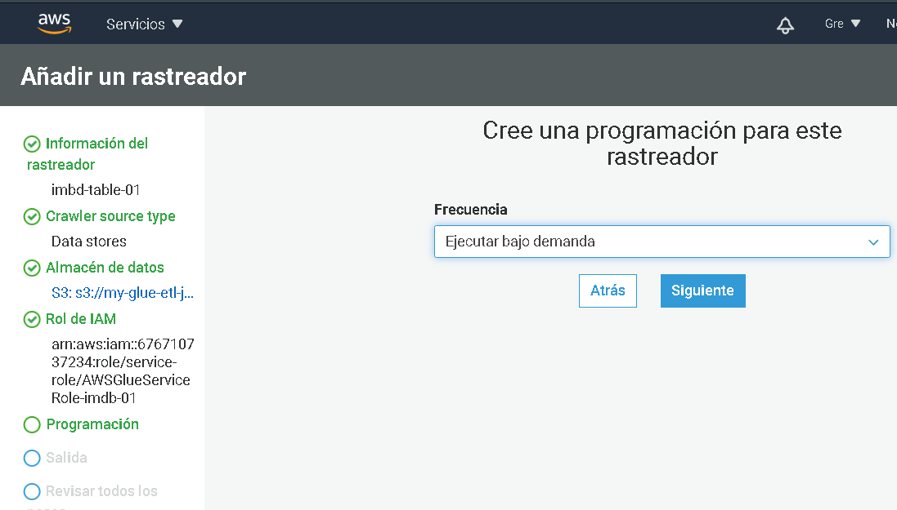
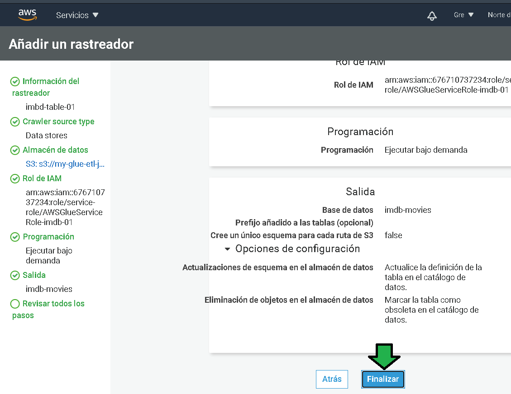
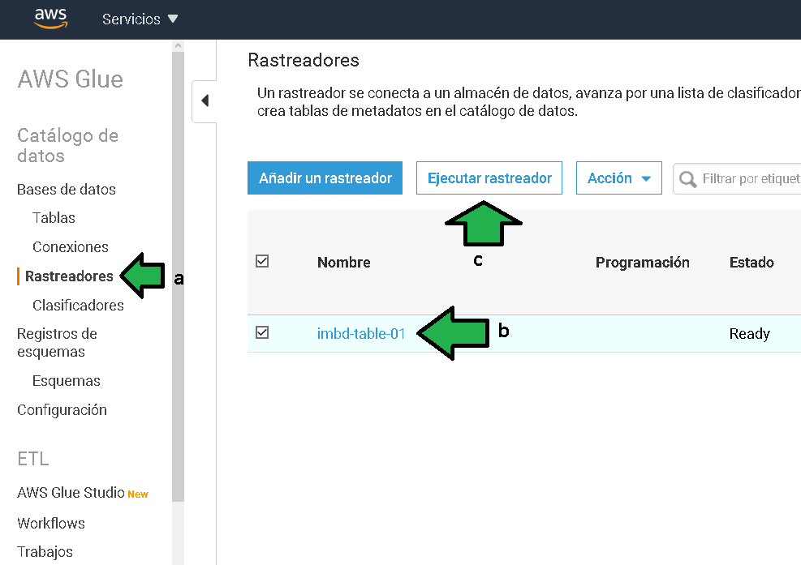
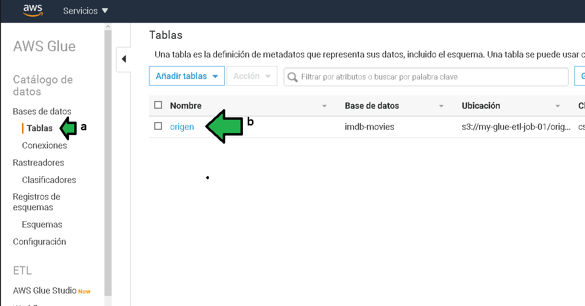

# Ejemplo 3

## 1. Objetivo 
- Muchas veces al trabajar con datos el reto consiste en normalizar los datos a un formato útil para los propósitos de las tareas que se desean realizar.

## 2. Requisitos 
- Cuenta de AWS Console
- AWS CLI configurado con credenciales con permisos para lectura y escritura en el servicio S3.

## 3. Desarrollo 

>**💡Nota**
>
>El siguiente ejemplo y código están destinados únicamente a fines educativos. Asegúrese de personalizarlo, probarlo y revisarlo por su cuenta antes de usar cualquiera de esto en producción.


1. Generar un bucket de S3, el bucket será el origen de datos y el destino de los datos ya transformados. Para hacer el trabajo ágilmente se hará por medio de línea de comandos.
Para tal efecto ejecutar el comando 
```ssh
aws s3api create-bucket --bucket my-glue-etl-job-01 --region us-east-1
```
Donde `my-glue-etl-job-01` es el nombre del bucket, se puede personalizar el nombre por uno a conveniencia propia.

</img>

2. Generar un par de carpetas en el bucket, una carpeta como origen de datos y otra de destino, para lo cual hay que ejecutar el comando:

```ssh
aws s3api put-object --bucket my-glue-etl-job-01 --key origen/
```

```ssh
aws s3api put-object --bucket my-glue-etl-job-01 --key destino/
```

</img>

3. Descargar los [datos](https://raw.githubusercontent.com/peetck/IMDB-Top1000-Movies/master/IMDB-Movie-Data.csv) que se van a procesar.

Guardar el archivo en una ubicación conocida. Normalmente se puede hacer dando click derecho sobre la página y seleccionando **Guardar como**
 
 </img>
 
4. Subir el archivo que se acaba de descargar con el comando 
```bash
aws --region us-east-1 s3 cp D:\downloads\IMDB-Movie-Data.csv s3://my-glue-etl-job-01/origen/
```

Donde `D:\downloads\IMDB-Movie-Data.csv` es la ruta del origen del archivo, reemplazar por la ruta del archivo.

</img>

5. Acceder a la consola de AWS, buscar el servicio "Glue", ingresar al servicio.

</img>

6. Ya en el servicio AWS Glue, a) seleccionar "BAse de datos", b) seleccionar "Añadir una base de datos", c) establecer un nombre a los datos que se procesarán.

</img>

7. a) Seleccionar En el menú "Tablas" y luego b) "Añadir tablas con un rastreador"

</img>

8. Especificar un nombre a la tabla, luego click en  "Siguiente"

</img>

9. Seleccionar las opciones por default


10. Seleccionar un origen de datos, en este caso S3, seleccionar la ruta de origen de datos que en este caso será la carpeta "origen" en el  bucket S3 recién creado.

</img>
 
 11. Seleccionar siguiente
 
</img>

12. Es momento de generar un role para que AWS Glue tenga acceso al bucket S3. Establecer un sufijo al role y dar click en "siguiente".

</img>

13. Seleccionar la frecuencia de ejecución **Bajo demanda**

</img>


14. Seleccionar la base de datos creada en un principio

</img>

15. Hechos todos los pasos dar click en **Finalizar**:

</img>

16. a) Hacer click en **Rastreadores**, b) seleccionar el recién hecho y dar click en **Ejecutar rastreador**

</img>

Se verá como comienza la ejecución:

</img>

17. a) Dar click en "Tablar", b) se verá una tabla creada por el rastreador

</img>
