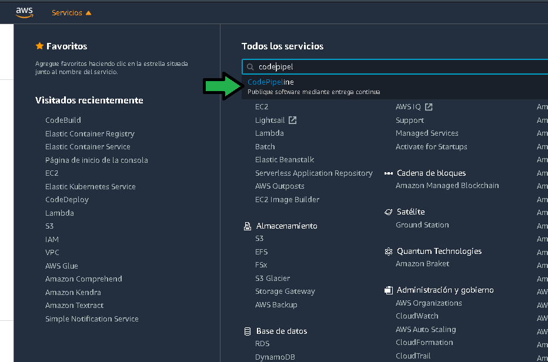
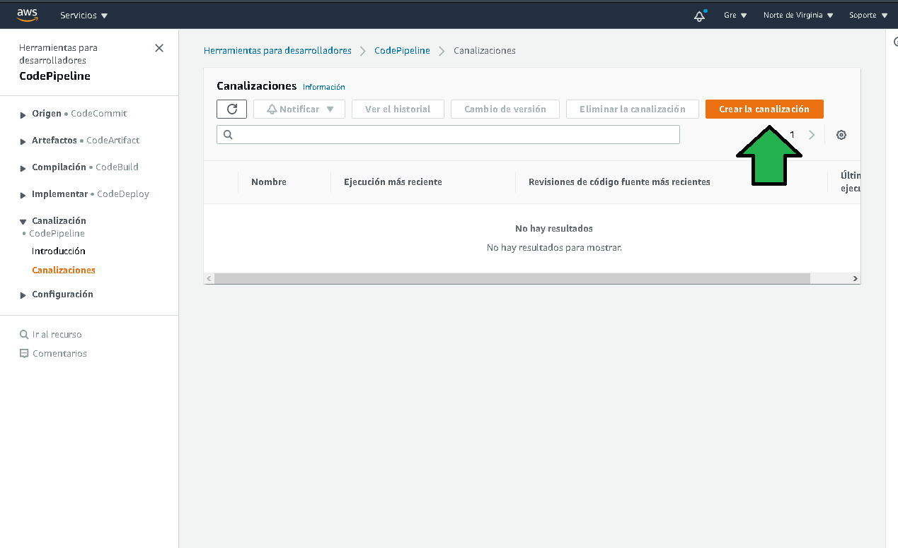
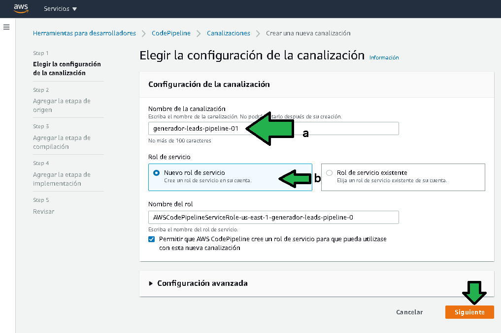
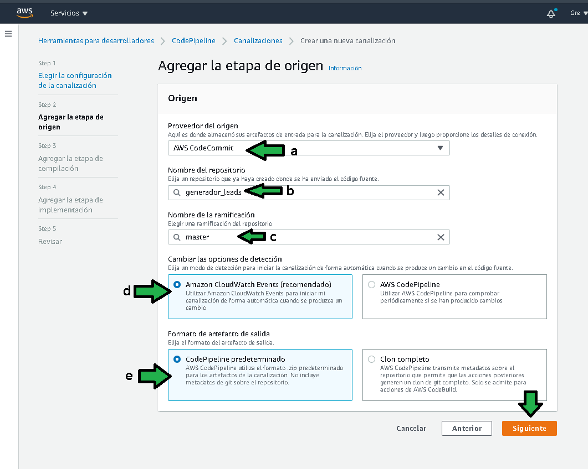
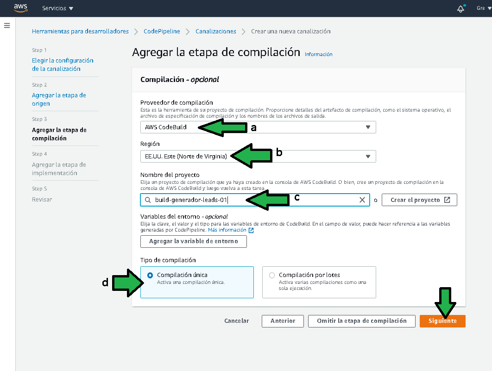
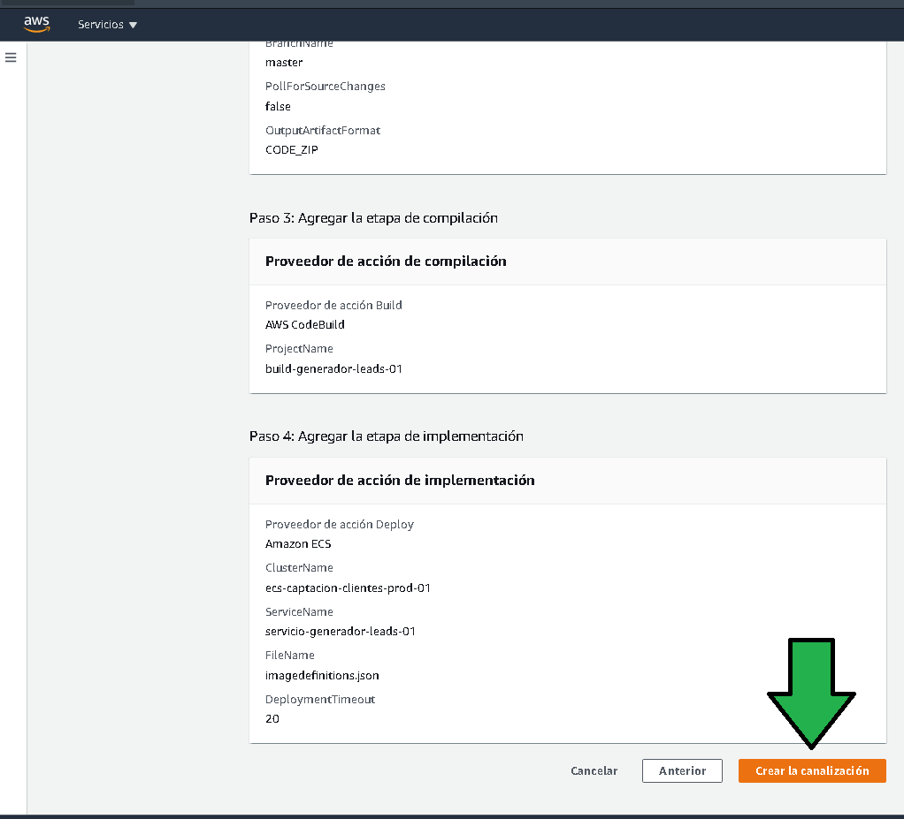
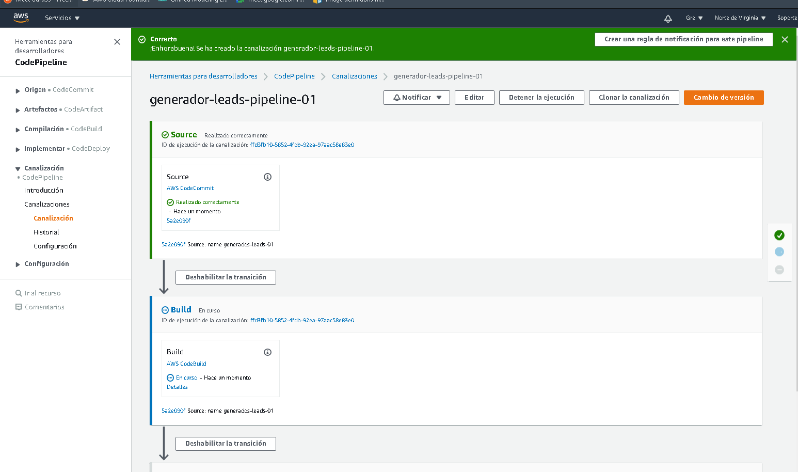
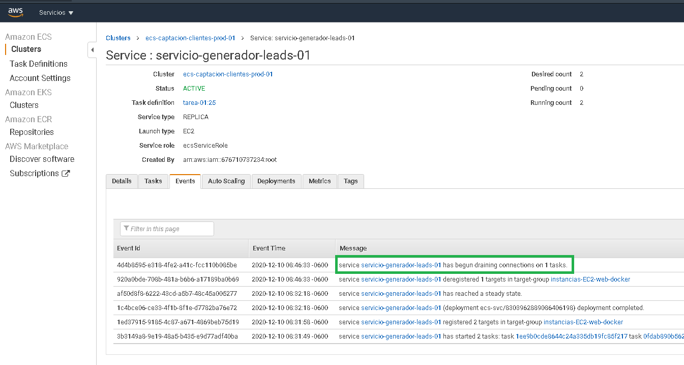
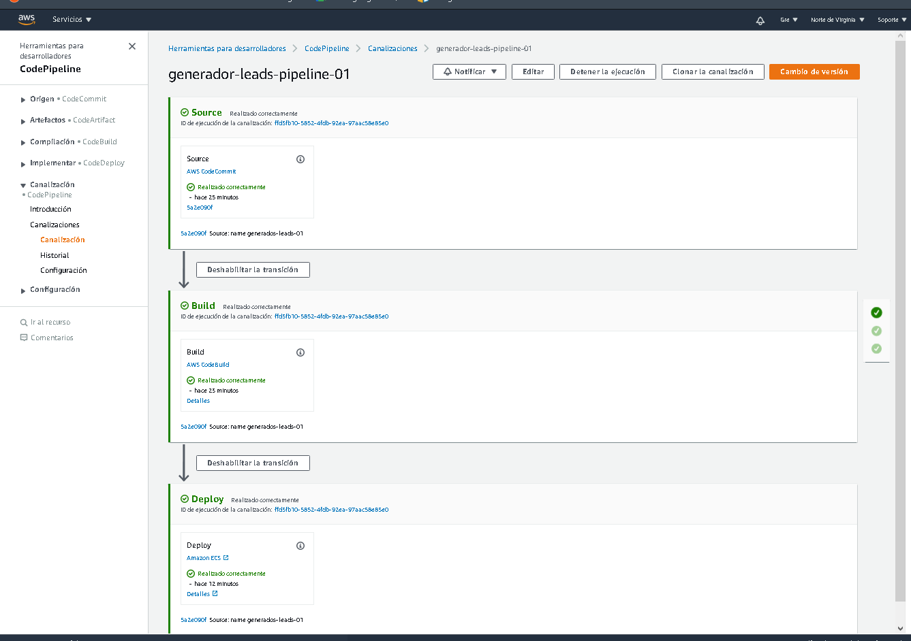
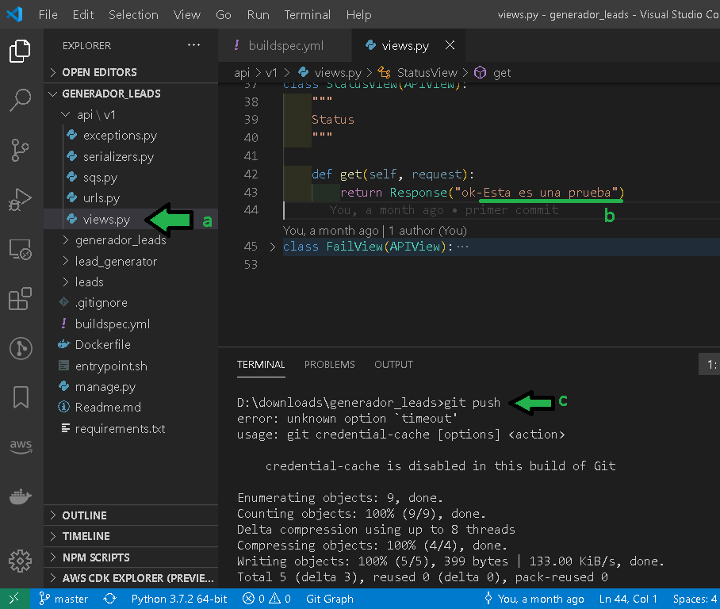

# Ejemplo 05: Code Pipeline

## 1. Objetivo

- Proceder con la configuración de code pipeline

## 2. Requisitos 
- Acceso a AWS Console
- Haber completado el Ejemplo 04

## 3. Desarrollo 

Con code pipeline se podrá desplegar la imagen de Docker generada por la etapa build.
Para ello:

1. Ir a al servicio "Code Pipeline"



2. Seleccionar "Crear la canalización"



3. Establecer parámetros del pipe de despliegue
```
a) Nombre del pipe, debe ser un nombre descriptivo.
b) Seleccionar "Nuevo rol de servicio"
```


3. Configurar la etapa de origen
```
a) Establecer como origen Code Commit
b) Establecer el nombre del repositorio, usar el que se ha usado par prácticas anteriores.
c) Establecer la rama master.
d) Establecer que Pipeline sea disparado de acuerdo a eventos de Cloud Watch. 
e) Establecer el artefacto de salida como "predeterminado", el artefacto de salida será una copia del código que Pipeline guardará en un bucket S3 para que la siguiente etapa (Build) pueda trabajar.
```
Click en "Sigueinte"



a) Seleccionar como proveedor de compilación a "AWS CodeBuild"
b) Seleccionar la región donde se ha trabajado todo el proyecto.
c) Seleccionar el nombre del proyecto de compilación recién creado.
d) Establecer "Compilación única"

Click en "Siguente"



```
a) Seleccionar como proveedor de implementación "Amazon ECS"
b) Establecer la región donde se ha trabajado el proyecto.
c) Establecer el nombre del cluster ECS.
d) Establecer el servicio del cluster donde se deberá implementar el contenedor docker.
e) Establecer el valor como `imagedefinitions.json`, este es un archivo generado por AWS CodeBuild que especifica el nombre del contenedor en la tarea de ejecución y la URI de la imagen de docker a ser desplegada.
f) Establecer el tiempo de espera en unos 20 minutos.
```
Click en "siguiente"


Al pasar por el review de la aplicación y estar conforme con los parámetros se puede dar click en "Crear la canalización"



Un Proceso nuevo de despliegue comienza a ejecutarse:



Al iniciar el despliegue se puede observar en los eventos del Servicio en el cluster como el servicio comienza la tarea de despliegue


En los eventos del servicio se pueden ir viendo todos los pasos que orquestan el despliegue del código.


Después de unos 10 minutos ser ve como el proceso de despliegue es exitoso.


```
a) Para probar que el despliegue se ejecuta correctamente se podría modificar el archivo "api/v1/views.py" 
b) Hay una clase llamada StatusView, en el Response se puede modificar el texto que regresa.
c) Una vez modificado se puede hacer push de este código.
```


Después de algunos minutos hecho el push de código se puede comprobar como la nueva versión ha sido desplegada sin necesidad de entrar a ningún servidor.

