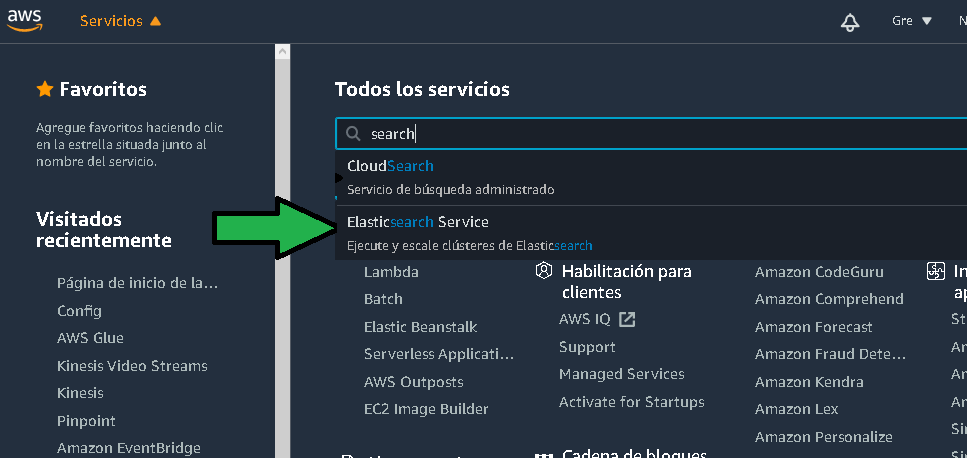
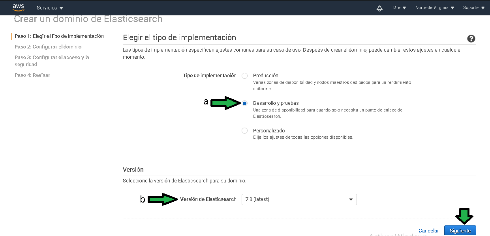
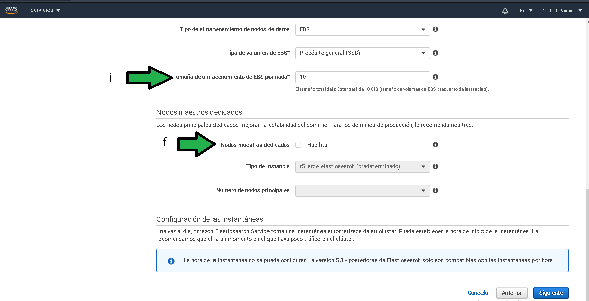
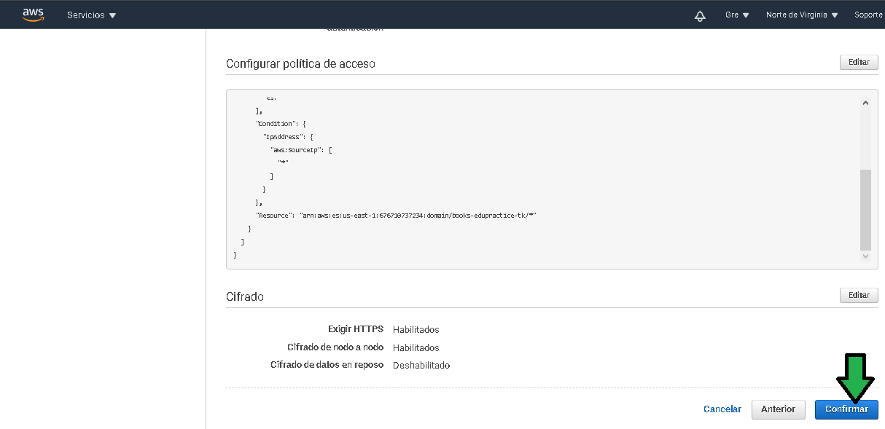
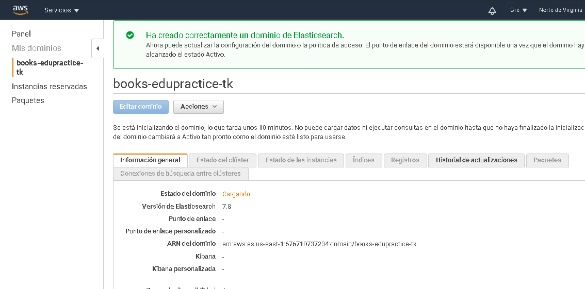
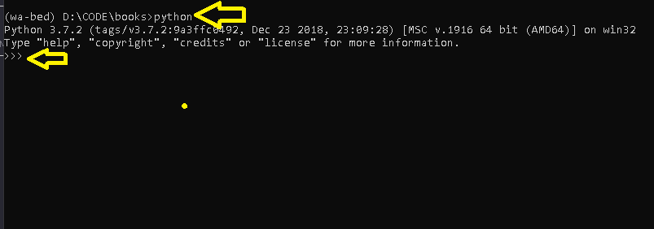
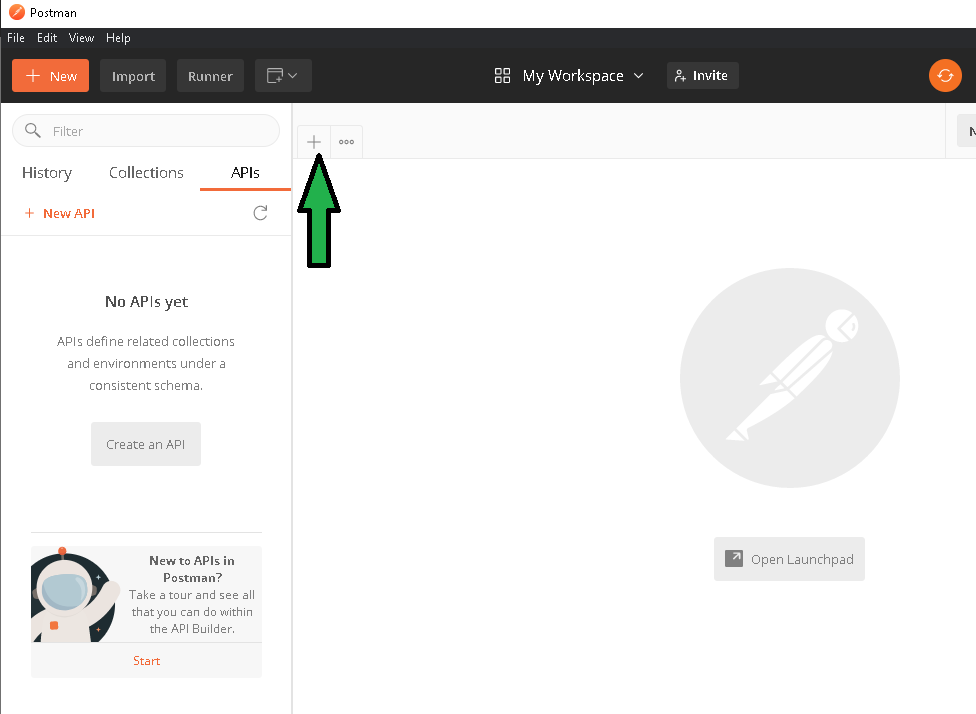
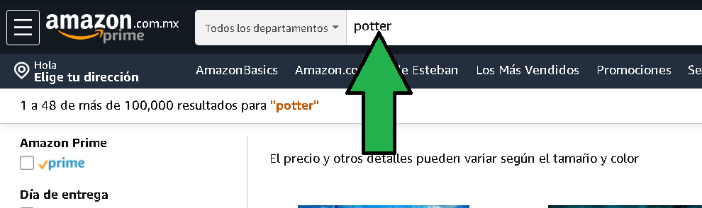
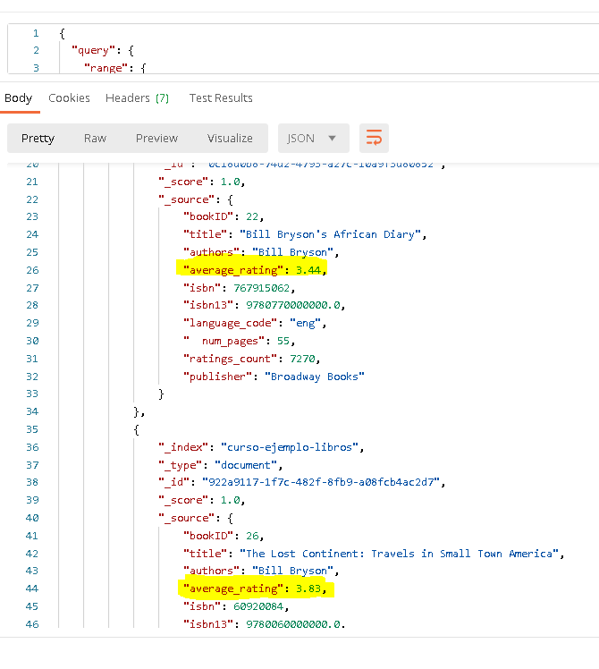

# Postwork: Elasticsearch

## 1. Objetivo 
- Montar un buscador de libros en Elasticsearch service de AWS.

## 2. Requisitos 
- [Python](https://www.python.org/downloads/) 3.7 o superior instalado en el sistema operativo.
- [Postman](https://www.postman.com/product/rest-client/)
- Saber como ejecutar un script de python, calma, no es nada del otro mundo.

## 3. Desarrollo 

>**💡Nota:**
>
>El siguiente ejemplo y código están destinados únicamente a fines educativos. Asegúrese de personalizarlo, probarlo y revisarlo por su cuenta antes de usar cualquiera de esto en producción.

1. Seleccionar el servicio Elasticsearch Service

</img>

2. Dar click en **Crear nuevo dominio**

</img>

3. Seleccionar **Desarrollo y pruebas**

</img>

4. (a) Establecer un nombre, este nombre solo debe tener minúsculas y guiones bajos sin espaciosDesarrollo y pruebas. (b) No habilitar el punto de enlace predeterminado.

</img>

5. (e) Seleccionar el tipo de instancia **t3.small.elasticsearch**, (f) con un solo nodo. (g, h) Establecer el almacenamiento de datos a "EBS" con tipo de disco SSD de propósito general.

</img>

6. (i)Establecer el tamaño de almacenamiento a 10 GB, (f) no habilitar nodos maestros dedicados

</img>

7. En cuanto a acceso y seguridad 
a) Establecer acceso público.

</img>

8. a) Habilitar el control de acceso detallado, b) seleccionar "Crear usuario maestro", establecer un usuario y contraseña (no poner en la contraseña el caracter `#`, da problemas al querer conectarse al cluster)

</img>

9. Establecer la política de acceso al dominio como libre acceso.

</img>

10. Dar click en "Siguiente"

</img>

11. Al revisar los datos que tenemos podemos dar click en "Confirmar"

</img>


12. El cluster se comenzará a crear, tardará unos 15 minutos.

</img>

13. Después de unos 15 minutos el cluster es generado, habrá que tomar nota del `punto de enlace` este dato será usado muchas veces en los pasos siguientes

</img>


14. Descargar el archivo [ej1-books.json](assets/ej1-books.json) que contiene todos los libros para la búsqueda, trasladarse hasta ese directorio en la linea de comandos. Descomprimir el archivo hasta que el archivo json, mover este archivo a una carpeta vacía para trabajar.

```shell
$ python -m pip install elasticsearch
```
>**💡Nota:** 
>
>Si el comando no funciona puede reemplazar `python` por `python3` en el comando anterior.

</img>

15. Ejecutar en la consola el comando `python` hasta ver un prompt como `>>>`

</img>

16. Copiar el contenido del siguiente script en un archivo `main.py` en la misma carpeta donde se encuentra el archivo json de libros asignando a la variable `ELASTIC_SEARCH_DOMAIN` la url de `Punto de enlace`, en la variable `USER` y `PASSWORD` deberán asignarse los valores previamente dados de alta al generar el cluster de Elasticsearch.

Así queda el contenido del archivo `main.py`
```py
import datetime
import json
import os
import uuid
from urllib.parse import urlparse

from elasticsearch import Elasticsearch, helpers

USER = ""
PASSWORD = ""
ELASTIC_SEARCH_DOMAIN = ""

FILENAME_BOOKS = "ej1-books.json"


def get_url():
    _url = urlparse(ELASTIC_SEARCH_DOMAIN)
    domain = _url.netloc.split("@")[-1]
    url = "{}://{}:{}@{}".format(_url.scheme, USER, PASSWORD, domain)
    return url

client = Elasticsearch([get_url()])

with open(FILENAME_BOOKS, "r", encoding="utf-8") as fp:
    datas = json.load(fp)
    books = []
    for data in datas:
        books.append({
            '_index': 'curso-ejemplo-libros',
            '_type': 'document',
            '_id': str(uuid.uuid4()),
            '_source': data
        })

    helpers.bulk(client, books)
```

Para ejecutar el script ejecutar el comando,
```py
python main.py
```
 después de algunos segundos los datos se habrán dado de alta en Elasticserarch.

</img>

>**💡Nota**
>
>En algunos sistemas operativos es necesario ejecutar python3 en lugar de solo python.

17. Ahora toca abrir Postman, hacer click en el símbolo "+" para establecer un nuevo request.

</img>

18. Dar click en Authorization (a), luego click en Type (b) y seleccionar "BasicAuth", establecer usuario y password (c y d).

</img>

19. Establecer la url del "Punto de enlace", añadiendo el path `/curso-ejemplo-libros/_search`
```
a) Seleccionar **raw**
b) seleccionar **JSON**
c) Establecer el parámetro de búsqueda con un json, a esta forma se le conoce como [Query DSL](https://www.elastic.co/guide/en/elasticsearch/reference/current/query-dsl.html), para este ejemplo se usará un query de tipo [match](https://www.elastic.co/guide/en/elasticsearch/reference/current/query-dsl-match-query.html).
```
```json
{
  "query": {
    "match": {
      "title": "potter"
    }
  }
}
```
Click en **Send** y disfrutar el resultado.

</img>

Aunque usted no lo crea, este es el principio de un buscador de productos en un e-commerce.

</img>

------------------------------

## Funciones de agregado

Ademas de búsquedas, Elasticsearch permite generar funciones de agregado. El resultado de la búsqueda con funciones de agregado puede ayudar a generar menús como el siguiente señalado.

</img>

Para hacer una búsqueda basada en el `review` de los libros habrá que hacer a búsqueda en Elasticsearch con el siguiente Query DSL con la función de agregado [range](https://www.elastic.co/guide/en/elasticsearch/reference/current/search-aggregations-bucket-range-aggregation.html).

```json
{
  "size": 0,
  "aggs": {
    "rango_calificaciones": {
      "range": {
        "field": "average_rating",
        "ranges": [
          { "from": 0, "to": 1 },
          { "from": 1, "to": 2 },
          { "from": 2, "to": 3 },
          { "from": 3, "to": 4 },
          { "from": 4, "to": 5 }
        ]
      }
    }
  }
}
```

El resultado deberá ser el siguiente, se muestran los rangos y el número de documentos (número de objetos) encontrados que cumplan los rangos.

</img>

Si el usuario final da click en alguna de las opciones en la página del ecommerce se podría hacer un Query DSL también de tipo [range](https://www.elastic.co/guide/en/elasticsearch/reference/current/query-dsl-range-query.html#range-query-ex-request) con la siguiente forma:

```json
{
  "query": {
    "range": {
      "average_rating": {
        "lte": 4
      }
    }
  }
}
```

Con ello se regresarán todos los libros que tengan un `average_rating` menor o igual a 4.

</img>
