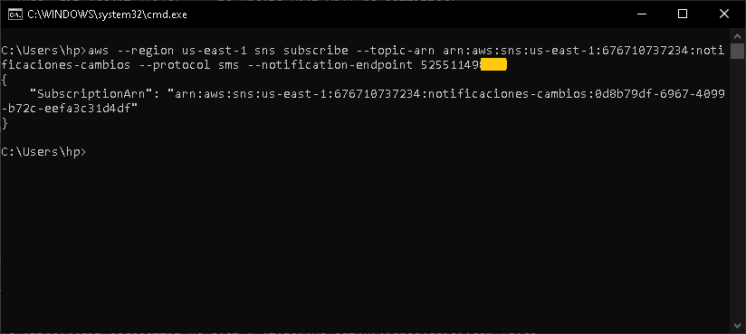
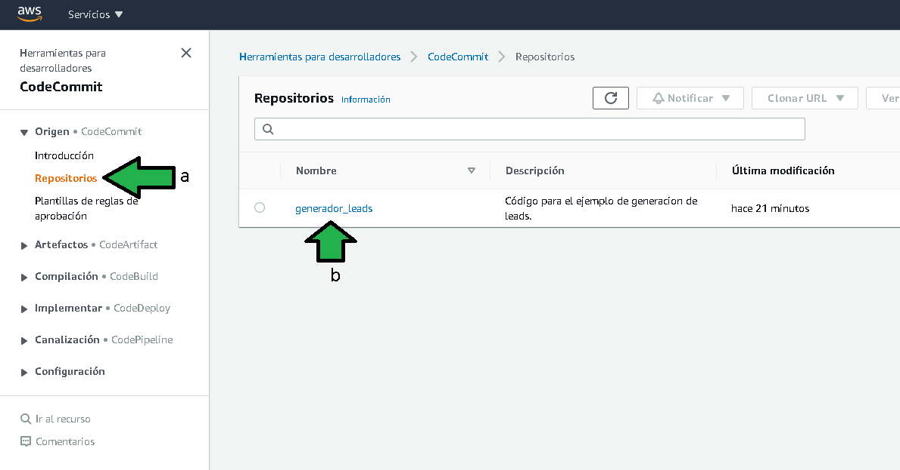
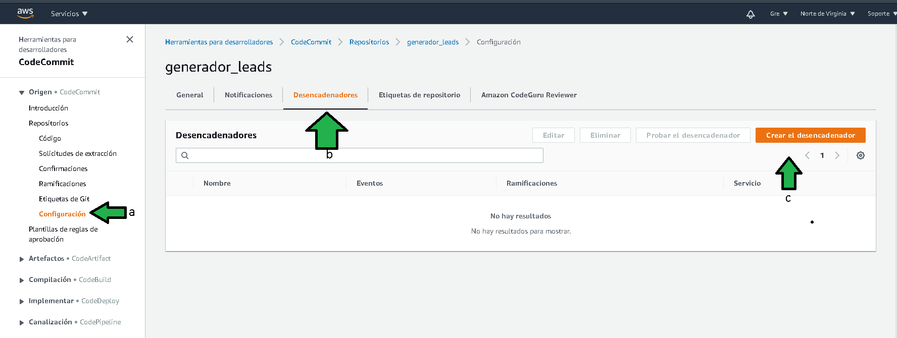
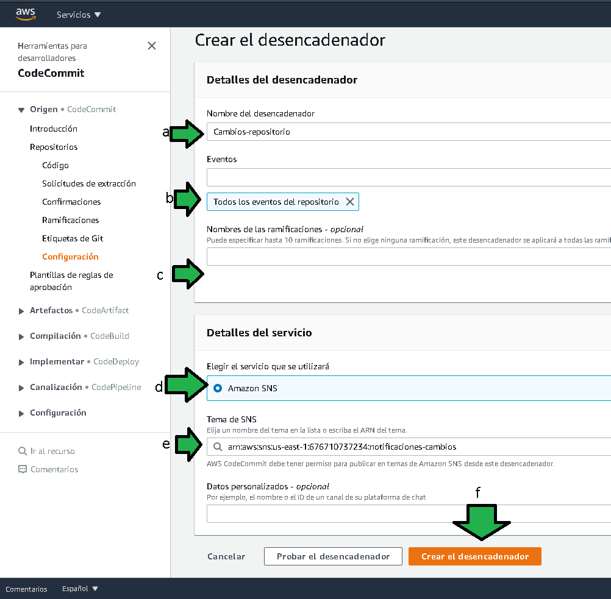
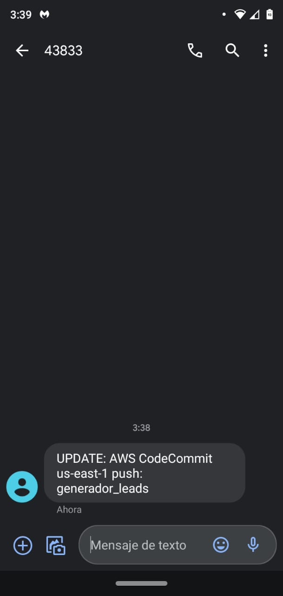

# Reto 1: Notificaciones con SNS

## 1. Objetivo 
- Notificar los cambios en el repositorio a los integrantes del equipo por medio de SMS.

## 2. Requisitos
- AWS CLI configurado.
- Cliente de git instalado en local.

>**💡Nota**
>
>El siguiente ejemplo y código están destinados únicamente a fines educativos. Asegúrese de personalizarlo, probarlo y revisarlo por su cuenta antes de usar cualquiera de esto en producción.

1. Habrá que abrir una línea de comandos para crear el servicio que enviará el SMS. Saldrá un poco del scope de este reto pero a grandes rasgos esta será la arquitectura de la unión de CodeCommit y SNS.

</img>

Para generar el servicio SNS que mandará los sms, ejecutar el comando:
```bash
aws --region us-east-1 sns create-topic --name notificaciones-cambios
```
</img>

2. Tomar nota del valor en la llave "TopicArn", se usará en el siguiente comando:
Habrá que reemplazar el ARN del comando anterior, también habrá que reemplazar el número de celular al que deben llegar los SMS a 10 dígitos con el código de país. Ej, si el celular es 7745215474 el número para agregar en el comando deberá ser 527745215474 en el caso que el número sea México.

```bash
aws --region us-east-1 sns subscribe --topic-arn arn:aws:sns:us-east-1:676710737234:notificaciones-cambios --protocol sms --notification-endpoint 52551149XXXX
```
</img>

3. Ir al servicio de CodeCommit,
a) Seleccionar los repositorios y después b) seleccionar el nombre del repositorio.

</img>


4. Seleccionar 
a) Configuración
b) Seleccionar Desencadenadores
c) Click en "Crear el desencadenador"

</img>


5. Crear desencadenador
```
a) Especificar el nombre del desencadenador que mandará la notificación SMS
b) establecer que eventos deben desencadenar el envío del sms
c) dejar en blanco las ramas para que se tomen todos los cambios de todas las ramas
d) seleccionar el servicio SNS
e) Seleccionar el tópico de SNS recién creado con la línea de comandos
f) generar el desencadenador
```
</img>

Se genera el desencadenador después de algunos segundos.

6. Para probar un cambio se puede generar el archivo `README.md` en el repositorio (puede ir vacío en este momento).
Agregar el archivo con los comandos
```bash
git add *
git commit -m "Agregar readme"
```

Mandar los cambios al repositorio con el comando.
```bash
git push
```

</img>

7. Al haber hecho push se el SMS es recibido.

</img>
