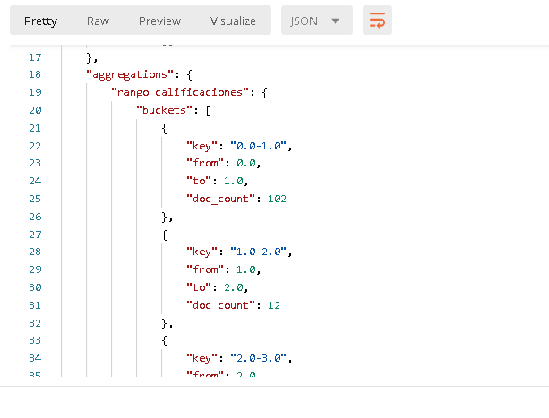

# Reto 1


# 1. Objetivo 🎯
- Establecer las bases para la generación de menus interactivos en un ecommerce.


# 2. Requisitos 📌
- El ejercicio 1 resuelto y funcional.


# 3. Desarrollo 📑

#### El siguiente ejemplo y código están destinados únicamente a fines educativos. Asegúrese de personalizarlo, probarlo y revisarlo por su cuenta antes de usar cualquiera de esto en producción.

Elasticsearch permite ademas de búsquedas generar funciones de agregado.

El resultado de la búsqueda con funciones de agregado puede ayudar a generar menús como el siguiente señalado.


Para hacer una búsqueda basada en el `review` de los libros habrá que hacer a búsqueda en Elasticsearch con el siguiente Query DSL con la función de agregado [range](https://www.elastic.co/guide/en/elasticsearch/reference/current/search-aggregations-bucket-range-aggregation.html).


```json
{
  "size": 0,
  "aggs": {
    "rango_calificaciones": {
      "range": {
        "field": "average_rating",
        "ranges": [
          { "from": 0, "to": 1 },
          { "from": 1, "to": 2 },
          { "from": 2, "to": 3 },
          { "from": 3, "to": 4 },
          { "from": 4, "to": 5 }
        ]
      }
    }
  }
}
```

El resultado deberá ser el siguiente, se muestran los rangos y el número de documentos (número de objetos) encontrados que cumplan los rangos.




Si el usuario final da click en alguna de las opciones en la página del ecommerce se podría hacer un Query DSL también de tipo [range](https://www.elastic.co/guide/en/elasticsearch/reference/current/query-dsl-range-query.html#range-query-ex-request) con la siguiente forma:

```json
{
  "query": {
    "range": {
      "average_rating": {
        "lte": 4
      }
    }
  }
}
```

Con ello se regresarán todos los libros que tengan un `average_rating` menor o igual a 4.


