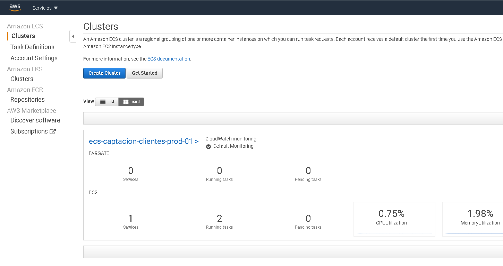
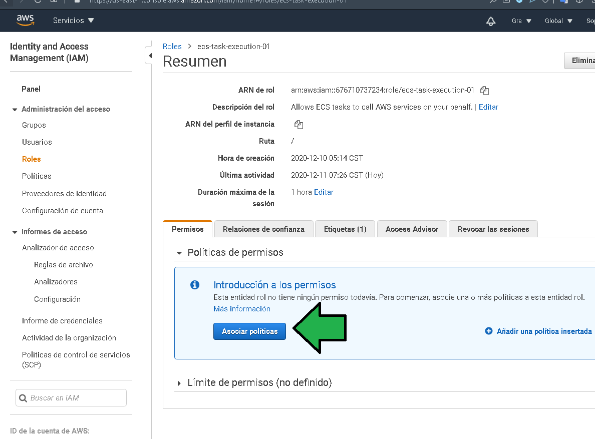
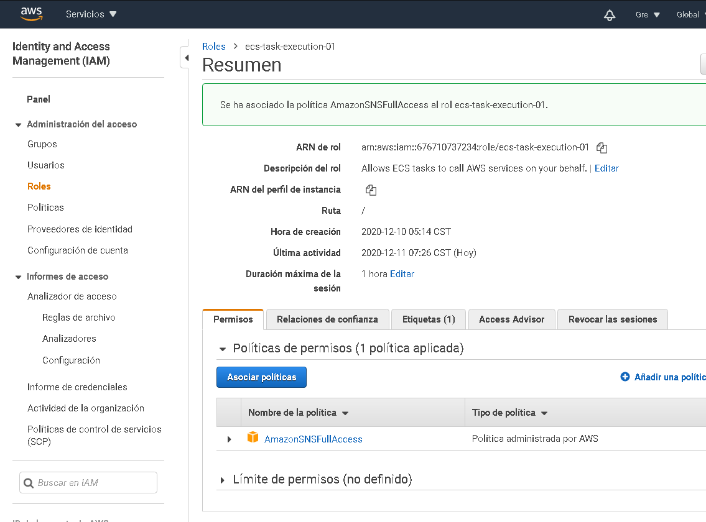
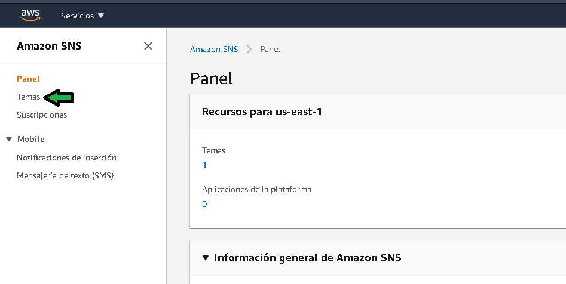
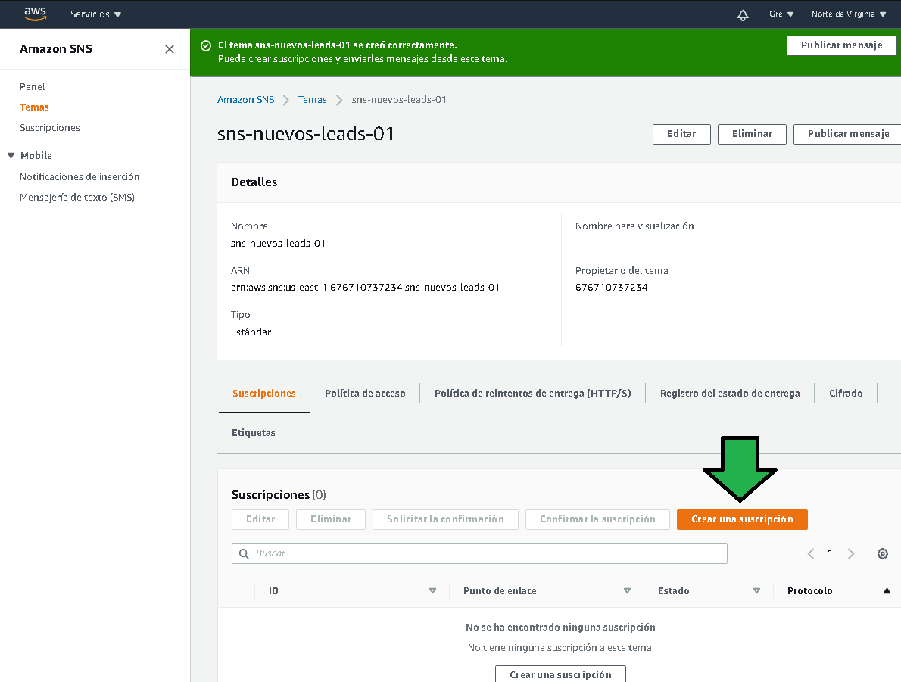
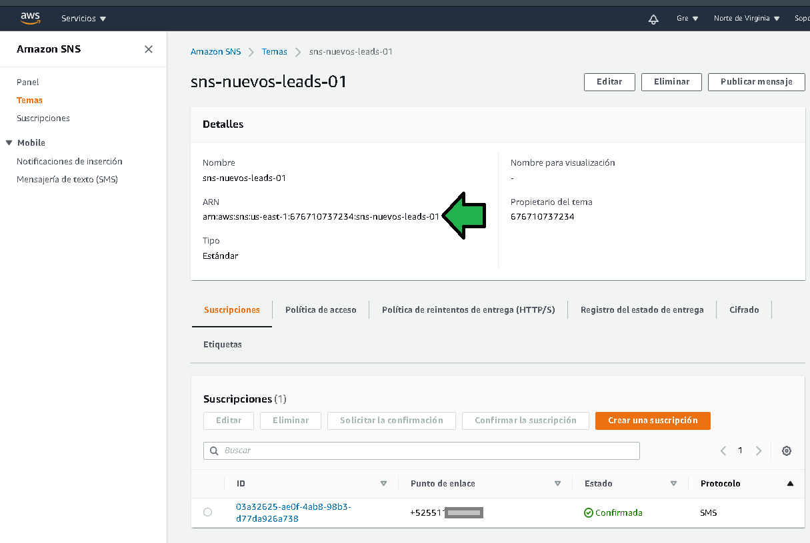

# Ejemplo 1: SMS en registro

## 1. Objetivo 
- Integración de servicios de Messaging, servicios para la comunicación entre servicios de AWS.

## 2. Requisitos
- AWS CLI configurado
- Acceso a AWS consola.
- Un teléfono celular con capacidad para recibir mensajes SMS.

## 3. Desarrollo 

> **💡Nota:**
>
> El siguiente ejemplo y código están destinados únicamente a fines educativos. Asegúrese de personalizarlo, probarlo y revisarlo por su cuenta antes de usar cualquiera de esto en producción.

Hasta este punto ya se tiene un endpoint funcional en el que la aplicación en este caso es "app.edupractice.tk" puede mandar los leads que la página vaya generando a la base de datos.

Como paso siguiente, de cada lead que se registre además de guardarse en base de datos se debe enviar un mensaje SMS a un número celular específico dando aviso del nuevo lead registrado.

Para ello las instancias del cluster deberán tener permiso para poderse comunicar con el servicio de AWS SNS, de la práctica anterior se generó un rol en blanco que no contenía ningún permiso, es momento de agregar un permiso al rol.

1. Solo para cambiar el permiso, ingresar al servicio AWS ECS, dar click al cluster generado.

2. Acceder a la parte de servicios y dar click en el servicio generado.

3. Dar click en la tarea

4. Dar click en el `Task role`

 

5. Eso abrirá la consola del servicio IAM posicionado directamente en el Rol. Dar clic en "Asociar políticas"

7. a) Buscar los grupos de políticas referentes a SNS, b) seleccionar la política "AmazonSNSFullAccess", c) Click en "Asociar la política".

8. Listo, con esos pasos se ha dado capacidad para que los contenedores docker tengan acceso al servicio SNS.

------------------------------

## Configurar tópico en SNS

Para generar un "Topic" a dónde enviar los mensajes SMS se deben seguir los siguientes pasos:

1. Ir al servicio de AWS SNS:

2. Click en "Temas" (Topic):

3. Click en "Crear un tema"

4. a) Seleccionar un tópico Estándar, establecer un nombre descriptivo para el tópico. Proceder con la creación del tópico o tema.

5. El tópico o tema es generado. Click ahora en "Crear una nueva suscripción"

6. Finalmente a) Seleccionar el protocolo como SMS, b) Establecer el punto de enlace con el número de celular a donde se enviarán las notificaciones, el número debe tener como prefijo el signo +, luego el código del país seguido de los 10 dígitos del número celular. Proceder con la suscripción.

7. La suscripción es generada, dar click en el nombre del Tema:

8. Copiar el ARN del tópico, será usado en el siguiente paso.

