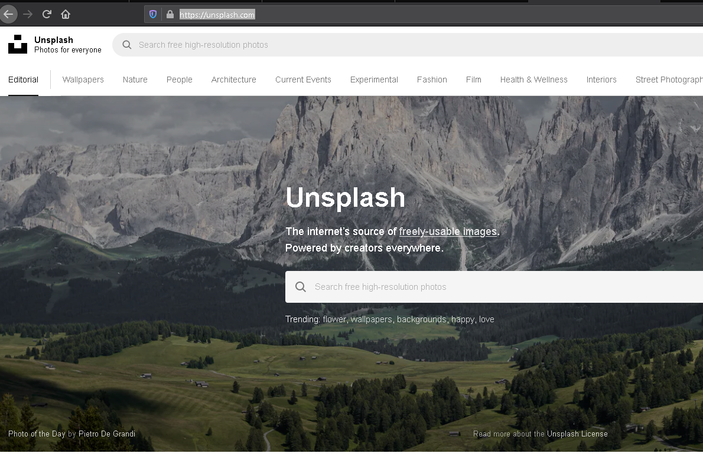

# Ejemplo 2

## 1. Objetivo 
- Usar el servicio Amazon Rekognition para Detección de escenas, detección de matrículas y análisis facial.

## 2. Requisitos 
- AWS CLI instalado y configurado.

## 3. Desarrollo 


Para probar la detección de objetos.
1. Buscar una imagen que se quiera analizar se puede usar la página [unsplash](https://unsplash.com/).



2. Descargar la imagen seleccionada.


3. Abrir una línea de comandos y ejecutar el comando:
```bash
aws rekognition detect-labels --image-bytes  fileb://D:\downloads\photo-1542459302-d516c17ee862.jpg
```
Donde la ruta de la imagen se debe especificar de acuerdo al sistema operativo. Para ejecutar el comando se debe anteponer el prefijo "fileb://" a la ruta de la imagen.


4. Después de ejecutar el comando se verá una respuesta en formato json con los resultados de los objetos detectados.


-------------------------------------------------------------------

1. Descargar una imagen de un auto con un número de matrícula visible, para este ejemplo se puede usar: 
 


2. Ejecutar el comando 

```bash
aws rekognition detect-text --image-bytes  fileb://D:\downloads\auto-placas.PNG
```

Reemplazar la ruta de la imagen en el comando, aunque si se debe anteponer el prefijo `fileb://` a la ruta.


---------------------------------------------
1. Para el análisis facial, descargar la imagen de una persona con el rostro descubierto. Se puede usar la [página](https://generated.photos).

Para este ejemplo se usará el rostro:


2. Ejecutar el comando
```bash
aws rekognition detect-faces --image-bytes  fileb://D:\downloads\oldman.PNG --attributes "ALL"
```
Donde la ruta de la imagen se debe especificar de acuerdo al sistema operativo. Para ejecutar el comando se debe anteponer el prefijo "fileb://" a la ruta de la imagen.


