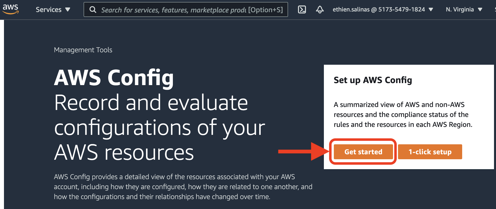
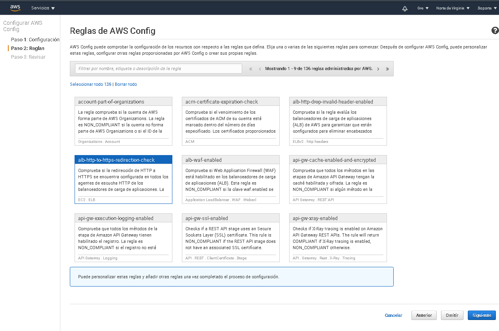
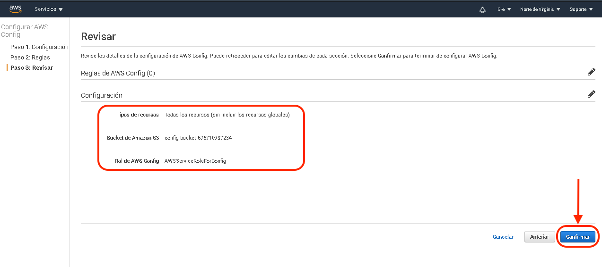

# Postwork: AWS Config

## 1. Objetivo 
- Conocer todos los servicios que están siendo ejecutados o consumidos en la cuenta de AWS.

## 2. Requisitos 
- Acceso a AWS Console
- Usuario IAM con permisos para ejecutar AWS Config

## 3. Desarrollo

1. Comencemos buscando el servicio de `AWS Config`, con cualquiera de estas opciones:
```
i) el buscador de servicios
ii) seleccionándolo desde Services / Management & Governance / Config
```


2. Debemos inicializar el servicio dando click en `get started`



3. Estando en la pantalla de configuración (Paso 1: Configuración), dejaremos los valores que vienen preseleccionados por defecto
    - Registrar todos los recursos admitidos en esta región
    - Crear un bucket
    - Crear un rol vinculado al servicio de AWS Config


4. En la pantalla de reglas (Paso 2), daremos click en `omitir` ya que no se hará una auditoría, solo nos interesa tener el inventario de los servicios usados en la cuenta.



5. Revisemos la configuración



6. Comienza el escaneo de los recursos usados.


7. Se visualiza el invetario de los recursos mostrando una tabla con el tipo y la cantidad encontrada.


