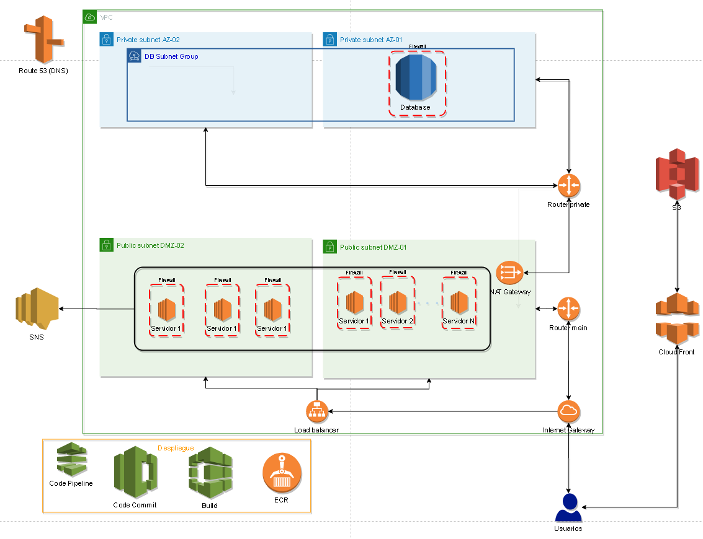
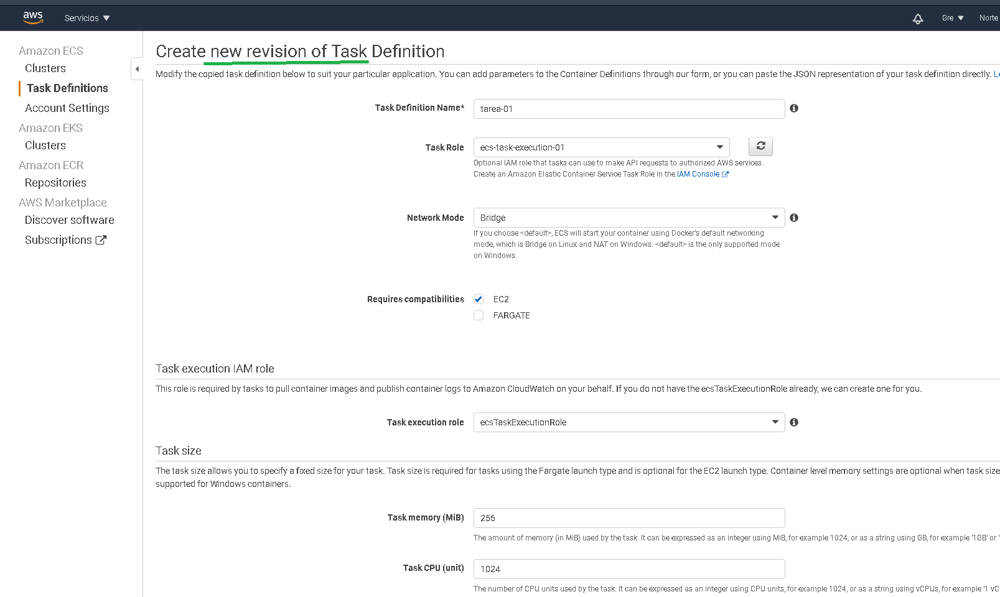
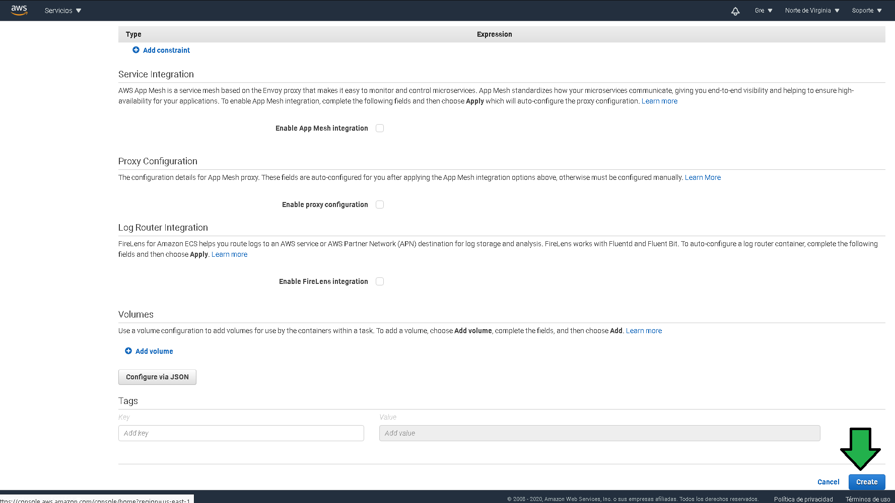
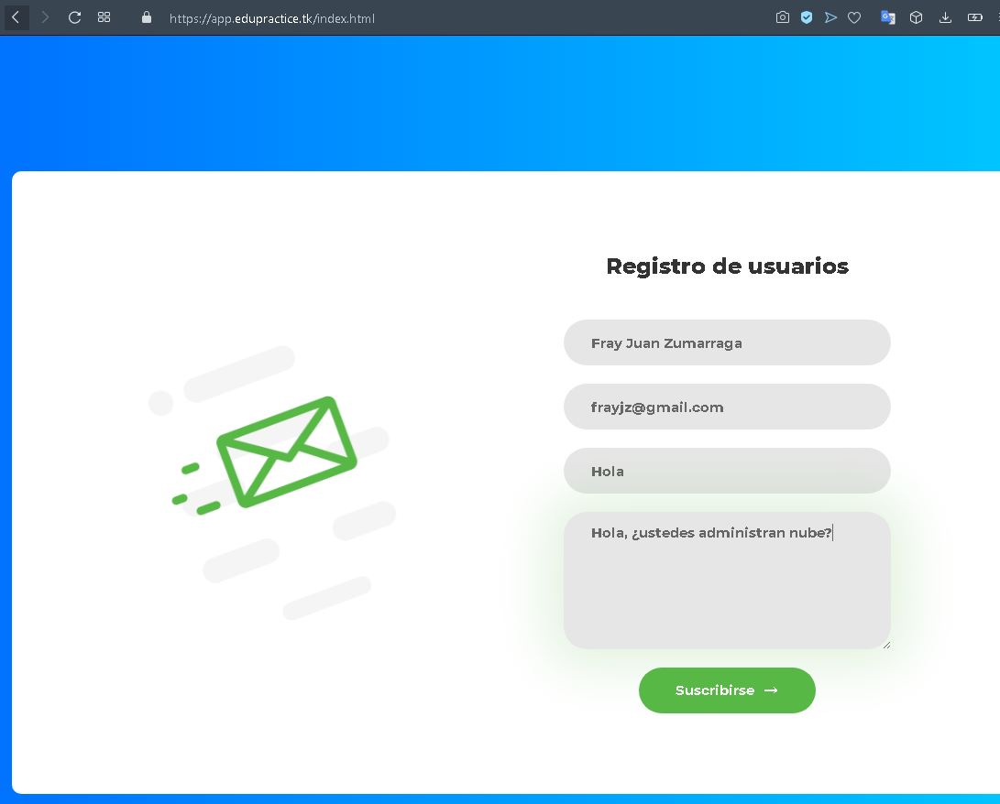
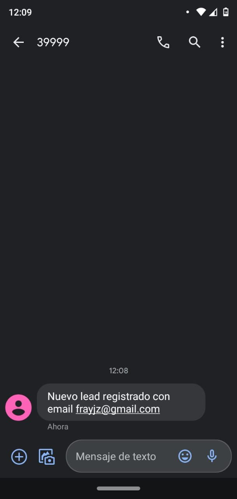

# Reto 1: Actualizar ECS task con soporte para envio de SMS

## 1. Objetivo 
- Integración de servicios de Messaging, servicios para la comunicación entre servicios de AWS.

## 2. Requisitos
- AWS CLI configurado
- Acceso a AWS consola.
- Un teléfono celular con capacidad para recibir mensajes SMS.

## 3. Desarrollo 
AWS SNS es el servicio que permitirá enviar mensajes SMS desde los contenedores docker ejecutándose en las instancias EC2 administradas por el cluster ECS.

-----------------------------------------

El paso siguiente es decirle al código ejecutándose en  contendedores en ejecución que deben enviar la información al tópico en el servicio SNS.
El código fuente ya tiene la funcionalidad integrada, solo hay que establecer el ARN del tópico en el contenedor, para ello:

1. Dirigirse a al servicio ECS, luego entrar al apartado "Task Definition"

2. Seleccionar la tarea y luego click en "create new definition", con esto se iniciará el proceso de actualización de la tarea que se ejecuta en los contenedores.

3. Se comenzará la configuración de la tarea, recordar que la tarea funciona a modo de template para que ECS pueda saber que desplegar y con que configuración. En esta parte no se modificará nada, hacer scroll hacia abajo hasta la sección "Container definitions".

4. A) Hacer click en la definición del contenedor, a) establecer la variable de entorno `SNS_TOPIC_ARN` (es forzoso que lleve ese nombre ya que el código fuente depende de ese nombre de variable) ,b) con el valor del ARN recién copiado.  Después click en "update".

5. Ninguna otra configuración en la tarea será cambiada, por lo que se puede generar la nueva definición de la misma dando click en el botón "Create"

6. a) La nueva definición de la tarea es generada, ahora que la tarea fue actualizada b) habrá que decirle al servicio del cluster que tiene que desplegar esta nueva versión de la tarea haciendo click en "Update Service".

7. a) Establecer forzar un nuevo despliegue después de actualizar el servicio, b) establecer el valor "One task per Host", click en "Next Step"

8. No hay que modificar nada, se puede pasar al "next step"

9. Sejar la configuración como aparece en la pantalla, click en "next step".

10. Una vez hecho el review de los cambios se puede hacer click en "Update Services"

11. Se verá como el servicio comienza a actualizarse con la nueva versión de la tarea con el soporte para envío de SMS. Click en "View service"

12. El servicio tardará unos cinco minutos para poder ser actualizado con la nueva tarea, para saber si ya esta actualizado la versión de la tarea en (a) debe coincidir con la versión de las tareas en ejecución (b). 

13. A continuación se ve como las tareas ejecutándose (a) ya son iguales a la definida en el servicio (a).

14. La prueba final a continuación, ingresar a la url de la aplicación web, en este caso `https://app.edupractice.tk/`  Se procederá a rellenar el formulario y dar click en "Suscribirse".

15. Un mensaje de registro exitoso se puede ver.

16. Y lo más importante, un SMS debe llegar al celular dado de alta al configurar el tópico en AWS SNS.

