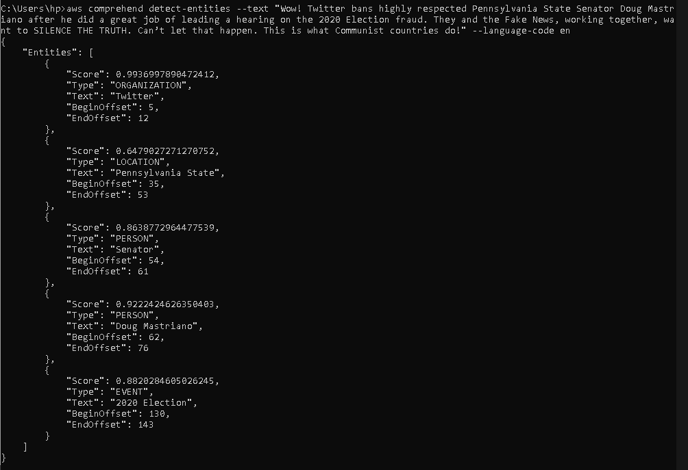

# Ejemplo 3

# 1. Objetivo 🎯
Probar el análisis de textos con las herramientas de AI Services de AWS para análisis de sentimientos y reconocimiento de entidades.

# 2. Requisitos 📌
- AWS CLI configurado.

# 3. Desarrollo 📑

1. Seleccionar un Tweet con connotación negativa.
Para el ejemplo se usará el [siguiente](https://twitter.com/realDonaldTrump/status/1332317394165968899?s=20).

"Wow! Twitter bans highly respected Pennsylvania State Senator Doug Mastriano after he did a great job of leading a hearing on the 2020 Election fraud. They and the Fake News, working together, want to SILENCE THE TRUTH. Can’t let that happen. This is what Communist countries do!"


2. Ejecutar el comando 
```bash
aws comprehend detect-sentiment --text "Wow! Twitter bans highly respected Pennsylvania State Senator Doug Mastriano after he did a great job of leading a hearing on the 2020 Election fraud. They and the Fake News, working together, want to SILENCE THE TRUTH. Can’t let that happen. This is what Communist countries do!" --language-code en
```

Reemplazando el texto del Tweet con el texto propietario y seleccionar el lenguaje (languaje-code) al lenguaje apropiado.


-------------------------------------------------

Con ese mismo texto para detectar entidades del texto se usará el comando 

```ssh
aws comprehend detect-entities --text "Wow! Twitter bans highly respected Pennsylvania State Senator Doug Mastriano after he did a great job of leading a hearing on the 2020 Election fraud. They and the Fake News, working together, want to SILENCE THE TRUTH. Can’t let that happen. This is what Communist countries do!" --language-code en
```

Reemplazando el texto del Tweet con el texto propietario y seleccionar el lenguaje (languaje-code) al lenguaje apropiado.


